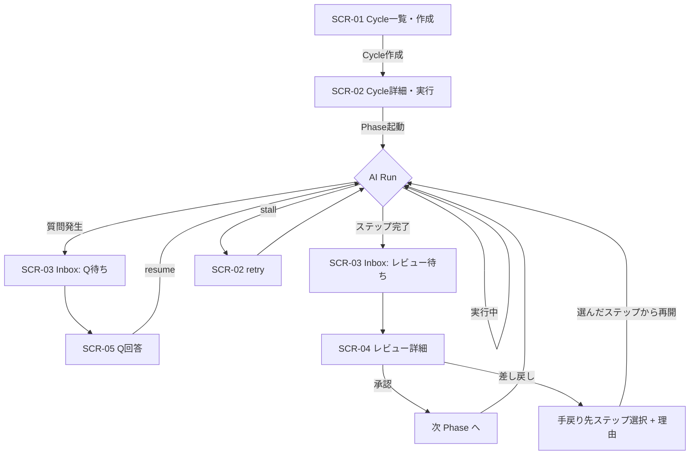

# S2 — 画面モック / フロー(一覧)

## メタ
- 工程: S2 (Mock / Flow)
- 役割: プロダクトデザイナー(情報構造)
- ステータス: 確定
- 入力参照: [s1/index.md](../s1/index.md) / [design/review-output.md](../design/review-output.md)
- 作成日: 2026-06-05 / 更新日: 2026-06-05

> 進め方: **MVP(v0.0.1)= 6 US** の画面に絞る(残りの画面は v0.0.x で追加)。
> インベントリ + フローを視覚レビュー → OK後に 1 画面 1 ファイル(`scr-NN-*.md`)へ展開。
> レビュー面(SCR-04)は design/review-output.md の **block-stream レンダラ**(ReviewBlock[] を上から描画)。

## MVP 画面インベントリ(v0.0.1)

| SCR | 画面 | 対応 US | 役割 |
|-----|------|---------|------|
| SCR-01 | Cycle 一覧・作成 | US-05 | Cycle を作る / 一覧表示(最小) |
| SCR-02 | Cycle 詳細・実行 | US-06,07,08 | **ステップパイプライン(S1〜S7)+ 現在位置 + 手戻り履歴** / Run state(running/stalled/done)/ Phase 起動 / retry |
| SCR-03 | Human Inbox | US-12,13 | 待ちカード一覧(Q待ち / レビュー待ち) |
| SCR-04 | レビュー詳細(汎用) | US-13 | ReviewBlock[] を描画 + 承認 / **差し戻し(手戻り先ステップ選択 + 理由)** |
| SCR-05 | Q 回答 | US-12 | 質問表示 + 回答入力 → AI resume |

- **retry**(US-08)は SCR-02 のボタン、**生成**(US-07)は画面要素少(状態表示のみ)。
- v0.0.x で追加: Dashboard 4象限 / Backlog / 手戻り判断面 / Decision 履歴 / Wiki / 会話履歴 / Vision 管理 / 設定 / scenario-demo 動画ビューア 等。

## MVP フロー(Mermaid)

## 全体方針
- **Human Inbox(SCR-03)がハブ**。待ちカードから Q回答(SCR-05)/ レビュー詳細(SCR-04)へ遷移。
- **SCR-04 が製品の心臓**: block-stream レンダラ。MVP では軽いブロック(`summary`/`ac-map`/`mermaid` 等)のみ描画、重いブロック(動画 dossier)は v0.0.x。
- 「人間が IDE を触らず 1 フェーズ回る」= A→B→(Q→回答)→(完了→レビュー→承認)→次、が画面だけで完結する。

## 全体 質疑応答ログ

### Q-01 — MVP 画面はこの 5 枚でよいか?(過不足)
- 特に: SCR-03(Inbox)と SCR-04(レビュー詳細)を分けたが、MVP では Inbox のカードを開いたら即レビュー詳細、で十分かもしれない。分離 / 統合どちらが良いか。
- **回答**:
  > OK
- **確定**:
  > 5 枚で確定。Inbox(SCR-03=待ち一覧のハブ)と レビュー詳細(SCR-04)は分離のまま。

### Q-02 — このフロー(手戻り = 戻り先ステップ選択)で MVP の体験は通るか?
- **回答**:
  > OK
- **確定**:
  > 確定。差し戻し = 手戻り先ステップ選択 + 理由(→ Decision/ledger)。

---

## 全体 AI が独自に決めたこと と 理由

### D-01 — MVP 画面を 5 枚に絞った
- **理由**: 6 US のうち US-07(生成)/US-08(retry)は専用画面でなく SCR-02 の状態・ボタン。残り 4 US が 5 画面に対応。

### D-02 — SCR-04 を汎用 block-stream レンダラとして設計
- **理由**: design/review-output.md 確定。step × task-kind の出力差を画面でなくデータ(ReviewBlock[])で吸収。

### D-03 — 手戻りは「手戻り先ステップを選んで戻る」(MVP に内在)
- **理由**: AI-DLC は任意の過去ステップへ戻れる。差し戻し = **戻り先ステップ選択 + 理由** → Cycle がそのステップから再開。SCR-02 がステップパイプライン + 現在位置 + 手戻り履歴を持つ。**within-step の部分差し戻し(AC/画面 単位)は v0.0.x**(別物)。

---

## 棄却した案

### R-01 — MVP に Dashboard を入れる
- **棄却理由**: S1 Q-01 で US-10 を v0.0.x へ。MVP は縦ループ貫通に集中。

## 画面一覧(ファイル)
- [SCR-01](./scr-01-cycle-list-create.md) / [SCR-02](./scr-02-cycle-detail-run.md) / [SCR-03](./scr-03-human-inbox.md) / [SCR-04](./scr-04-review-detail.md) / [SCR-05](./scr-05-answer-question.md)

## 次工程 (S2.5 / S3) への引き継ぎ
- **S2.5(視覚意図)で詰める画面**: SCR-02(パイプライン+Run状態の表現)/ SCR-03(待ちカードの種類が一目で分かる)/ SCR-04(block-stream を読みやすく階層化 / 承認・差し戻しの重み)。状態(default/empty/running/stalled/error)を data-state として定義。
- **S3(Unit 分割)の境界**: Cycle/Run 実行 ・ Human Inbox/Decision ・ レビュー(ReviewBlock 生成=Agent emit)・ orchestration(Agent 起動/stall/retry)。非機能(fresh-context/外部記憶)は Run 境界の設計論点。
- **S5 へ**: Task/Cycle/Run/Decision/Artifact/ReviewBlock の集約化。Artifact・Task は `kind` を持つ。

## 前サイクルからの引き継ぎ (手戻り時のみ追記)
- 何が漏れていたか:
- 暫定の解決方針:
- 棄却した案とその理由:
