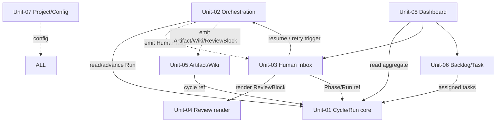

# S3 — Unit of Work(全体)

## メタ
- 工程: S3 (Unit of Work)
- 役割: ソフトウェアアーキテクト
- ステータス: 確定
- 入力参照: [s1/index.md](../s1/index.md), [s2/index.md](../s2/index.md)
- 作成日: 2026-06-05
- 更新日: 2026-06-06

> 進め方: AI が Unit 分割案 + I/F 定義案を叩き台として全 Unit ファイルに展開済み。**ユーザーは IDE で各 md を開き、`回答` / `判断` を直接書き込む**。Unit 横断の議論はこの index、個別 Unit の議論は該当 `unit-NN-*.md`。
> 粒度方針(kit 準拠): 1 Unit = 並行開発できる責務境界。Unit 数は出力であって目標ではない。

## アーキテクチャ前提
- スタック (現状の仮置き): **web** = Vite + React(ビューア & 操作盤) / **orchestrator** = Node 常駐サーバ + Claude Agent SDK(headless 起動)+ git worktree / **store** = studio の run/HumanTask 状態(aidlc-docs とは別 store、ローカル DB or ファイル)。
- 既存資産・制約: `web/` `orchestrator/` は**空(グリーンフィールド)**。`kit/skills/` の AI-DLC 9 スキルは可搬な方法論本体で、orchestrator が backend から load し IDE からも `/aidlc-sN` で叩ける(web/IDE 両刀)。
- 想定デプロイ形態: **ローカルセルフホスト**(対象リポ・モデルは env で設定、絶対パス埋め込み禁止)。並行サイクルは worktree 分離。
- **真実の source** = `aidlc-docs/`(各ターゲット PJ 側)。studio は run/HumanTask 状態のみ別管理。

## I/F 決定方針
- 採用: **AI 事前調査**(ユーザー確定 2026-06-05)
- 理由: コードは未着手だがデータモデル(Milestone/Phase/Run/Artifact/Wiki/HumanTask)とスタックは確定済み。AI が確定データモデル + Agent SDK / worktree パターンから I/F 案を起こし、人間が md 上で判断する方が早い。

## 設計の背骨(非機能 → Unit 境界の根拠)

S1 の「非機能・設計上の関心事」(コンテキスト精度劣化 / 圧縮回避)が、そのまま Unit 境界の引き方を決める。

- **fresh-context の専用 Agent で各ステップ実行・最小コンテキストのみ引き継ぐ** → **Run = orchestration 境界**。1 Run = 1 Agent 起動 = 1 fresh context。「Cycle/Run が何であるか(ドメイン状態機械)」と「Run をどう実行するか(Agent SDK runner)」を別 Unit に割る根拠。
- **圧縮ではなく外部記憶 + 選択的ロード** → 成果物は **Artifact / Wiki / ledger として外部化**(Unit-05)。各 Agent は必要な成果物だけ read。store は状態のみ、内容は aidlc-docs。
- **イベント駆動で依存を一方向化** → Run 実行(Unit-02)は HumanTask / Artifact / ReviewBlock を **emit** するだけ。Inbox(Unit-03)・Artifact(Unit-05)・Review(Unit-04)は購読する側。ドメイン(Unit-01)が外を呼ばないことで循環を回避。

## Unit 一覧
| Unit | 名称 | 責務 | MVP(v0.0.1) |
|------|------|------|------|
| [Unit-01](./unit-01-cycle-run-core.md) | Cycle & Run ライフサイクル | Milestone/Phase/Run の状態機械(ドメイン核) | ◎ US-05,06 |
| [Unit-02](./unit-02-orchestration.md) | Orchestration / Agent Runner | Agent SDK で kit/skills を headless 起動・stall 検知・retry・worktree | ◎ US-07,08 |
| [Unit-03](./unit-03-human-inbox.md) | Human Inbox & Decision | HumanTask カード / Q回答・視覚レビュー依頼・D承認・手戻り / Decision 履歴 / 通知 | ◎ US-12,13 |
| [Unit-04](./unit-04-review-render.md) | Review Rendering(block-stream) | ReviewBlock[] を上から描画する汎用レンダラ / 承認・差し戻し | ○ 最小レンダラ(US-13 が使用) |
| [Unit-05](./unit-05-artifact-wiki-ledger.md) | Artifact / Wiki / Ledger | aidlc-docs 閲覧 / AI による Wiki 維持 / ledger reconcile / 会話履歴 | — |
| [Unit-06](./unit-06-backlog-task.md) | Backlog & Task | Task CRUD・優先度 / Cycle 割り当て / AI 起案・妥当性確認 | — |
| [Unit-07](./unit-07-project-config.md) | Project & Config | Vision 管理 / リポ切替 / env 設定 / ステップ定義カスタム | — |
| [Unit-08](./unit-08-dashboard.md) | Dashboard | 最小2列 + プロダクトバックログ風4象限(read-only 集約) | — |

### US → Unit 割り当て(全 33 US / 漏れ無し)
- **Unit-01**: US-05, US-06, US-09, US-29, US-30
- **Unit-02**: US-07, US-08
- **Unit-03**: US-12, US-13, US-14, US-15, US-16, US-17, US-31
- **Unit-04**: US-18(+ US-13 のレンダラ提供)
- **Unit-05**: US-19, US-20, US-21, US-28, US-32, US-33
- **Unit-06**: US-01, US-02, US-03, US-04, US-23, US-24
- **Unit-07**: US-22, US-25, US-26, US-27
- **Unit-08**: US-10, US-11

> US-13 は **Inbox(Unit-03)が所属**(視覚レビューという人間判断フロー)。描画は Unit-04 のレンダラを呼ぶ。1 US = 1 所属を守るため Unit-04 の owned US は US-18。

### 依存方向(一方向 / 循環なし)

- **Unit-01 は内部 Unit を呼ばない**(核)。Unit-06 の Task は参照(ID)で受ける。
- **Unit-02 → Unit-01** は片方向。Unit-02 が emit したイベントを Unit-03 / Unit-05 が購読(逆方向の直接呼び出し無し)。
- **Unit-03 ⇄ Unit-02**: Inbox が resume/retry を **トリガ**(コマンド)、Orchestration は HumanTask を **emit**(イベント)。役割が異なるため循環ではない(command/event 分離)。
- **Unit-04 は純粋関数的**: ReviewBlock[] を渡されて描画するだけ。内部 Unit に依存しない。
- **Unit-08 は read-only**: 何にも依存されない終端。

## 全体 質疑応答ログ (アーキ全体・I/F 方針・Unit 横断)

### Q-01 — Unit 分割の粒度(8 Unit)は「並行開発できる」単位として妥当か?
- 観点: Unit-01(Cycle/Run ドメイン)と Unit-02(Orchestration runner)を分けた。fresh-context 設計上「Run が何か」と「Run をどう動かすか」は別チームで並行可能と判断。統合しすぎ / 分けすぎの感覚があれば。
- **回答**(ユーザー記入):
  > OK
- **確定**(AI 記入):
  > 8 Unit で確定。Unit-01/02 の分離(D-01)込みで「並行開発できる単位」として承認。

### Q-02 — command/event 分離(Unit-03 ⇄ Unit-02)を循環ではなく一方向と扱う設計でよいか?
- Inbox→Orchestration は「resume せよ / retry せよ」のコマンド。Orchestration→Inbox は「人間の判断が要る」イベント(HumanTask emit)。両者を分けることで依存グラフを非循環に保つ。これを S4 ContextMap でも明示する。
- **回答**(ユーザー記入):
  > OK
- **確定**(AI 記入):
  > command/event 分離で確定。S4 ContextMap で Unit-03⇄Unit-02 を「command(同期呼び出し)/ event(emit 購読)」の異なる 2 関係として明示する。

### Q-03 — studio store(run/HumanTask 状態)と aidlc-docs(真実)の境界をこの分担でよいか?
- store = Run state / HumanTask / Decision の**状態のみ**。成果物の**内容**は常に aidlc-docs から read(Unit-05)。store に内容をコピーしない(圧縮回避・単一の真実)。
- **回答**(ユーザー記入):
  > OK
- **確定**(AI 記入):
  > 境界確定。store = 状態のみ / 成果物内容 = aidlc-docs から read(Unit-05 経由)。圧縮回避・単一真実を S5 集約設計へ引き継ぐ。

---

## 全体 AI が独自に決めたこと と 理由

### D-01 — Unit-01(Cycle/Run ドメイン)と Unit-02(Orchestration runner)を分離
- **理由**: S1 非機能(fresh-context / 圧縮回避)の核心が Run 境界の設計。「Cycle/Run の状態機械(技術非依存ドメイン)」と「Agent SDK + worktree + stall 検知(技術依存 runner)」を分けると、S5/S6 のドメインコードと orchestrator 実装を並行開発でき、テストも分離できる。hexagonal の port/adapter 分割に対応。
- **判断**(ユーザー記入): 承認
- **上書き内容**(上書き時のみ):

### D-02 — Unit 間依存を command/event で一方向化(イベント駆動)
- **理由**: Unit-02 が HumanTask / Artifact / ReviewBlock を emit、Unit-03/05/04 が購読。ドメイン(Unit-01)が外部 Unit を呼ばない。これで循環依存ゼロ、並行開発時の I/F 破壊が片側で閉じる。
- **判断**(ユーザー記入): 承認
- **上書き内容**(上書き時のみ):

### D-03 — US-13(視覚レビュー)を Unit-03 所属とし、描画は Unit-04 が部品提供
- **理由**: US-13 は「待ちカード → レビュー → 承認/差し戻し」という人間判断フロー(Inbox の責務)。block-stream 描画は Unit-04 の汎用レンダラを呼ぶ部品関係。1 US = 1 所属を守りつつ「製品の心臓(レンダラ)」を独立 Unit に保つ。
- **判断**(ユーザー記入): 承認
- **上書き内容**(上書き時のみ):

### D-04 — Review レンダラ(Unit-04)を純粋データ駆動・無依存に
- **理由**: ReviewBlock[] を渡されて描画するだけの純粋関数的 Unit にすると、step × task-kind の出力差を画面でなくデータで吸収でき(S2 D-02 と一致)、単体テスト・ビジュアルリグレッションが容易。重いブロック(動画 dossier)は v0.0.x で型追加。
- **判断**(ユーザー記入): 承認
- **上書き内容**(上書き時のみ):

### D-05 — Project & Config(Unit-07)を横断設定 Unit として独立
- **理由**: Vision / repo 切替 / env / step 定義は全 Unit が read する横断関心事。1 か所に集約しないと各 Unit に絶対パス・モデル名が散る(セルフホスト要件違反)。低結合の設定 Unit にする。
- **判断**(ユーザー記入): 承認
- **上書き内容**(上書き時のみ):

---

## 棄却した Unit 案

### R-01 — Unit-01 と Unit-02 を 1 つの「Cycle 実行」Unit に統合
- **棄却理由**: fresh-context 設計(非機能の核)が Run 境界の分離を要求。統合するとドメインと Agent SDK 実装が密結合し、S6(純粋ドメイン)/S7(統合)の工程分離とも噛み合わない。

### R-02 — Review レンダラ(Unit-04)を Human Inbox(Unit-03)に内包
- **棄却理由**: block-stream は「製品の心臓」かつ US-18 リッチレビューで単独成長する。Inbox(待ち行列管理)と Render(データ駆動描画)は変更理由が異なる。分離して並行開発・テスト独立。

### R-03 — Wiki/Ledger を独立 Unit に分ける(Artifact と分離)
- **棄却理由**: Artifact・Wiki・Ledger はいずれも aidlc-docs を真実 source とする「成果物の外部記憶」読み書きで、同じ I/F 基盤を共有する。分けると aidlc-docs アクセス層が重複。1 Unit に束ねる。

## 次工程 (S4) への引き継ぎ
- ContextMap で強調すべき境界・依存: **command/event 分離(Unit-03 ⇄ Unit-02)**、**Unit-01 が内部無依存の核**、**Unit-05 経由でのみ aidlc-docs に触れる**。
- 並行開発時のリスク: MVP は Unit-01/02/03/04 の 4 Unit が同時に動く。**Run state 機械(Unit-01)と emit イベント契約(Unit-02→03/05)が先に固まらないと他が進めない** = クリティカルパス。I/F を S3 で確定させる意義はここ。
- 仕様未確定: 通知手段(US-31)/ ステップ定義カスタム(US-27, 優先度低)は I/F に可変点だけ残す。

## 前サイクルからの引き継ぎ (手戻り時のみ追記)
- 何が漏れていたか:
- 暫定の解決方針:
- 棄却した案とその理由:
