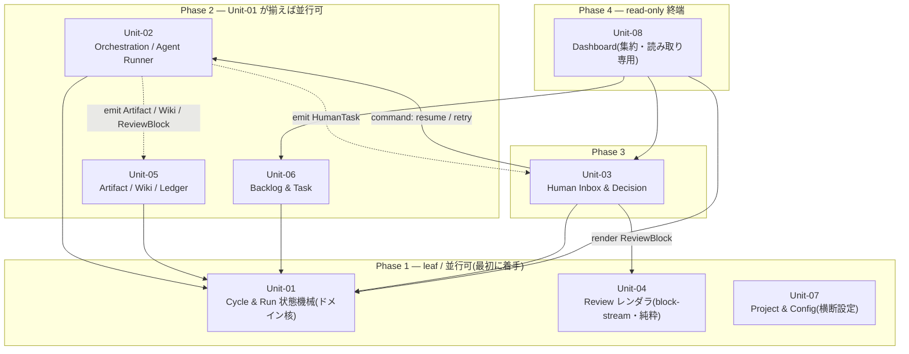

# S4 — コンテキストマップ

## メタ
- 工程: S4 (Context Map)
- 役割: ソフトウェアアーキテクト
- ステータス: 確定
- 入力参照: [s3/index.md](./s3/index.md)
- 作成日: 2026-06-06
- 更新日: 2026-06-06

> 進め方: AI が Phase レイアウトの依存 DAG を叩き台として起こした。**ユーザーは IDE でこの md を開き、`### Q-NN` の `回答` / `### D-NN` の `判断` を直接書き込む**。確定したら `ステータス: 確定` にして S5 へ。

## 全体図 (Unit 間依存 DAG / **Phase レイアウト**)

**読み方**:
- **実線矢印 `-->`** は **strong 依存**(`A --> B` = A は B を呼ぶ / B が無いと A はビルドも動作もできない)。**この実線だけが Phase(着手順)を決める**。
- **上から下に読めば着手順**。上の Phase ほど先に作る。Phase 内の Unit は互いに依存しないので **並行に着手できる**。
- **実線矢印は必ず下の Phase → 上の Phase(上向き)**。依存先は自分より上 = 先に作られている。**実線が上から下に伸びていたら循環の疑い**(S3 に戻る材料)。
- **点線矢印 `-.->`** は **event emit**(実行時の一方向通知 / Unit-02 が投げて以降は知らない)。**弱い依存なので Phase を決めない**(emit 方向に描くため下向きに見えるが循環ではない。下の凡例 + D-02 参照)。

## 凡例
- **角括弧 `[X]`**: Unit(S3 で定義した自前 8 Unit のみ)。
- **実線矢印 `-->`**: strong 依存(`A --> B` =「A は B を呼ぶ / A は B が無いと動かない」)。ビルド時依存であり、**Phase レイアウト(着手順)を決めるのはこの実線だけ**。
- **点線矢印 `-.->`**: event emit(イベント駆動・非同期 / `A -.-> B` =「A が B にメッセージを投げて以降は知らない」)。実行時の弱い結合で、**Phase を決めない**。
- **subgraph**: **Phase = 実装順の段** を表現する正規用途のみ(Phase 1 = leaf = 最初に着手 / Phase N = 最後)。図そのものが着手順の地図。**物理境界(端末 vs サーバ / Docker network / プロセス境界)を表現する subgraph は使わない**。

**意図的に使わない記号**:
- 円柱 `[(X)]` 永続化、六角 `{{X}}` 外部サービス → S4 では描かない(S5 / S7 の領域。store / aidlc-docs / Agent SDK / LLM provider は出さない)。
- プロトコル種別を矢印太さで区別(REST / HTTP MCP / subprocess / WebSocket を `==>` 等で分類)→ S4 では描かない(プロトコルは S3 I/F 定義と S7 統合の話)。

**config(Unit-07)について**: Unit-07 は全 Unit が read する横断設定(Vision / repo 切替 / env / step 定義)。図上は **Phase 1 の leaf** として置くにとどめ、**8 本の config 矢印は描かない**(全 Unit → Unit-07 の依存は自明かつ図を汚す)。「**全 Unit が Unit-07 を read する**」とここで一度だけ明記する(D-01)。

## 依存方向の根拠
| 依存 (A → B) | 種別 | 根拠 (なぜ A は B に依存するか) |
|--------------|------|-------------------------------|
| Unit-02 → Unit-01 | 実線 strong | Orchestration は Run を read して advance する。Run 状態機械(Unit-01)が無いと「次に何の Phase/Run を起動するか」を決められない。 |
| Unit-05 → Unit-01 | 実線 strong | Artifact/Wiki/Ledger は cycle/phase の ID 参照で成果物を紐付ける。どの Cycle の成果物かは Unit-01 が真実。 |
| Unit-06 → Unit-01 | 実線 strong | Task を Cycle に割り当てる。割り当て先 Cycle の存在・状態は Unit-01 が持つ。 |
| Unit-03 → Unit-01 | 実線 strong | HumanTask は対象の Phase/Run を参照(どの Run の Q か / どの Phase の D 承認か)。 |
| Unit-03 → Unit-02 | 実線 strong (**command**) | Inbox での回答・承認・retry 押下が Orchestration の `resume(runId)` / `retry(runId)` を**呼ぶ**。Unit-02 のコマンド port が無いと Inbox の操作が空振る。 |
| Unit-03 → Unit-04 | 実線 strong | 視覚レビュー(US-13)・リッチレビュー(US-18)を `ReviewBlock[]` を渡して Unit-04 のレンダラに**描画させる**。 |
| Unit-08 → Unit-01 | 実線 strong | Dashboard は Cycle/Phase/Run 状態を集約表示(read-only)。 |
| Unit-08 → Unit-03 | 実線 strong | Dashboard は HumanTask 件数・滞留を集約表示。 |
| Unit-08 → Unit-06 | 実線 strong | Dashboard はバックログ4象限を集約表示。 |
| Unit-02 ⟶ Unit-03 | 点線 event | Orchestration が判断点で **HumanTask を emit**。Inbox が購読してカード化(Unit-02 は Inbox 実装を知らない)。 |
| Unit-02 ⟶ Unit-05 | 点線 event | Orchestration が **Artifact / Wiki 更新 / ReviewBlock を emit**。Unit-05 が購読して外部記憶へ永続(Unit-02 は購読者を知らない)。 |

## 並行開発の着手順(図中の Phase subgraph と一対一対応)

| Phase | 着手可能な Unit | 理由 |
|-------|----------------|------|
| Phase 1(leaf) | Unit-01 / Unit-04 / Unit-07 | 他 Unit に strong 依存しない。**Unit-01 の Run 状態機械と Unit-02 が emit するイベント契約(HumanTask / Artifact / ReviewBlock)を最優先で固める**(= クリティカルパス。これが固まらないと Phase 2 以降が動けない)。Unit-04 は純粋データ駆動レンダラで完全独立。Unit-07 は横断設定。 |
| Phase 2 | Unit-02 / Unit-05 / Unit-06 | いずれも Unit-01 のみに依存。Unit-01 の I/F が固まれば 3 つ並行可。Unit-02 ⟶ Unit-05 の emit は弱結合なのでイベント契約だけ先に合意すれば独立開発できる。 |
| Phase 3 | Unit-03 | Unit-01(参照)・Unit-02(command port + emit 契約)・Unit-04(レンダラ)が揃ってから。製品の心臓 Human Inbox。 |
| Phase 4 | Unit-08 | Unit-01 / Unit-03 / Unit-06 の集約を read するだけの終端。最後でよい(誰にも依存されない)。 |

**重要**: この表は **図中の Phase subgraph と一対一対応** している(表が Phase の根拠説明、図が Phase の視覚化)。Phase 数や所属 Unit を変更したら必ず両方を同期する。

**MVP(v0.0.1)の現実**: S3 引き継ぎの通り MVP は **Unit-01 / 02 / 03 / 04 の 4 Unit が同時に動く**。Phase 1 で Unit-01 の Run state 機械 + Unit-02 の emit イベント契約を確定させることが全体のクリティカルパス。Unit-05〜08 は MVP スコープ外〜薄く、後追いで Phase 通りに足せる。

## 読み手別の見方
- **エンジニア**: 自分の担当 Unit から伸びる **実線矢印の先**(strong 依存先)を見て、先にスタブを用意すべき相手を把握する。**点線の先**(emit 先)は購読側なのでイベント契約(DTO 形)だけ合意すれば独立に進められる。詳細 I/F は [s3/](./s3/) の各 Unit ファイル参照。
- **PM**: Phase 1 の 3 Unit(特に Unit-01 の Run 機械 + Unit-02 の emit 契約)が全体のクリティカルパス。ここが遅れると Phase 2 以降が連鎖で遅れる。着手順テーブルを進捗計画に使う。

## 質疑応答ログ

書き方: AI が `### Q-NN` で問いを追記。**ユーザーは IDE でこの md を開き、`回答` に直接書き込む**(複数行・コードブロック OK)。AI は次のやり取りで `確定` を埋める。

### Q-01 — Phase の段割り(1: U1/U4/U7 → 2: U2/U5/U6 → 3: U3 → 4: U8)は並行開発の着手順として妥当か?
- 観点: strong 依存(実線)だけでトポロジカルに段を割った。MVP で同時に動く U1/02/03/04 が Phase 1〜3 にまたがるが、「Phase 1 で U1 状態機械 + U2 emit 契約を先に固める」ことを最優先クリティカルパスとして明示した。この優先順位で現場が動けるか。
- **回答**(ユーザー記入):
  > OK
- **確定**(AI 記入):
  > Phase 段割り(1: U1/U4/U7 → 2: U2/U5/U6 → 3: U3 → 4: U8)で確定。Phase 1 で「U1 Run 状態機械 + U2 emit イベント契約」を固めることを全体のクリティカルパスとして S5 に引き継ぐ。

### Q-02 — Unit-02 ⇄ Unit-03 の command/event を「実線(Phaseを決める strong)+ 点線 emit(Phase を決めない event)」の2種で描き分けたが、誤読しないか?
- 観点: S3 Q-02 で「command/event 分離=循環ではない」と確定済み。S4 では実線 `U3 --> U2`(resume/retry コマンド)と点線 `U2 -.-> U3`(HumanTask emit)を別関係として描いた。点線が下向き(U2→U3)に見えるが、凡例で「点線は Phase を決めない実行時 emit」と明記。これで「U2↔U3 が循環では?」という誤読を防げているか。
- **回答**(ユーザー記入):
  > OK
- **確定**(AI 記入):
  > command/event の描き分け(実線=Phase を決める strong / 点線=Phase を決めない emit)で確定。Unit-02⇄Unit-03 は循環ではない(S3 Q-02 と一貫)。

---

## AI が独自に決めたこと と 理由

書き方: AI が `### D-NN` で決定と理由を追記。ユーザーは `判断` を `承認 / 上書き / 保留` から選び、上書きするなら `上書き内容` に直接書く。

### D-01 — config(Unit-07)を Phase 1 の leaf として置き、個別の config 矢印は描かない
- **理由**: Unit-07 は全 Unit が read する横断設定。8 本の `* --> U7` を描くと図がハブ&スポークのハリネズミになり、肝心の「実装順 DAG」が読めなくなる。leaf として Phase 1 に置き(依存ゼロ=最初に作れるのは正しい)、凡例に「全 Unit が Unit-07 を read」と一度だけ明記する方が、図の主目的(着手順の可視化)を保てる。
- **判断**(ユーザー記入): 承認
- **上書き内容**(上書き時のみ):

### D-02 — command(実線・Phase 決定)と event emit(点線・Phase 非決定)を描き分け、Unit-02⇄Unit-03 を循環としない
- **理由**: S3 Q-02 / D-02 で「command/event 分離」を確定済み。Phase(着手順)を決めるのはビルド時の strong 依存だけなので、これを実線に限定した。emit は実行時の一方向通知(弱結合)で着手順に影響しないため点線にし、emit 方向(U2→U3 / U2→U5)に描いた。結果、点線が見かけ上「下向き / 同段横」になるが、凡例で「点線は Phase を決めない」と切り分けたため循環(実線の上→下)とは区別される。
- **判断**(ユーザー記入): 承認
- **上書き内容**(上書き時のみ):

---

## 棄却した案

書き方: AI が `### R-NN` で追記。ユーザーが追加したい棄却案があれば同じ形式で追記。

### R-01 — emit(イベント)を「消費側 → 生成側」の実線依存(U3 → U2 / U5 → U2)として描く
- **棄却理由**: 消費側が生成側の契約に依存するのは事実だが、実線にすると Phase を決める strong 依存と混ざり、かつ U3 については既存の command 実線(U3→U2)と同方向に重なって command/event の区別が図から消える。emit は弱結合なので点線・emit 方向で描き、Phase 計算からは除外するのが正しい(D-02)。

### R-02 — 物理境界(端末 / orchestrator サーバ / worktree)で subgraph を切る
- **棄却理由**: S4 の subgraph は Phase(実装順)表現専用。物理デプロイ境界・プロセス境界は S5 ドメイン / S7 統合の領域で、S4 で描くと役割が混線する(skill 明示の NG)。必要なら各 Unit の責務 1 行に書く。

## 次工程 (S5) への引き継ぎ
- ドメインモデリングの対象になる Unit(どの subgraph か): **Phase 1 の Unit-01(Cycle & Run 状態機械)が最優先のドメインモデリング対象**。Milestone/Phase/Run の状態遷移(running|stalled|done|failed + retry)を S5 で集約として固める。次いで Phase 2 の Unit-05(Artifact/Wiki/Ledger の外部記憶 = aidlc-docs を真実 source とする集約境界)、Unit-06(Backlog/Task)。
- 技術詳細(DB / 外部 I/F)から守るべき境界: **store(run/HumanTask 状態のみ)と aidlc-docs(成果物の真実 source)の分離**(S3 Q-03 確定)を S5 集約設計で必ず保つ。成果物の内容を store にコピーしない(圧縮回避・単一の真実)。**Unit-02 が emit するイベント契約(HumanTask / Artifact / ReviewBlock の DTO)** は Phase 1 で固める最優先項目で、S5 でその DTO のドメイン的位置づけを定義する。

## 前サイクルからの引き継ぎ (手戻り時のみ追記)
- 何が漏れていたか:
- 暫定の解決方針:
- 棄却した案とその理由:
