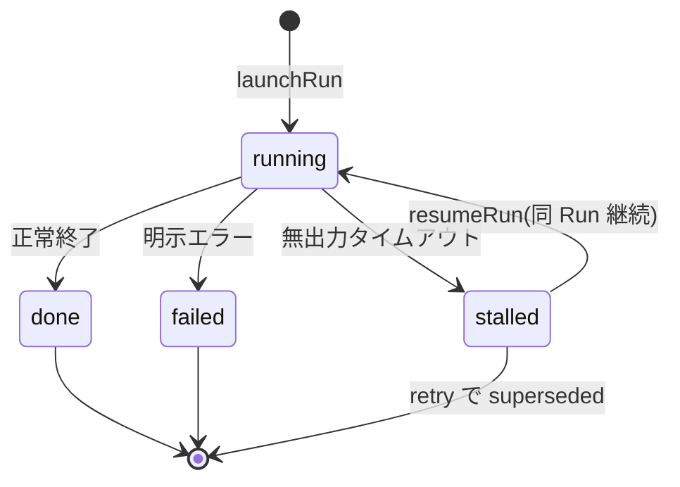
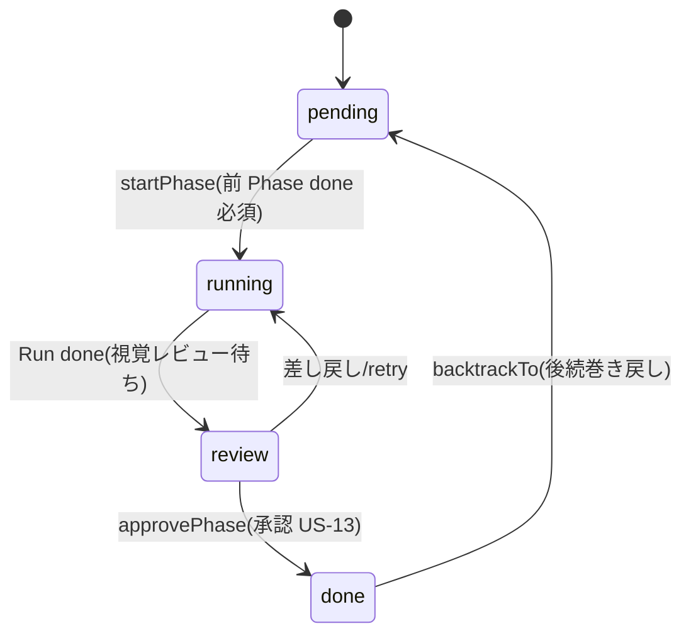
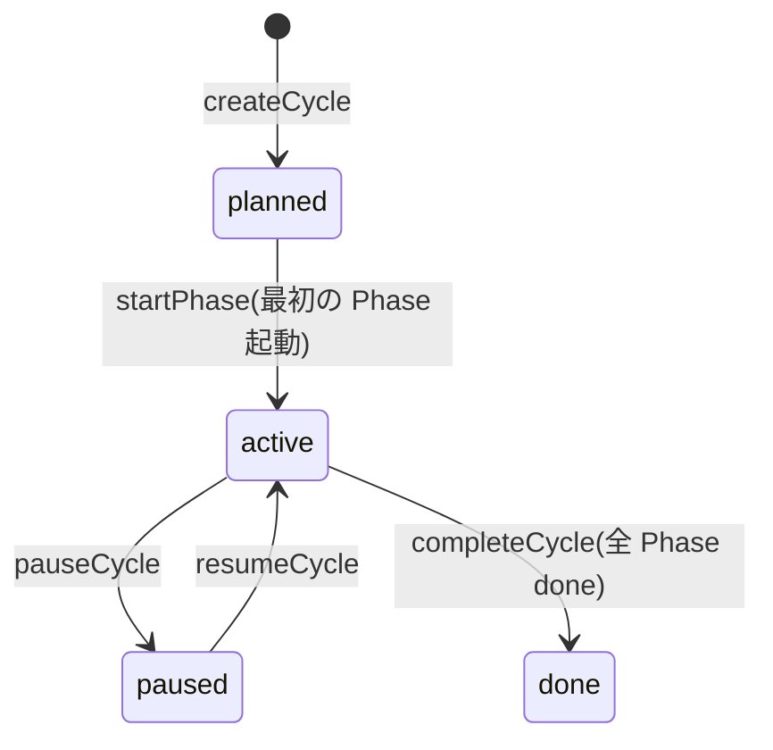

# 集約: Cycle ライフサイクル

## メタ
- 親: [s5/index.md](./index.md)
- 対応 US: [US-05](../s1/us-05-cycle-create.md), [US-06](../s1/us-06-cycle-start-phase.md), [US-07](../s1/us-07-agent-generate-artifact.md), [US-08](../s1/us-08-retry-run.md), [US-09](../s1/us-09-parallel-cycles.md), [US-29](../s1/us-29-cycle-pause-watch.md), [US-30](../s1/us-30-cycle-complete.md)
- 所属 Unit: [Unit-01](../s3/unit-01-cycle-run-core.md)
- ステータス: 確定
- MVP: ◎ — S6(純粋ドメインコード)の主対象

## モデル定義 (DDD 採用)

**集約ルート**: `Cycle`(Phase / Run を内包。整合性境界 = Cycle 単位。R-01 参照)

```
Cycle (集約ルート)
 ├─ id: CycleId
 ├─ projectId: ProjectId      // 属する Project(コンテキストルート)
 ├─ version: Version          // VO: vX.Y.Z, Project 内で一意
 ├─ title: NonEmptyText       // VO: 空不可
 ├─ taskIds: TaskId[]         // Backlog から ID 参照のみ(中身は持たない)
 ├─ state: CycleState         // planned | active | paused | done
 ├─ createdAt: Instant        // ISO-8601
 └─ phases: Phase[]           // 子エンティティ(order で直列)

Phase (子エンティティ)
 ├─ id: PhaseId
 ├─ step: Step                // VO: S1|S2|S2.5|S3|S4|S5|S6|S7
 ├─ order: int                // パイプライン上の位置
 ├─ state: PhaseState         // pending | running | review | done
 └─ runs: Run[]               // 子エンティティ(attempt 昇順)

Run (子エンティティ)
 ├─ id: RunId
 ├─ attempt: int              // 1 始まり、retry で +1
 ├─ state: RunState           // running | stalled | done | failed
 ├─ startedAt: Instant
 └─ endedAt: Instant?         // 終端(done/failed)で確定
```

### 値オブジェクト
- `Version`: `vX.Y.Z`(SemVer 形)。生成時に形式検証。**Project 内で一意**(別 Project では同 Version 可。Project D-01)。
- `NonEmptyText`(title): 空文字・空白のみを拒否。
- `Step`: 工程種別。**意味・数は Project の `pipelineDef`(StepDef[])で per-PJ 定義**(Project D-03)。**Cycle は工程列の実体 `phases[]` を所有**し、`createCycle` 時に **その Project の `pipelineDef` から phases を instantiate** する。MVP の既定は `[S1,S2,S2.5,S3,S4,S5,S6,S7]`(kit/skills/aidlc-sN)。カスタム(意味・数の変更)は US-27(v0.0.x)。
- `CycleState` / `PhaseState` / `RunState`: 下記状態遷移のみ許可する列挙。

## 操作(集約ルート経由のコマンド)

| 操作 | 入力 | 出力 / 効果 | エラー(不変条件違反) |
|------|------|------|--------|
| createCycle | { projectId, title, version, taskIds[] } | Cycle(planned)+ phases を Project の pipelineDef から instantiate | EmptyTitle / DuplicateVersion |
| startPhase | { cycleId, step } | Phase(running) + Run(attempt=1, running)。Cycle を active 化 | CyclePaused / PrevPhaseNotDone / PhaseAlreadyRunning |
| advanceRun | { runId, to: stalled\|done\|failed } | Run 遷移。done なら Phase を review へ | IllegalTransition |
| resumeRun(継続) | { runId } | stalled→running(同 Run 継続)※プロセス再開は Unit-02 | RunNotResumable |
| retryRun | { runId } | 新 Run(attempt+1, running)。元 Run は終端のまま | RunNotFailedOrStalled / MaxAttemptExceeded |
| approvePhase | { phaseId } | Phase review→done。**その Run の全 Task レビュー Question が承認済みのときのみ** | PhaseNotInReview / TaskReviewsPending |
| backtrackTo | { cycleId, step, reason } | 戻り先 Phase を running、後続 Phase を pending に巻き戻す。履歴は保持 | StepNotInPipeline |
| pauseCycle / resumeCycle | { cycleId } | Cycle paused⇄active | AlreadyInState |
| completeCycle | { cycleId } | Cycle done | PhasesNotAllDone |

> `approvePhase` は S5 で明示化(S3 では PhaseState に `review` がありながら done への遷移操作が暗黙だった → D-02)。視覚レビューは **Task 単位**(Result/Question に taskId、[result.md](./result.md)/[question.md](./question.md))。1 Run の成果は Task 分の Result に分解され、Task ごとに `answerQuestion(approve)`。**全 Task レビューが承認**されて初めて `approvePhase` が `review→done` できる(1 件でも reject なら `backtrackTo`)。Task に割れないアーキ成果(S4/S5)は Cycle 単位 1 件。

## 状態遷移

### RunState(1 Run の生涯)



- **retry は遷移ではなく新 Run 生成**: `failed` / `stalled` な Run から `retryRun` で attempt+1 の**新しい Run** を作る(元 Run は終端のまま履歴に残る)。
- **`done`→`running` は禁止**(IllegalTransition)。
- **「人間待ち」は RunState ではない**(index D-01): Q や視覚レビューで人間の応答を待つ間、Run は `running` のまま。待ちは **open な Question の存在**で表す。`stalled` は無応答タイムアウト専用。

### PhaseState(1 Phase の生涯)



### CycleState(1 Cycle の生涯)



## 不変条件
- **INV-1**: `version` は **Project 内で一意**(DuplicateVersion)。`title` は空不可(EmptyTitle)。Cycle は 1 つの Project に属す(projectId 必須)。
- **INV-2**: 1 Cycle 内で `running` な Phase は**同時に高々 1**(Phase は直列 S1→…→S7)。並行は **Cycle 間のみ**(US-09、worktree 分離は Unit-02 が担保)。
- **INV-3**: 1 Phase 内で `running` な Run は**高々 1**(= 最新 attempt)。過去 attempt は終端で残る。
- **INV-4**: `startPhase` は ① Cycle が `paused` でない ② 直前 order の Phase が `done` ③ 当該 Phase が未 running、を満たすときのみ可。
- **INV-5**: RunState 遷移は状態図のみ許可(`advanceRun` の IllegalTransition が `done→running` 等を弾く)。
- **INV-6**: `retryRun` は元 Run が `failed` か `stalled` のときのみ。`attempt` は env 上限(既定 3)を超えない(MaxAttemptExceeded)。自動 retry なし(MVP 手動、S3 Q-02 確定)。
- **INV-7**: `backtrackTo` は戻り先 step の Phase を running・後続 Phase を pending に巻き戻すが、**過去の Run / Fact(確定事項)履歴は破棄しない**(Question/Facts/外部記憶 が保持。S2 確定「差し戻し=戻り先ステップ選択+理由」)。
- **INV-8**: `completeCycle` は全 Phase が `done` のときのみ(PhasesNotAllDone)。
- **INV-9**: Cycle は**内部 Unit を呼ばない**(ドメイン核)。Task は ID 参照で受け、Agent 実行・worktree・プロセス情報は持たない(技術依存は Unit-02、S3 R-01)。
- **INV-10(レビューは Task 単位)**: 視覚レビューが要る Phase は、`approvePhase` で `review→done` する前に **その Run の全 Task レビュー Question が承認済み**でなければならない(TaskReviewsPending)。成果物の妥当性は Task の要求充足で判断する(Result/Question の taskId)。Task に割れないアーキ成果は Cycle 単位 1 件で代替。

## この集約固有の 質疑応答ログ

### Q-01 — PhaseState の `review` と `approvePhase` の明示化でよいか?
- 観点: S3 では PhaseState に `review` 値はあったが、`running→review→done` の承認操作が I/F 表に無く暗黙だった。S5 で **Run done → Phase review(視覚レビュー待ち)→ approvePhase で done** と明示し、視覚レビュー承認(US-13 / Question `answerQuestion(approve)`)がこれを呼ぶ、とした。この明示化で齟齬ないか。
- **回答**(ユーザー記入):
  > 明示化する
- **確定**(AI 記入):
  > **明示化で確定**。`Run done → Phase review → approvePhase で done`。Phase は Run done でも自動 done にせず、視覚レビュー承認(US-13)を必須ゲートにする。kit #2(レビュー要求漏れ)を状態機械で構造的に防ぐ。

### Q-02 — resume(同 Run 継続)と retry(新 Run)の 2 操作分離でよいか?
- 観点: 人間が Q に回答 → AI が同じ Run を継続(`resumeRun`: stalled/waiting から running)と、stall/failed から作り直す(`retryRun`: 新 attempt)を**別操作**に分けた。Unit-02 の `resumeRun`(回答注入し再開)/ `retryLaunch`(新 attempt)に対応。ドメインでこの 2 つを分けて持つ理解でよいか。
- **回答**(ユーザー記入):
  > 別操作で分ける
- **確定**(AI 記入):
  > **別操作で確定**。`resumeRun`(同 Run 継続)と `retryRun`(attempt+1 の新 Run)を分離。Unit-02 の resumeRun / retryLaunch に 1:1 対応。attempt ごとに Run 履歴が残り、retry=新 Run / resume=同 Run 継続を型で区別する。

---

## この集約固有の AI が独自に決めたこと と 理由

### D-01 — Phase/Run を Cycle 集約内のエンティティにする(独立集約にしない)
- **理由**: 「1 Cycle 内 running Phase=高々 1」「startPhase は前 Phase done 必須」「backtrack の後続巻き戻し」は Cycle 全体を見ないと守れない不変条件。整合性境界は Cycle 単位。Phase/Run を独立集約に切ると跨ぎ保証が崩れる(index R-01)。
- **判断**(ユーザー記入): 承認(cycle Q-01/Q-02 確定に同梱)
- **上書き内容**(上書き時のみ):

### D-02 — `review` を承認ゲートの正式 state にし `approvePhase` を新設
- **理由**: kit の S6/S7 完了ゲート「人間に求めるのは実機+視覚レビューのみ」を Cycle 状態機械に焼き込む。Run が done でも Phase は自動 done にせず `review` で止め、人間の `approvePhase`(視覚レビュー承認)を経て初めて next Phase に進める。粒度ゲーミング/レビュー要求漏れ(kit #2)の構造的予防。
- **判断**(ユーザー記入): 承認(Q-01 で明示化を選択)
- **上書き内容**(上書き時のみ):

---

## この集約固有の 棄却した案

### R-01 — Run に Agent プロセス情報(pid / worktree path)を持たせる(S3 R-01 を踏襲)
- **棄却理由**: 技術依存情報はドメイン核を汚す。pid/worktree/モデル名は Unit-02 が runId に紐づけ別管理。Cycle 集約は「何であるか(状態)」だけを持ち、「どう動かすか」を持たない。

### R-02 — backtrack を「後続 Phase を削除して作り直す」でモデル化
- **棄却理由**: 履歴(過去 Run / Fact)を破棄すると US-17(判断履歴の追跡)と ledger reconcile が壊れる。Phase を `done→pending` に**巻き戻す**遷移にし、過去の Run/Fact は不変で残す(INV-7 / S3 D-02)。
