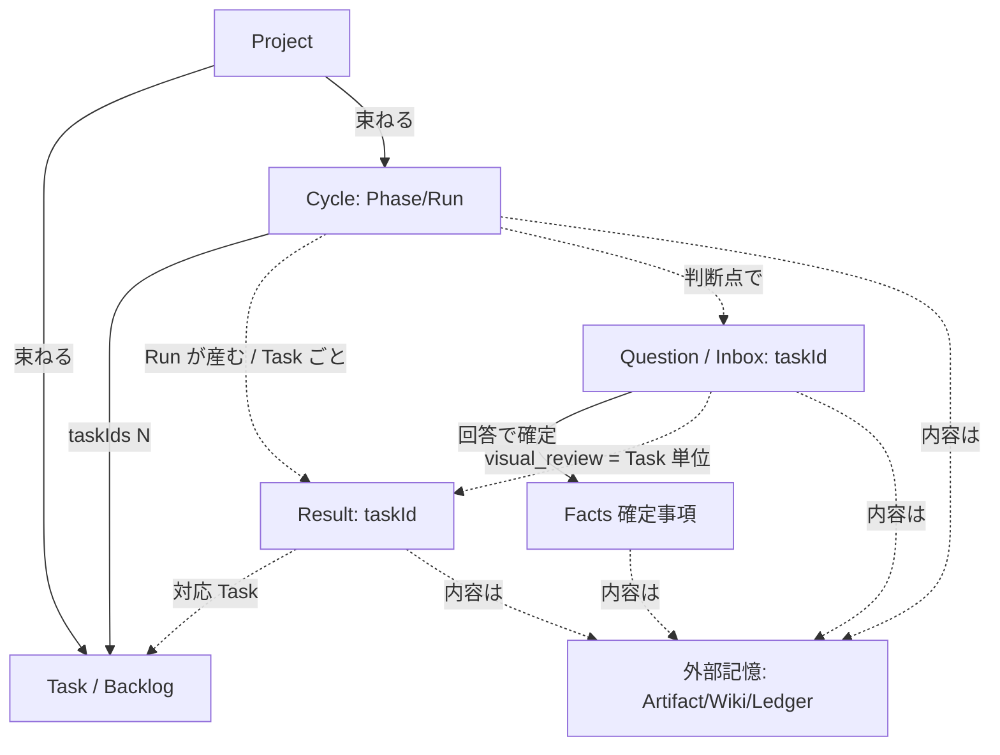
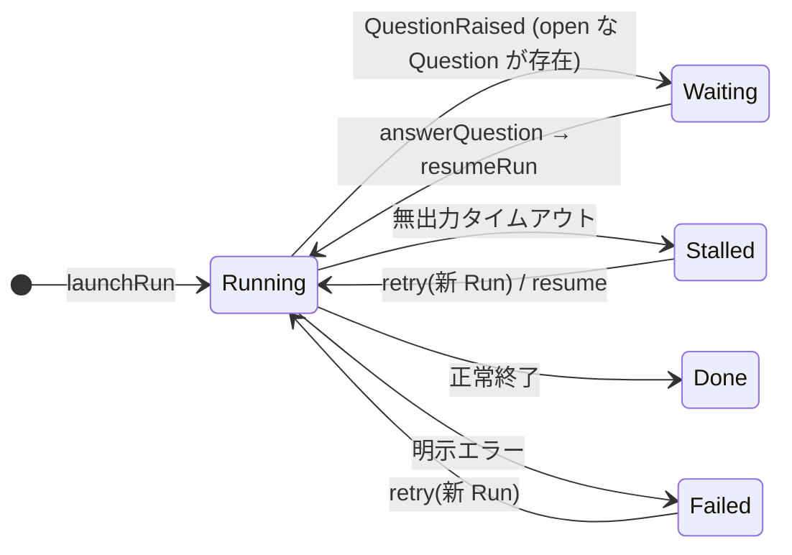

# S5 — ドメインモデル(全体)

## メタ
- 工程: S5 (Domain Model)
- 役割: ドメインモデラー
- ステータス: 確定
- 入力参照: [s1/index.md](../s1/index.md), [s3/index.md](../s3/index.md), [s4-context-map.md](../s4-context-map.md)
- 作成日: 2026-06-06
- 更新日: 2026-06-06

> 進め方: AI が S1〜S4 から集約候補・不変条件・ユビキタス言語を起こし、Q-02 のユーザー指摘を受けて骨格を `Project / Task / Cycle / Question / Facts / Result / 外部記憶` に組み直した。**ユーザーは IDE で各 md を開き、`### Q-NN` の `回答` / `### D-NN` の `判断` を直接書き込む**。スタック・DDD 判断・ユビキタス言語・集約横断はこの index、個別集約の議論は該当 `{aggregate}.md`。確定したら `ステータス: 確定` にして S6 へ。

## スタック確認 (PDF 警告: 実 PJ と乖離すると AI が的外れな質問を返す)
- 言語: **TypeScript**(web / orchestrator 共通)
- フレームワーク: web = Vite + React / orchestrator = Node 常駐サーバ + **Claude Agent SDK**(headless 起動)+ git worktree
- 永続化: **二層**。① **真実 source = `aidlc-docs/`**(ファイルシステム / git 管理。成果物・Wiki・ledger の内容)。② **studio store**(ローカル DB or ファイル。Cycle/Run/Question/Facts の**状態のみ**、成果物内容は持たない)。**S5/S6 ではどちらの実装にも依存しない**(port/adapter で隔離、S7 で確定)。
- 既存資産: `web/` `orchestrator/` は空(グリーンフィールド)。`kit/skills/` の AI-DLC 9 スキルは可搬な方法論本体(orchestrator が load / IDE 両刀)。
- ※ s3/index.md「アーキテクチャ前提」と矛盾なし(TS / React / Node + Agent SDK / 二層永続化 = S3 Q-03 確定)。

## DDD 採用判断
- 採用: **DDD 採用 + クリーンアーキテクチャ**(Q-01 確定)
- 理由: Cycle/Phase/Run は状態遷移規則(running|stalled|done|failed + retry/backtrack)を持つ**状態機械**で、不変条件をコードの外(散文)に置くと S6 で守れない。Question の kind×verdict 整合、Facts の append-only、Ledger の `carried⇒into / dropped⇒reason` も**集約の不変条件**として閉じ込めるのが自然。
- **レイヤリング(クリーンアーキ)**: ① **entities = 集約**(下記 7 つ。技術非依存・S6 の主対象)② **use-case interactors = アプリケーション層**(`answerQuestion`・`startPhase` 等。複数集約の調停、port を呼ぶ)③ **interface adapters**(web/React・orchestrator)④ **frameworks & drivers**(DB・Claude Agent SDK・ファイルシステム = S7)。**依存は内向きのみ**(集約は store/SDK/HTTP を知らない。Repository/Port インターフェースだけ定義し実装は外側 = S7)。

## ユビキタス言語 (用語集)
| 用語 | 定義 | 別名NG / 注意 |
|------|------|--------|
| **Project** | コンテキストのルート。対象リポ / Vision(brief)/ **工程定義 pipelineDef** / env を持ち、配下に Backlog と Cycle 群を束ねる。 | 複数リポ切替(US-25)= Project 切替。 |
| **Cycle** | 開発の実行単位。Task を束ね 1 つの版(vX.Y.Z)を産む。S1〜S7 の Phase 列を内包する集約ルート。 | brief/CLAUDE.md の「**Milestone**」は Cycle の別名(D-02)。コード上は `Cycle`。 |
| **Version** | Cycle の版識別子。`vX.Y.Z`(SemVer 形)。Project 内で一意。 | 「タグ」「リリース番号」と混称しない。 |
| **Phase** | Cycle 内の 1 ステップ(S1\|S2\|S2.5\|S3\|S4\|S5\|S6\|S7)。AI 実行の単位枠。 | 「ステージ」と混称しない。 |
| **Step / StepDef** | 工程種別。**意味・数・対応スキルは Project の `pipelineDef`(StepDef[])で per-PJ 定義**(MVP は既定 S1〜S7)。Phase はその Step を指す。 | ステップは普遍固定でなく PJ ごとに可変(US-27)。pipeline 定義=Project / 実体 phases=Cycle。 |
| **Run** | 1 回の Agent 起動 = 1 fresh context。Phase に属し attempt を持つ。 | 「ジョブ」と混称しない。 |
| **Attempt** | 同一 Phase に対する Run の試行回数(retry で +1)。 | |
| **RunState** | `running\|stalled\|done\|failed`。stall(無応答=復帰可)と failed(明示エラー)は別物。 | 「waiting(人間待ち)」は RunState ではない(D-01)。 |
| **stall** | Run の**無出力タイムアウト**(進捗が止まった)。手動 retry の対象。 | 人間の回答待ち(=open な Question)と混同しない(D-01)。 |
| **backtrack(手戻り)** | 戻り先 Step の Phase を running に、後続 Phase を pending に巻き戻す遷移。履歴は破棄しない。 | Run の作り直しではない(Phase 巻き戻し)。 |
| **Question** | **AI→人間への問い(依頼)カード = Inbox**。kind で全依頼種別を吸収する単一型(製品の魂)。open→answered。 | **旧称 HumanTask**。Task(開発要求)と区別するため Question に改名(Q-02)。 |
| **kind(QuestionKind)** | `question\|visual_review\|device_check\|decision\|backtrack\|stall_retry`。 | |
| **Answer** | 人間の応答(verdict + 任意 body / backtrackTo / reason)。 | |
| **Facts(確定事項)** | 回答で**確定した判断の版付き記録**(何を・なぜ確定したか)。**AI は append のみ・人間は版付きで編集可**(旧版は不変保持)。Wiki/Ledger の源泉。 | **旧称 Decision**。AI は上書き不可、過去版は消さない(US-17 の真実)。 |
| **Result** | Run が産む**レビュー成果(dossier)**。`ReviewBlock[]` で構成(block-stream)。**Task 単位**(`taskId`、妥当性を Task の要求で判断)。実体ファイルは外部記憶に在る。 | step×kind で画面分岐しない(データで吸収)。Task に割れないアーキ成果のみ Cycle 単位。 |
| **ReviewBlock** | Result を構成する判別可能ユニオンの**値オブジェクト**(summary/ac-map/mermaid/screenshot…)。 | |
| **Task / Backlog** | 開発要求(Task)を溜める Backlog。Task 単体では実行しない(Cycle が実行単位)。 | Question(AI の問い)とは別概念。 |
| **TaskProposal / ValidationFinding** | AI の起案・妥当性指摘。人間 accept で初めて Task 化(生成=AI / 判断=人間)。 | AI 出力を直接 Task にしない。 |
| **Artifact / Wiki / Ledger** | 外部記憶。aidlc-docs 上の成果物 / AI 維持 Wiki / 持ち越し台帳。studio は参照・索引のみ保持。 | 内容を store に複製しない(圧縮回避・単一真実)。 |

## 集約 / モデル一覧
| 集約 / モデル | ファイル | 集約ルート | MVP | 由来 Unit |
|------|------|------|-----|------|
| Project(コンテキストルート) | [project.md](./project.md) | `Project` | △(MVP は単一固定でも可) | Unit-07 |
| Backlog | [task.md](./task.md) | `Task`(別集約: TaskProposal, ValidationFinding) | — | Unit-06 |
| Cycle ライフサイクル | [cycle.md](./cycle.md) | `Cycle`(子: Phase, Run) | ◎ | Unit-01 |
| Question(Inbox) | [question.md](./question.md) | `Question`(旧 HumanTask) | ◎ | Unit-03 |
| Facts(確定事項) | [facts.md](./facts.md) | `Fact`(append-only / 旧 Decision) | ◎(回答時に追記) | Unit-03 |
| Result(レビュー成果) | [result.md](./result.md) | `Result`(ReviewBlock VO 族を内包) | ○ | Unit-04 |
| 外部記憶 | [external-memory.md](./external-memory.md) | `ArtifactRef` / `WikiDoc` / `LedgerEntry` / `Conversation` | — | Unit-05 |

> Unit-02(Orchestration / Agent Runner)は**技術アダプタ**(クリーンアーキの最外殻)でドメイン集約を持たない。ただし emit する**イベント契約はドメインイベント**として下「ドメインイベント契約」に正本を置く(S4 引き継ぎの最優先項目)。Unit-08(Dashboard)は read-only 投影でドメインモデルを新設しない。

## 集約の関係(俯瞰)

> **Cycle は Task を N 個持つ**(taskIds)。**実行は Cycle/Phase 単位**(1 Phase = 1 Run = Cycle スコープ)だが、**レビュー(Result)と視覚レビュー Question は Task 単位**(`taskId`)― 成果物の妥当性は「その Task の要求充足」で判断する(ユーザー指摘 / result Q-02・question Q-02)。Task に割れないアーキ成果(S4/S5)は Cycle 単位(taskId=null)。
> **「Cycle が待ちか」は導出値**(D-01): その Run を指す **open な Question が在るか**で判定。Question は別集約(全 Cycle 横断の人間作業キュー=Inbox)だが、Cycle の待ち状態はそこから計算する(Q-02 確定)。

## ドメインイベント契約 (Unit-02 emit / Phase 1 クリティカルパス)

Unit-02(技術アダプタ)は Agent 実行中に下記イベントを **emit** し、購読側の集約がそれを受けて状態遷移する。**技術非依存**(Agent SDK の API 形ではなくドメインの意味で定義)。payload の詳細スキーマは S6/S7 で確定。

| ドメインイベント | 意味 | 受け手の集約反応 |
|------|------|------|
| `RunStateChanged{ runId, to: running\|stalled\|done\|failed }` | Run の進捗・終了・stall 検知 | **Cycle** が `advanceRun` で Run/Phase を遷移 |
| `QuestionRaised{ runId, taskId?, kind, payload }`(S3 名: HumanTaskEmitted) | AI が人間判断を要求した | **Question** を 1 枚 open 生成(visual_review は Task ごと) |
| `ResultEmitted{ runId, taskId?, blocks: ReviewBlock[] }`(S3 名: ReviewBlocksEmitted) | レビュー成果の描画データ(Task 単位) | **Result** を構築 → Question(visual_review)に同梱 |
| `ArtifactEmitted{ runId, path, kind }` | aidlc-docs に成果物が書かれた | **ArtifactRef** を索引化(内容は複製しない) |
| `WikiUpdated{ runId, section }` | Wiki の再生成が要る | **WikiDoc** を成果物から再生成・追記 |

> **MVP の最小契約 = `RunStateChanged` + `QuestionRaised` + `ResultEmitted`**(US-07/08/12/13 を貫通させる 3 本)。`ArtifactEmitted` / `WikiUpdated` は v0.0.x。

## 横断的な状態遷移(集約をまたぐ「待ち」の正準表現)

> **重要(D-01)**: 上図の `Waiting` は **RunState ではない**。Run は `running` のまま(プロセス生存)で、「人間待ち」は **open な Question が存在すること**で表現する。`Stalled` は無応答タイムアウトに限定し、意図的な人間待ちと区別する。これにより RunState 列挙(`running\|stalled\|done\|failed`、S3 確定)を増やさず「待ち」を表せる。

## 全体 質疑応答ログ (スタック・DDD 判断・モデル横断)

書き方: AI が `### Q-NN` で問いを追記。**ユーザーは IDE でこの md を開き、`回答` に直接書き込む**(複数行・コードブロック OK)。AI は次のやり取りで `確定` を埋める。

### Q-01 — DDD 採用 + Milestone/Cycle の正名統一でよいか?
- 観点: ① 状態機械・不変条件が中核なので **DDD 採用**(エンティティ/VO/集約の語彙)で S6 に渡す方針。② brief/CLAUDE.md は「Milestone(=サイクル)」、S1〜S4 は「Cycle」と表記揺れ。コード/ドキュメントの正名を **`Cycle`** に統一(Milestone は別名として brief 由来の語にのみ残す)案。両方を確定してよいか。
- **回答**(ユーザー記入):
  > DDD + くりーんあーき
- **確定**(AI 記入):
  > **DDD + クリーンアーキテクチャ**で確定。集約=entities を最内層に置き、依存を内向きに限定(集約は store/SDK/HTTP 非依存、port/adapter で隔離)。正名は **`Cycle`**(Milestone は brief 文脈の別名)。S6 はこのレイヤリングで実装する。

### Q-02 — 集約境界(6 モデル)は整合性境界として妥当か?
- 観点: Cycle(Phase/Run を内包)/ HumanTask / Decision(append-only を別集約に)/ Task / 外部記憶 / ReviewBlock(集約でなく共有 VO)の 6 つに割った。特に **Decision を HumanTask から切り離して独立集約**にしたのは「HumanTask は open→answered で可変、Decision は不変追記」と整合性ルールが異なるため。この境界で過剰分割/不足はないか。
- **回答**(ユーザー記入):
  >  HumanTaskがTaskと意味かぶっててわかりにくい。一番大きな分け方としては、Cycle / Task / Question / Facts(確定事項) / Result / 外部記憶 / Project とか？HumanTaskは、Cycleの状態なのかなって思った
- **確定**(AI 記入):
  > ご提案の骨格を採用し **7 集約**に再編: **Project / Task / Cycle / Question / Facts / Result / 外部記憶**。① `HumanTask → Question` に改名(Task との衝突解消)② `Decision → Facts(確定事項)` に改名 ③ `ReviewBlock` を `Result`(レビュー成果=dossier)に昇格、ReviewBlock はその内部 VO ④ `Project` をコンテキストルートとして集約化(Unit-07)。「HumanTask は Cycle の状態では?」の感覚は **D-01** で実現 = *Cycle の待ち = open な Question の存在で導出*。Question/Facts は別集約に保つ(Inbox=横断キュー / 履歴=不変、整合性境界が異なる。フォローQでもユーザーが「別集約に保つ」を選択)。Result はレビュー dossier(ReviewBlock stream)として確定(フォローQ)。

### Q-03 — ドメインイベント契約の MVP 最小 3 本(RunStateChanged / QuestionRaised / ResultEmitted)で縦ループは閉じるか?
- 観点: S4 で「Unit-02 emit イベント契約が Phase 1 クリティカルパス」と確定。MVP(US-07/08/12/13)を貫通させるのはこの 3 本で十分(Artifact/Wiki emit は v0.0.x)とした。漏れはないか。
- **回答**(ユーザー記入):
  > OK
- **確定**(AI 記入):
  > MVP 最小 3 本(`RunStateChanged` / `QuestionRaised` / `ResultEmitted`)で確定。`ArtifactEmitted` / `WikiUpdated` は v0.0.x。S6 は購読側集約の反応(advanceRun / Question 生成 / Result 構築)を技術非依存に実装し、S7 で Agent SDK の stdout JSON にマッピングする。

---

## 全体 AI が独自に決めたこと と 理由

### D-01 — 「人間待ち」を RunState に追加せず、open な Question で表現する
- **理由**: S3 で RunState 列挙は `running\|stalled\|done\|failed` 確定。人間の回答待ちは Run プロセスが生きたままブロックしている状態で、`stalled`(無応答=異常)とは意味が違う。待ちを RunState に足すと「stall と waiting」の二重管理になる。**待ち = open Question の存在**で表し、Run は `running` を保つ。これは Unit-02 の `resumeRun`(RunNotWaiting エラー)とも一致し、「Question は Cycle の状態か」というユーザーの感覚も *導出値* として満たす。
- **判断**(ユーザー記入): 承認
- **上書き内容**(上書き時のみ):

### D-02 — ドキュメント/コードの正名を `Cycle` に統一(Milestone は別名)
- **理由**: brief は「Milestone」、S1〜S4 実作業は一貫して「Cycle」。S5 で正名を分岐させると S6 のクラス名・ユビキタス言語が割れる。実作業の蓄積が多い `Cycle` を正名にし、`Milestone` は brief 文脈の別名として残す。
- **判断**(ユーザー記入): 承認
- **上書き内容**(上書き時のみ):

### D-03 — Question(可変・Inbox)と Facts(不変・履歴)を別集約にする
- **理由**: Question は `open→answered/dismissed` と可変、Facts は生成後不変・追記のみ(US-17 の履歴の真実)。整合性境界が異なるので別集約にし、回答時に Question を閉じる + Fact を 1 件 append する 2 集約更新を use-case interactor(application 層)で束ねる。※ Q-02 でユーザーが提示した `Question / Facts` 分割と一致(旧 HumanTask/Decision の改名版)。
- **判断**(ユーザー記入): 上書き
- **上書き内容**(上書き時のみ): Qで回答ずみ → Q-02 確定に統合(Question/Facts の名で別集約を維持)。

### D-04 — Unit-02 の emit 契約を「ドメインイベント」として S5 に正本配置
- **理由**: S4 引き継ぎの最優先項目。技術(Agent SDK)に寄せず、ドメインの意味(Run が進んだ / 人間判断が要る / レビュー成果)でイベントを定義しておくと、S6 が集約の反応を技術非依存に実装でき、S7 で SDK の stdout JSON にマッピングするだけになる。
- **判断**(ユーザー記入): 承認
- **上書き内容**(上書き時のみ):

---

## 棄却した集約案

### R-01 — Phase / Run を Cycle と独立した集約にする
- **棄却理由**: Phase/Run の不変条件(1 Cycle 内 running Phase は同時 1 / startPhase は前 Phase done 必須 / backtrack の巻き戻し)は Cycle 全体を見ないと守れない。整合性境界は Cycle 単位。Phase/Run は **Cycle 集約内のエンティティ**にする。

### R-02 — Question を Cycle 集約の状態に畳む(独立 Inbox を持たない)
- **棄却理由**: フォローQでユーザーが「別集約に保つ」を選択。Inbox は全 Cycle 横断の人間作業キュー(製品の魂)で Dashboard の主投影。Cycle に畳むと横断一覧が別途必要になる。Question は別集約に保ち、Cycle の待ちは open Question から**導出**する(D-01)。

### R-03 — Result を持たず ReviewBlock を裸の共有 VO のまま置く
- **棄却理由**: ユーザー提案の骨格で Result を top-level に立てた。Run が産むレビュー成果を `Result` として束ね、ReviewBlock はその内部 VO にすると「どの Run の成果か」が明確になり、Question(visual_review)の payload も Result 参照で一意になる。

## 次工程 (S6) への引き継ぎ
- フレームワーク非依存で実装すべき集約: **Cycle(状態機械が S6 の主対象)** → Question → Facts → Task → Project → 外部記憶。Result/ReviewBlock は型(判別可能ユニオン)中心。
- 不変条件のうちコード化が複雑なもの: ① Cycle の `backtrackTo`(後続 Phase の pending 巻き戻し + 履歴保持)② RunState 遷移表(retry=新 Run / resume=同 Run 継続 / stall≠waiting の区別、D-01)③ Question の kind×verdict 整合 ④ 回答時の「Question close + Fact append」2 集約更新の原子性(use-case interactor)。
- テストで保証したいビジネスルール: 同一 Cycle 内 running Phase=1 / 前 Phase 未 done で startPhase 不可 / done→running 不可 / answered な Question 再回答不可 / **視覚レビューは Task 単位・全 Task 承認まで approvePhase 不可(TaskReviewsPending)** / Fact は AI から不変・人間 editFact は新版を積み旧版保持(in-place 破壊なし) / Ledger `carried⇒into` `dropped⇒reason` / ArtifactRef は内容を持たない。
- **クリーンアーキの境界**: 集約は store(状態)にも aidlc-docs(内容)にも Agent SDK にも直接触れない。Repository/Port インターフェースだけ定義し、実装(DB / ファイル / Agent SDK)は S7。

## 前サイクルからの引き継ぎ (手戻り時のみ追記)
- 何が漏れていたか:
- 暫定の解決方針:
- 棄却した案とその理由:
