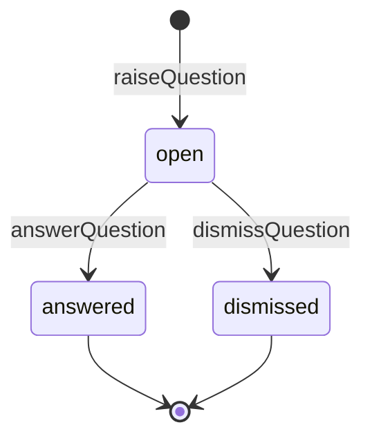

# 集約: Question(Inbox)

## メタ
- 親: [s5/index.md](./index.md)
- 対応 US: [US-12](../s1/us-12-answer-question.md), [US-13](../s1/us-13-visual-review-step.md), [US-14](../s1/us-14-backtrack-ai-initiated.md), [US-15](../s1/us-15-backtrack-human-initiated.md), [US-16](../s1/us-16-device-check.md), [US-31](../s1/us-31-notification.md)
- 所属 Unit: [Unit-03](../s3/unit-03-human-inbox.md)
- ステータス: 確定
- MVP: ◎(US-12 質問回答 / US-13 視覚レビュー)

> **旧称 HumanTask**。Task(開発要求)との衝突を避けるため **Question** に改名(Q-02)。Question = AI→人間への問い(依頼)カード。製品の魂 = この単一 Inbox。

## モデル定義 (DDD 採用)

**集約ルート**: `Question`(AI→人間の全依頼を kind で吸収する単一型)

```
Question (集約ルート)
 ├─ id: QuestionId
 ├─ runId: RunId              // 由来の Run(Cycle 集約は ID 参照)
 ├─ cycleId: CycleId          // どの Cycle の問いか(Inbox 横断表示・Facts 記録用)
 ├─ taskId: TaskId?           // 対象 Task(visual_review は Task 単位で出す)。null=Cycle 単位(S4/S5 等)
 ├─ kind: QuestionKind        // VO: question|visual_review|device_check|decision|backtrack|stall_retry
 ├─ state: QuestionState      // open | answered | dismissed
 ├─ payload: QuestionPayload  // kind 別の中身(visual_review は対応 Result(taskId 一致)を含む)
 └─ createdAt: Instant

Answer (値オブジェクト / 入力)
 ├─ verdict: Verdict          // approve | reject | answer | confirm
 ├─ body: Text?               // answer 時の回答本文
 ├─ backtrackTo: Step?        // reject(手戻り)時の戻り先
 └─ reason: Text?             // reject / backtrack の理由
```

### 値オブジェクト
- `QuestionKind`: `question | visual_review | device_check | decision | backtrack | stall_retry`(S3 確定の 6 種)。
- `QuestionState`: `open | answered | dismissed`。`open` のみ応答可能。
- `Verdict`: `approve | reject | answer | confirm`([facts.md](./facts.md) と共有)。
- `QuestionPayload`: kind 依存(question=問い文 / visual_review=`Result`([result.md](./result.md))/ stall_retry=stall 情報 等)。

## 操作

| 操作 | 入力 | 出力 / 効果 | エラー |
|------|------|------|--------|
| raiseQuestion | { runId, cycleId, taskId?, kind, payload } | Question(open) を 1 枚生成(`QuestionRaised` 受信時)。visual_review は Task ごとに 1 枚 | — |
| listInbox | { filter?: kind\|state } | Question[](全 Cycle 横断) | — |
| openQuestion | { questionId } | Question(+ visual_review なら Result) | QuestionNotFound |
| answerQuestion | { questionId, answer:Answer } | state→answered + Fact 1 件 append + Unit-02 へ resume/retry/cancel | QuestionClosed / InvalidVerdict / EmptyReason |
| dismissQuestion | { questionId } | state→dismissed(応答不要で閉じる) | QuestionClosed |

> `answerQuestion` は use-case interactor(application 層)で「Question close + Fact append + Unit-02 コマンド」を 1 トランザクションに束ねる(D-02)。

### 画面ルーティング(S2 確定を踏襲)
- `listInbox`(SCR-03 ハブ)→ `openQuestion`。**kind=question → SCR-05** / **kind=visual_review → SCR-04**(Result 同梱)。

### kind × verdict 整合(INV-2 の具体表)
| kind | 許可 verdict | 効果 |
|------|------|------|
| question | answer | `resumeRun`(回答注入で同 Run 継続) |
| visual_review | approve / reject | **Task 単位**(taskId)。approve→該当 Task 分のレビュー承認 / reject→`backtrackTo`(reason 必須)。Phase は全 Task 承認で `approvePhase` |
| device_check | confirm / reject | 実機確認結果を記録 |
| decision | approve / reject | AI の自律判断(D)の承認 / 却下 |
| backtrack | approve / reject | approve→`backtrackTo`(AI 起点の手戻り提案を承認) |
| stall_retry | approve / reject | approve→`retryLaunch`(新 Run)/ reject→`cancelRun` |

## 状態遷移



## 不変条件
- **INV-1**: 応答可能なのは `open` のみ。`answered`/`dismissed` への再応答は QuestionClosed。閉じた Question は不変。
- **INV-2**: `verdict` は `kind` と整合していること(上表)。不整合は InvalidVerdict。
- **INV-3**: `reject` で `backtrackTo` を伴う場合 `reason` 必須(EmptyReason)。
- **INV-4**: `answerQuestion` 成功時は**必ず Fact を 1 件 append**する(US-17 の履歴保証)。Question close と Fact append は原子的に(use-case interactor で調停)。
- **INV-5**: Question は Cycle/Run を **ID 参照**で持つ(Cycle 集約の状態を直接書き換えない。状態遷移は Cycle 集約の操作 `approvePhase`/`backtrackTo` 経由で呼ぶ)。
- **INV-6(導出)**: 「Cycle が人間待ちか」は **その Run を指す open な Question が存在するか**で判定する(index D-01)。Question は Cycle の状態を複製しない。
- **INV-7(レビューは Task 単位)**: `visual_review` の Question は **Task ごとに 1 枚**(`taskId`)。1 Run の成果は Task 分の Result に分解され、各 Task の妥当性を要求に照らして個別レビューする(ユーザー指摘)。Task に割れないアーキ成果(S4/S5)のみ taskId=null(Cycle 単位 1 枚)。

## この集約固有の 質疑応答ログ

### Q-01 — 手戻り 2 経路(AI 起点 kind=backtrack / 人間起点 requestBacktrack)を 1 処理に集約でよいか?
- 観点: S3 Q-02 確定の踏襲。AI 起点(emit された backtrack カードを `answerQuestion(approve)`)も人間起点(Inbox から直接 `requestBacktrack`)も、最終的に `Cycle.backtrackTo` + Fact append に集約する。入口が違うだけで処理は同一、という S5 モデルでよいか。
- **回答**(ユーザー記入):
  > 1 処理に集約
- **確定**(AI 記入):
  > **1 処理に集約で確定**。AI 起点(backtrack カード承認)/ 人間起点(requestBacktrack)とも入口が違うだけで、処理は `Cycle.backtrackTo`(戻り先 step を running・後続を pending)+ Fact append に一本化(use-case interactor で調停)。S3 Q-02 と一貫。

### Q-02 — 視覚レビュー Question を Task 単位で出す(taskId 付与)でよいか?
- 観点: ユーザー指摘「レビューはタスクに対してでないと成果物の妥当性として微妙」。1 Run(Phase 実行は Cycle 単位)の成果を Task ごとの Result に分解し、`visual_review` Question を **Task 単位で 1 枚ずつ**出す(= 「Q はタスク単位」とも一致)。アーキ成果(S4/S5)は taskId=null。この形でよいか。
- **回答**(ユーザー記入):
  > レビューはタスクに対してじゃないと成果物の妥当性として微妙(Task 単位で出す方針に合意)
- **確定**(AI 記入):
  > **Task 単位の視覚レビューで確定**。Question に `taskId` を付与し、visual_review は Task ごとに 1 枚。Phase は **その Run の全 Task レビューが承認**されて `approvePhase`(cycle.md INV 反映)。reject は該当 Task の `backtrackTo`(reason 必須)。アーキ成果のみ Cycle 単位。

---

## この集約固有の AI が独自に決めたこと と 理由

### D-01 — 全依頼を単一 Question 型(kind 違い)に統一(旧 HumanTask D-01 踏襲)
- **理由**: brief「製品の魂 = Human Inbox」。Q/レビュー/実機/承認/手戻り/retry を別 entity にすると Inbox が分裂し「次に何を捌くか」が 1 か所で見えなくなる。kind フィールドで吸収し、1 待ち行列・1 応答 I/F(`answerQuestion`)に統一。kind の差は payload と verdict 整合表で吸収。
- **判断**(ユーザー記入): 承認(Q-01 確定 + Q-02 改名で踏襲)
- **上書き内容**(上書き時のみ):

### D-02 — answerQuestion を「Question close + Fact append + Unit-02 コマンド」の use-case interactor に
- **理由**: 回答は必ず ① カードを閉じ ② 判断を確定事項(Fact)として履歴化し ③ AI を再開/再試行/中止させる、の 3 つを伴う。クリーンアーキの use-case interactor で 1 操作に束ねると、回答したのに Fact が残らない/AI が再開しない、という不整合を防げる。集約は Question(close)と Fact(append)で別 = 2 集約更新を 1 ユースケースで調停。
- **判断**(ユーザー記入): 承認(Q-01 確定 + Q-02 改名で踏襲)
- **上書き内容**(上書き時のみ):

---

## この集約固有の 棄却した案

### R-01 — kind ごとに別 Inbox(Q箱 / レビュー箱)に分ける(S3 R-01 踏襲)
- **棄却理由**: 人間は「次に何を捌くか」を 1 か所で見たい。kind は表示フィルタで足り、箱の分割は UX を悪化させ製品の魂(単一 Inbox)に反する。

### R-02 — Question を Cycle 集約の状態フィールドに畳む
- **棄却理由**: フォローQでユーザーが「別集約に保つ」を選択。Inbox は全 Cycle 横断の人間作業キューで Dashboard の主投影。Cycle に畳むと横断一覧が別投影で必要になる。別集約に保ち、Cycle の待ちは open Question から導出(INV-6 / index D-01)。
