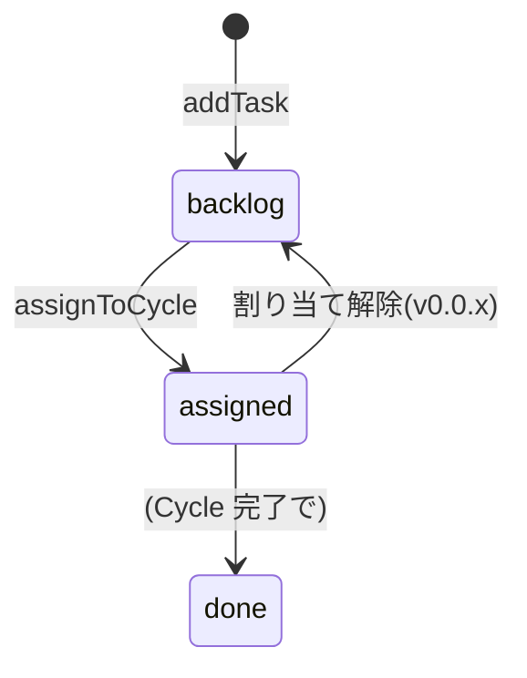

# 集約: Backlog(Task)

## メタ
- 親: [s5/index.md](./index.md)
- 対応 US: [US-01](../s1/us-01-backlog-add-task.md), [US-02](../s1/us-02-task-reorder.md), [US-03](../s1/us-03-task-assign-cycle.md), [US-04](../s1/us-04-ai-suggest-assignment.md), [US-23](../s1/us-23-ai-propose-task.md), [US-24](../s1/us-24-ai-validate-task.md)
- 所属 Unit: [Unit-06](../s3/unit-06-backlog-task.md)
- ステータス: 確定
- MVP: —(v0.0.x)

> 用語注意: **Task = 開発要求(Backlog の中身)**。AI→人間の問いは **Question**(旧 HumanTask、[question.md](./question.md))で別概念(Q-02 改名)。

## モデル定義 (DDD 採用)

**集約ルート**: `Task`(開発要求)/ 別集約: `TaskProposal` / `ValidationFinding`(AI 出力は人間 accept 前提で Task と分離)

```
Task (集約ルート)
 ├─ id: TaskId
 ├─ projectId: ProjectId      // 属する Project(コンテキストルート)
 ├─ title: NonEmptyText
 ├─ body: Text
 ├─ kind: TaskKindCategory    // S2 引き継ぎの Task 種別
 ├─ priority: Ordinal         // Backlog 内の明示順序
 ├─ state: TaskState          // backlog | assigned | done
 ├─ assignedCycleId: CycleId? // assigned 時のみ
 └─ createdAt: Instant

TaskProposal (別集約 / AI 起案・割り当て案)
 ├─ id: ProposalId
 ├─ source: ai | human
 ├─ title, body, rationale
 └─ state: pending | accepted | rejected

ValidationFinding (別集約 / 妥当性指摘)
 ├─ taskId: TaskId
 ├─ kind: duplicate | stale
 ├─ note: Text
 └─ relatedTaskId: TaskId?
```

## 操作

| 操作 | 入力 | 出力 / 効果 | エラー |
|------|------|------|--------|
| addTask | { projectId, title, body, kind } | Task(backlog)+ 重複検知発火 | EmptyTitle |
| reorderTasks | { orderedIds[] } | Task[](priority 更新) | UnknownTaskId |
| assignToCycle | { taskIds[], cycleId } | Task[](assigned) | TaskAlreadyAssigned |
| suggestAssignment | { } | TaskProposal[](AI 束ね案) | — |
| proposeTask | { } | TaskProposal(AI 起案) | — |
| validateTasks | { } | ValidationFinding[](重複/陳腐化) | — |
| acceptProposal / rejectProposal | { proposalId } | Task(accept で生成)or void | ProposalClosed |

### 妥当性確認の発火(S3 確定)
- **重複検知 = 起票時**(`addTask` 直後)/ **陳腐化検知 = Cycle 作成時**。人間手動の `validateTasks` も可。

## 状態遷移(Task)



## 不変条件
- **INV-1**: `title` は空不可(EmptyTitle)。Task は 1 つの Project に属す(projectId 必須)。
- **INV-2**: `assignToCycle` は `state=backlog` の Task のみ(TaskAlreadyAssigned)。二重割り当て禁止。
- **INV-3**: `priority` は Backlog 内の**全順序**(reorder で再採番)。
- **INV-4**: Task は**単体で実行を開始しない**。実行は必ず `assignToCycle` → Cycle 集約経由(S1 R-01 / Cycle が実行単位)。
- **INV-5**: AI 出力(TaskProposal / ValidationFinding)は**直接 Task にならない**。`acceptProposal` で人間が承認して初めて Task 化(生成=AI / 判断=人間。粒度ゲーミング #3 予防)。

## この集約固有の 質疑応答ログ

### Q-01 — TaskProposal / ValidationFinding を Task と別集約にする境界でよいか?
- 観点: AI の起案・妥当性指摘は「人間が accept するまで Task ではない」中間状態。Task(確定した要求)と整合性ルールが違うため別集約に切り、accept で Task を生成する。この分離でよいか(S3 D-01 を集約境界として昇格)。
- **回答**(ユーザー記入):
  > 別集約 + accept ゲート
- **確定**(AI 記入):
  > **別集約 + accept ゲートで確定**。AI 出力は TaskProposal / ValidationFinding に留め、`acceptProposal` で人間承認して初めて Task 化。「生成=AI / 判断=人間」を型で強制し、Backlog の AI 起案膨張(粒度ゲーミング #3)を防ぐ。

---

## この集約固有の AI が独自に決めたこと と 理由

### D-01 — AI 提案を proposal/finding に隔離し accept ゲートを必須に(S3 D-01 踏襲)
- **理由**: kit 基本姿勢「判断は人間、生成は AI」。AI 出力を直接 Task 化すると Backlog が AI 起案で膨張し粒度ゲーミング(#3)を招く。proposal/finding を別集約にして人間 accept を通す。
- **判断**(ユーザー記入): 承認(Q-01 確定に同梱)
- **上書き内容**(上書き時のみ):

---

## この集約固有の 棄却した案

### R-01 — Task を Cycle に内包し Backlog を持たない(S3 R-01 踏襲)
- **棄却理由**: Backlog(溜める)と Cycle(実行で束ねる)は別ライフサイクル。US-01/02 が Backlog 操作(積む・並べ替え)を要求する。分離する。
