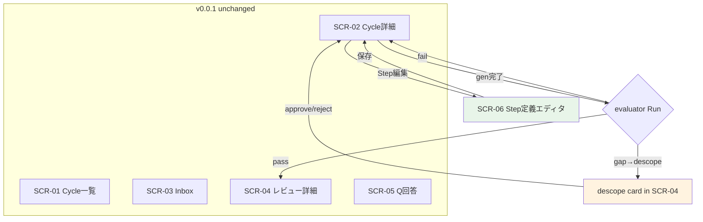

# S2 — 画面モック / フロー(一覧) — v0.0.2

## メタ
- 工程: S2 (Mock / Flow)
- 役割: プロダクトデザイナー
- ステータス: 確定
- 入力参照: [v0.0.2/s1/index.md](../s1/index.md) / [v0.0.1/s2/index.md](../../v0.0.1/s2/index.md)
- 作成日: 2026-06-10
- 更新日: 2026-06-10

> v0.0.1 の 5 画面(SCR-01〜05)を引き継ぎ、v0.0.2 スコープに必要な拡張と新規画面を定義する。

## v0.0.2 画面インベントリ

| SCR | 画面 | 対応 US | v0.0.2 変更 | 役割 |
|-----|------|---------|------------|------|
| SCR-02 | Cycle 詳細・実行 | US-07 | **拡張** | Phase pipeline に evaluator Run 表示(gen→eval の2段) / deterministic gate / completeness gate の状態表示 |
| SCR-04 | レビュー詳細 | US-13,18 | **拡張** | evaluator pass バッジ / 新 block 型(completeness table, impact table, bugfix dossier, descope card, video embed)の描画 / descope approve-reject 操作 |
| SCR-06 | Step 定義エディタ | US-27 | **新規** | StepDef の契約フィールド(Output/Verification/HumanGate/Escalation)をフォーム編集 / 成果物 Profile 表示 / パイプライン並べ替え |

- SCR-01/03/05 は v0.0.2 で変更なし。
- SCR-02/04 の **基本レイアウトは v0.0.1 から維持**。拡張部分のみ追記。

## 画面フロー(v0.0.2 追加分)



## 各画面の v0.0.2 差分

### SCR-02 拡張: gen→eval ループ表示

Phase pipeline の各 step 行に Run 情報を追加:

```
┌─ Phase Pipeline ─────────────────────────────┐
│ S5  ✓ done   [gen ✓] [eval ✓]              │
│ S6  ▶ review [gen ✓] [eval ✓] ← pass       │
│ S7  ● running [gen ●]                       │  ← gen 実行中
│     (deterministic gate: — / eval: pending) │
└──────────────────────────────────────────────┘
```

- 各 Run 行に `role: generator | evaluator` を表示
- deterministic gate の結果(✓ pass / ✗ fail → gen 差し戻し)
- completeness gate の結果(gaps: 0 / gaps: N → descope 発火)

### SCR-04 拡張: リッチ描画 + evaluator 情報

レビュー詳細に新 block 描画を追加:

- **evaluator verdict badge**: ヘッダに「AI evaluator: PASS ✓」バッジ
- **completeness table**: requirements 一覧 ↔ addressed ○/✗ の表形式
- **impact table**: 影響あり / 影響なし確認済 / 未確認(空=証明完了)の3段
- **bugfix dossier**: 原因(直接+根本) / 修正 / 再発防止の構造化表示
- **descope card**: 理由/影響/代替案をカード化し approve/reject ボタン
- **video embed**: before/after の動画プレイヤー枠(中身は v0.0.3)

### SCR-06 新規: Step 定義エディタ

```
┌─ Step 定義エディタ ─────────────────────────┐
│                                              │
│ パイプライン:                                 │
│ ┌───┬──────┬──────┬──────┬──────┬─────┐      │
│ │ # │ Step │ Output│ Gate │ Esc  │ ... │      │
│ ├───┼──────┼──────┼──────┼──────┼─────┤      │
│ │ 1 │ S1   │ ▸    │ ▸    │ ▸    │     │      │
│ │ 2 │ S2   │ ▸    │ ▸    │ ▸    │     │      │
│ └───┴──────┴──────┴──────┴──────┴─────┘      │
│                                              │
│ ── S2 詳細 ──────────────────────────────     │
│ Output:  profile: [step-deliverable ▾]       │
│          artifactPaths: (省略時=既定)         │
│ Verification: completenessGate: [✓]          │
│ HumanGate:   humanReview: [visual ▾]         │
│ Escalation:  onGap: [descope ▾]              │
│ ExecMode:    [single ▾]                      │
│                                              │
│ 成果物 Profile (step-deliverable):            │
│ 必須 blocks: summary, decision, completeness, │
│              impact, pointer, handoff         │
│                                              │
│              [保存] [キャンセル]               │
└──────────────────────────────────────────────┘
```

## 次工程 (S2.5 / S3) への引き継ぎ
- **S2.5**: SCR-06 のフォーム UI 詳細(契約フィールドの型ごとにコンボボックス/チェックボックス等) / SCR-04 の新 block 描画の視覚表現
- **S3 新規 Unit**: Step 定義 CRUD(US-27) / evaluator engine(US-07 拡張) / rich block renderer(US-18)
