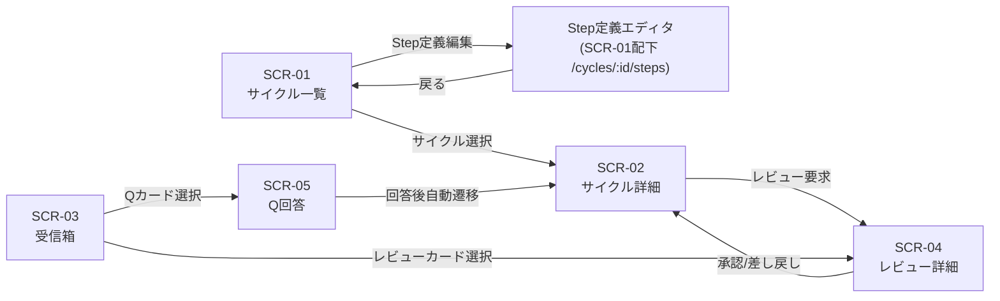
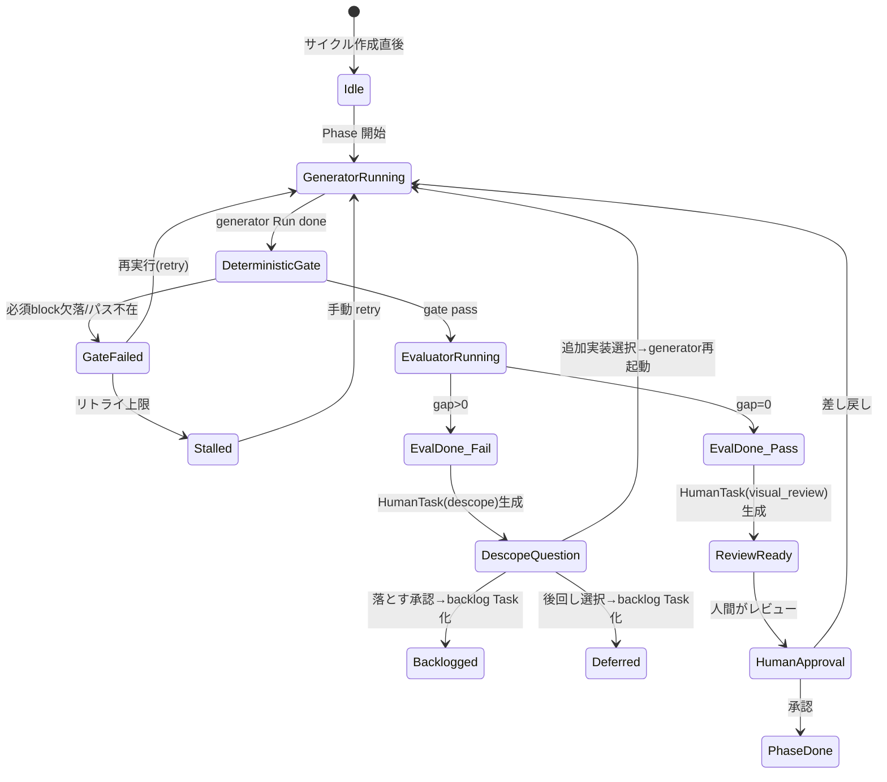
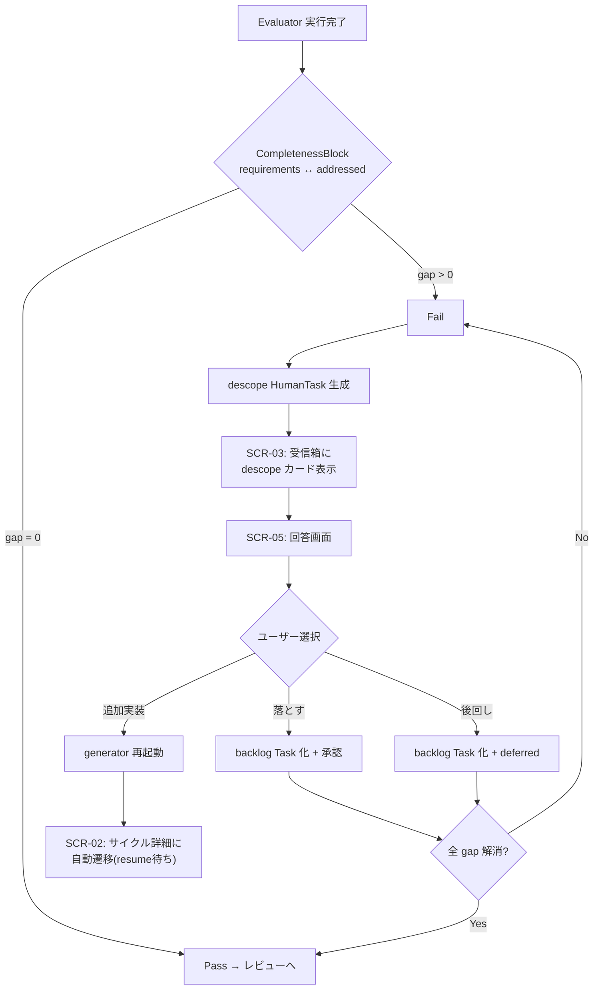

# S2 — 画面モック / フロー(全体) — v0.0.2

## メタ
- 工程: S2 Wireframe (Discovery)
- PhaseGroup: Discovery
- 役割: プロダクトデザイナー
- ステータス: 確定(S3 反映で更新 2026-06-11)
- 入力参照: [s1/index.md](../s1/index.md) / [scope.md](../scope.md)
- 作成日: 2026-06-10
- 更新日: 2026-06-11

> **S3 からの反映(手戻り)**: ①**「設定 > デフォルトのステップ構成」surface が情報構造に無かった**(S3 で判明)→ 下記に追加。②Step 定義の編集は SCR-01 配下から **設定(全サイクル共通テンプレ)** へ移動し、編集方式を **対話式**に変更。③**descope モデルを精緻化**(理由なし gap は自動差し戻し / AI の理由付き申請のみ人間に届く / 「前のステップからやり直す」追加)。④判断はサイクル側、受信箱はお知らせ一覧に。詳細は [s3/index.md](../s3/index.md)。

## 画面一覧

v0.0.2 は **v0.0.1 の既存画面(SCR-01〜05)の拡張** が中心。新規画面は追加しない。

| SCR | タイトル | 変更種別 | 対応 US | 概要 |
|-----|---------|---------|---------|------|
| SCR-01 | サイクル一覧 | **更新** | US-06 | Step定義エディタ(未開始サイクルのみ編集可) |
| SCR-02 | サイクル詳細 | **更新** | US-02 | gen/eval パイプライン可視化 |
| SCR-03 | 受信箱 | **更新** | US-03, US-08 | descope カード種別(全件表示) + Q 選択肢プレビュー |
| SCR-04 | レビュー詳細 | **更新** | US-07 | リッチ描画(completeness/impact/dossier/descope/video/screenshot) |
| SCR-05 | Q回答画面 | **更新** | US-03, US-08 | ハイブリッド入力(選択肢+推奨+補足コメント+自由入力) + descope バリアント |

- [SCR-01: サイクル一覧(更新)](./scr-01-cycle-list.md)
- [SCR-02: サイクル詳細(更新)](./scr-02-cycle-detail.md)
- [SCR-03: 受信箱(更新)](./scr-03-inbox.md)
- [SCR-04: レビュー詳細(更新)](./scr-04-review-detail.md)
- [SCR-05: Q回答画面(更新)](./scr-05-q-answer.md)

### ★ 新規 surface(S3 で判明)

| surface | 配置 | 内容 |
|---------|------|------|
| 設定 > デフォルトのステップ構成 | サイドバー「設定」配下(独立 SCR 番号は振らない) | 全サイクル共通のステップひな形を **対話式**(AI 提案 → プレビュー → 承認)で編集。新規サイクルはこれを複製。各ステップは「要約(人間向け)↔ 全文(AI 実行用)」の2層 |

> S2 初版では Step 定義編集を SCR-01 配下に置いたが、S3 で「**今後のデフォルト**を編集する常設導線が無い」と判明。設定に移し、サイクル側(SCR-01)は確認中心の控えめ導線とする。

## 画面遷移フロー

### v0.0.2 で追加・変更される遷移

| 遷移 | 変更 | トリガー |
|------|------|---------|
| SCR-01 ↔ Step定義エディタ | **新** | 未開始サイクルの Step定義編集(専用ビューに画面遷移 /cycles/:id/steps) |
| SCR-03 → SCR-05 | **新パターン** | descope カード(Q種別)からの遷移 |
| SCR-05 → SCR-02 | **新** | Q回答後の resume 待ち状態で自動遷移 |

## gen→eval パイプライン状態フロー (US-02)

AI の実行パイプラインの状態遷移。SCR-02 の Run Panel に反映される。

### Run Panel に表示する状態一覧

| UI 表示名 | 内部状態 | アクション | 備考 |
|-----------|---------|-----------|------|
| 未起動 | Idle | 「Phase 開始」ボタン | v0.0.1 と同じ |
| Generator 実行中 | GeneratorRunning | ログストリーム表示 | role バッジ「GEN」を表示 |
| 自動チェック中 | DeterministicGate | プログレス表示 | AI非依存の機械的検査 |
| チェック失敗 | GateFailed | 「再実行」ボタン + 失敗理由 | v0.0.2 新規状態 |
| Evaluator 実行中 | EvaluatorRunning | ログストリーム表示 | role バッジ「EVAL」を表示 |
| レビュー可能 | ReviewReady | 「レビュー」ボタン | v0.0.1 と同じ |
| 要対応(gap検出) | EvalDone_Fail | descope カードへ誘導 | v0.0.2 新規状態 |
| Phase 完了 | PhaseDone | 次 Phase へ | v0.0.1 と同じ |

## Completeness Gate → Descope 制御フロー (US-03)

gap が検出された時の人間承認フロー。

### descope(見送り)の選択肢 — S3 反映で更新

> **発火条件の変更**: 上のフロー図は「gap → 必ず人間に判断」を描くが、S3 で **「理由なしの gap は AI が自動で差し戻し(再実行)/ AI が理由つきで見送りを申請したときだけ人間に届く」** に精緻化。下表は AI 申請に対する人間の選択肢。判断はサイクル側で行い、受信箱はお知らせ一覧。

| 選択肢 | ラベル | 結果 |
|--------|--------|------|
| A | 「やっぱり今回つくってもらう」 | generator 再起動(差し戻し) |
| B | 「今回は見送る(次のバージョンへ)」 | backlog Task 化(不可逆のため確認あり) |
| C | 「前のステップからやり直す」 | AI が原因をたどり推奨ステップ + 理由を提示。選んだステップから再開 |
| D | 「その他(自由入力)」 | 自由指示(入力欄は1個) |

## Biz との合意事項

| # | 論点 | 合意内容 |
|---|------|---------|
| 1 | Step定義エディタの配置 | SCR-01(サイクル一覧)に配置。未開始サイクルのみ編集可。開始後は読み取り専用(S2 Q-01 で確定) |
| 2 | Step定義のスコープ | ステップごとに独立(ステップは可変、S1-S7とは限らない)(S2 Q-01 で確定) |
| 3 | gen/eval パイプラインの可視化粒度 | Run Panel に role バッジ(GEN/EVAL)と状態名を追加。deterministic gate は短時間なのでプログレス表示のみ |
| 4 | deterministic gate 失敗の通知 | Run Panel 表示 + HumanTask(stall_retry)も受信箱に出す(S2 Q-02 で確定) |
| 5 | descope カードの表示 | gap 全件をカード上に表示(S2 Q-03 で確定) |
| 6 | リッチ描画の情報優先度 | 1.completeness table 2.bugfix dossier 3.screenshot 証拠(S1 Q-03 で確定) |
| 7 | Q回答の入力形式 | ハイブリッド(選択肢+推奨マーク+補足コメント+自由入力)(S1 Q-04 + S2 Q-04 で確定) |
| 8 | SCR-04 の descope card | descope は SCR-05 で完結するが、evaluator からの descope 提案もありうるので残す(S2 Q-05 で確定) |
| 9 | descope の hard gate | gap>0 は必ず fail。人間承認なしに先に進まない(US-03 D-02) |

## US 漏れ・齟齬の検知ログ

| # | 検知内容 | 戻り | 解決方針 |
|---|---------|-------------|---------|
| 1 | 「今後のデフォルトのステップ構成」を編集する常設導線が情報構造に無かった | S2(本書)+ S1 US-06 | 「設定 > デフォルトのステップ構成」surface を新設(対話式編集 / 2層保持)。S3 で判明・反映済 |
| 2 | descope を「gap → 必ず人間判断」と単純化していた | S1 US-03 | 理由なし gap は自動差し戻し / AI の理由付き申請のみ人間に。「前のステップからやり直す」追加。S3 で判明・反映済 |
| 3 | 原因・影響を内部コード/ファイル名前提で描く想定だった | S1 US-07 | 振る舞いベース(機能名 + 高/中/低)に。想定ユーザーは PJ ソース非依存。S3 で判明・反映済 |

## 全体 質疑応答ログ (画面横断・フロー全体の議論)

### Q-01 — Step定義エディタの配置と編集タイミングは？
- **回答**(ユーザー記入):
  > サイクル一覧画面から編集したいサイクルを選ぶ。サイクルが始まったあとはステップ定義編集不可。
- **確定**(AI 記入):
  > Step定義エディタは SCR-01(サイクル一覧)に配置。未開始サイクルのみ編集可能。開始後は読み取り専用。D-01 を上書き。

### Q-02 — deterministic gate 失敗時、人間への通知方法は？
- **回答**(ユーザー記入):
  > HumanTask も出す。
- **確定**(AI 記入):
  > gate 失敗は Run Panel 表示に加え、HumanTask(stall_retry)を受信箱にも出す。二重通知で確実に気付ける。

### Q-03 — descope カードのプレビュー粒度は？
- **回答**(ユーザー記入):
  > 全件表示。
- **確定**(AI 記入):
  > gap の全要件をカード上に列挙。SCR-03 D-02 の「最大3件」を上書き。

---

## 全体 AI が独自に決めたこと と 理由

### D-01 — Step定義エディタを SCR-01(サイクル一覧)に配置する
- **理由**: Step定義はサイクル開始前に決めるもの。開始後は変更不可。したがってサイクル詳細(SCR-02)ではなく、サイクル一覧(SCR-01)で未開始サイクルの Step 定義を編集するのが自然。
- **判断**(ユーザー記入): 承認(元の SCR-02 配置から上書き)
- **上書き内容**: SCR-01 に配置。未開始のみ編集可。開始後は読み取り専用。

### D-02 — SCR-02 の PhasePipeline に gen/eval role バッジを追加する
- **理由**: generator と evaluator の2つの Run が連続して実行されるため、ユーザーが「いまどちらが動いているか」を即座に判別できる必要がある。PhasePipeline のノードに role バッジ(GEN/EVAL)を小さく表示する。
- **判断**(ユーザー記入): 承認

### D-03 — descope カードを SCR-05(回答画面)のバリアントとして扱う
- **理由**: descope 選択は「Q に回答する」の特殊ケース。選択肢(AI提示) + 自由入力の UI 構造は Q回答と同じ。SCR-05 の kind バリアントとして実装し、新規画面を作らない。
- **判断**(ユーザー記入): 承認

---

## 棄却した画面案

### R-01 — SCR-NEW: Step定義専用画面 / 設定画面
- **棄却理由**: Step定義は SCR-01(サイクル一覧)に配置(D-01 上書き)。独立画面は画面遷移を増やすだけ。

### R-02 — SCR-NEW: Descope 専用承認画面
- **棄却理由**: descope 選択は Q回答の特殊ケース。SCR-05 の kind バリアントで十分(D-03)。

### R-03 — SCR-NEW: パイプライン状態ダッシュボード
- **棄却理由**: gen/eval パイプラインの状態は SCR-02 の Run Panel で表示可能。独立ダッシュボードは v0.0.x で検討。

## 次工程 (S3) への引き継ぎ
- UI 設計で考慮すべき画面・フロー境界:
  - SCR-01 の Step定義エディタ: フォームレイアウトとバリデーション(4契約タイプ + execMode トグル)。未開始サイクルのみ編集可、開始後は読み取り専用の出し分け
  - SCR-02 の gen/eval パイプライン: role バッジ(GEN/EVAL)+ 新規 Run Panel 状態(DeterministicGate/GateFailed/EvalDone_Fail)
  - SCR-04 のリッチ描画: block 種別ごとのコンポーネント設計(completeness/impact/dossier/descope/video/screenshot)
  - SCR-05 のハイブリッド入力: 選択肢カード + 推奨マーク + 補足コメント + 自由入力の切り替え UX + descope バリアント
- 外部 I/F(認証、決済、通知など)が出てくる画面: なし(v0.0.2 スコープ外)

## 前サイクルからの引き継ぎ
- 何が漏れていたか: v0.0.2 の旧 S2 ドキュメントが v2 メソッドリファクタで全削除された。旧 S2.5(UI デザイン)も旧ステップモデルに基づく。
- 暫定の解決方針: v2 メソッドで S2 から完全に再作成。旧ドキュメントの内容は scope.md に集約済。
- 棄却した案とその理由: 旧ドキュメントの変換再利用 → メソッド構造が根本的に変わったため再作成が合理的。
