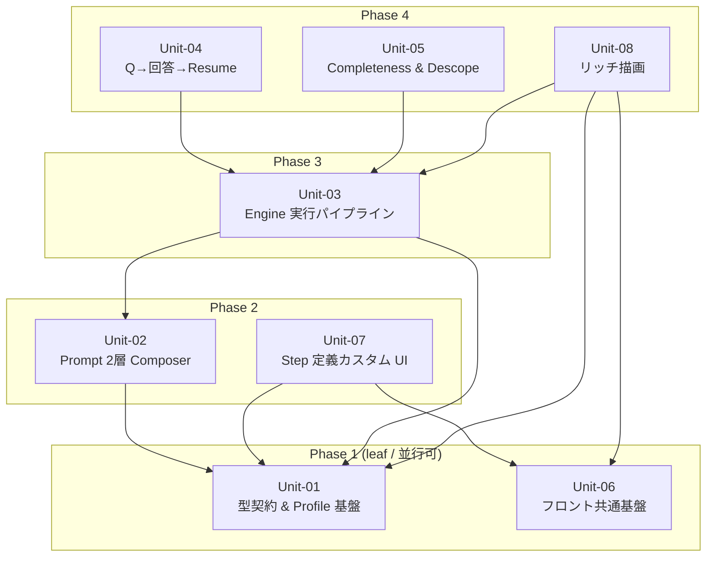

# S5 — Work Units (Unit 分割 + 依存マップ) — v0.0.2

## メタ
- 工程: S5 (Work Units)
- PhaseGroup: Build(起点)
- 役割: ソフトウェアアーキテクト
- バージョン: v0.0.2
- ステータス: 確定
- 入力参照: [s1/index.md](../s1/index.md)(US-01〜09) / [s2/index.md](../s2/index.md) / [s3/index.md](../s3/index.md) / [s4-tech-spec.md](../s4-tech-spec.md) / [scope.md](../scope.md) / [brief.md](../brief.md)
- 作成日: 2026-06-11
- 更新日: 2026-06-11

## アーキテクチャ前提
- スタック: **確定済み(S4 §1)**。Bun / Hono / SQLite(`bun:sqlite`)/ React+Vite / Playwright / TypeScript(branded type + 自前 `Result<T,E>`)/ Hexagonal(ports/adapters)+ event-sourced。**v0.0.2 で新規 runtime 依存なし**。
- 既存資産・制約:
  - `domain/`(純粋)= `project/` `cycle/` `review/` `task/` `question/` `events/` ほか。
  - `app/ports/` = `orchestrator.ts`(`OrchestratorPort` + `DomainEventSink`)/ `repos.ts` / `sys.ts` / `notify.ts` / `unit-of-work.ts` / `composition.ts`。
  - `app/services/` = `project-service.ts`(`defaultPipeline`/`customizePipeline`)/ `cycle-service.ts` / `inbox-service.ts` ほか。
  - `infra/orchestrator/` = `scripted.ts`(決定論)+ `live.ts`(local Claude CLI)+ `shared.ts`。**adapter は DB を書かず `DomainEventSink` に emit**(S7 D-04)。
  - `web/` = features 単位(`cycles/` `inbox/` `cycle-detail/` `review/`)。`ReviewBlock` union と `ReviewBlocks.tsx` が既存。
- 想定デプロイ形態: モノリス(ローカル常駐)+ SPA + API。シングルユーザー固定。
- **後方互換が最優先**: v0.0.1 の 155 tests を回帰ゲートにする。追加フィールドは全 optional。

## I/F 決定方針
- 採用: **(b) AI 事前調査**
- 理由: S4(技術仕様)で v0.0.2 差分の技術契約・拡張点・不変条件が既に確定済み。本 S5 はそれを実コード(`orchestrator.ts` / `project.ts` / `cycle.ts` / `review.ts` / `project-service.ts`)と突き合わせて Unit の I/F に翻訳した。新規の I/F 発明はせず、既存ポート/型の **拡張点**として定義する。

## Unit 一覧
- [Unit-01 型契約 & Profile レジストリ基盤](./unit-01-contract-profile-foundation.md) — US-01, US-05
- [Unit-02 Prompt 2層 Composer](./unit-02-prompt-composer.md) — US-04
- [Unit-03 Engine 実行パイプライン(gen→gate→eval)](./unit-03-engine-pipeline.md) — US-02
- [Unit-04 対話型 Q→回答→Resume](./unit-04-qa-resume-loop.md) — US-08
- [Unit-05 Completeness Gate & Descope ポリシー](./unit-05-completeness-descope.md) — US-03
- [Unit-06 フロントエンド共通基盤](./unit-06-frontend-foundation.md) — US-09
- [Unit-07 Step 定義カスタム UI](./unit-07-step-custom-ui.md) — US-06
- [Unit-08 Evaluator 成果物リッチ描画](./unit-08-rich-rendering.md) — US-07

## 依存 DAG (Unit 間依存方向 / Phase レイアウト)

**読み方**:
- 矢印は **依存方向**(`A --> B` = A は B を呼ぶ / A は B が無いと動かない)。
- **上から下に読めば着手順**(上の Phase ほど先に作る)。Phase 内の Unit は並行に着手できる。
- 矢印はすべて **下から上(または同 Phase 内)向き** = 依存先は必ず自分より上の Phase = 先に作られている。**矢印が上から下に伸びていたら循環の疑い**。

## 凡例
- **角括弧 `[X]`**: Unit(本ステップで定義した自前 Unit のみ)
- **実線矢印 `-->`**: 依存方向(`A --> B` は「A は B を呼ぶ / A は B が無いと動かない」)
- **点線矢印 `-.->`**: 弱い依存(イベント駆動・非同期)。本図では未使用(v0.0.2 は同期パイプライン)。
- **subgraph**: **Phase = 実装順の段**のみを表現(Phase 1 = leaf = 最初に着手、Phase 4 = 最後)。物理境界(domain/app/infra/web のレイヤ、プロセス、Docker、プロトコル)を表す subgraph は使わない(レイヤは各 Unit ファイルの「責務」に記す)。

**意図的に使わない記号**: 円柱 `[(X)]`(永続化)/ 六角 `{{X}}`(外部サービス)/ 矢印太さによるプロトコル区別 → S5 では描かない(S6 / S8 の領域)。

## 着手順テーブル (Phase subgraph と一対一対応)

| Phase | 着手可能な Unit | 理由 |
|-------|----------------|------|
| Phase 1(leaf) | Unit-01, Unit-06 | 他 Unit に依存しない。Unit-01 = 純粋 domain 型基盤 / Unit-06 = 既存 web の純粋リファクタ |
| Phase 2 | Unit-02, Unit-07 | Unit-02 は型基盤(01)があれば Composer を組める / Unit-07 は型基盤(01)+ フロント共通(06)が揃えば編集 UI を作れる |
| Phase 3 | Unit-03 | Composer(02)と型基盤(01)が揃って初めて gen→gate→eval パイプラインが組める |
| Phase 4 | Unit-04, Unit-05, Unit-08 | いずれも Engine(03)の往復実行と BriefOut を前提とする後続機能 |

**重要**: この表は図中の Phase subgraph と一対一対応(表=Phase の根拠、図=Phase の視覚化)。Phase 数や所属 Unit を変えたら両方を同期する。

### scope の実装フェーズ(P1〜P6)との関係
scope.md / S1 の P1〜P6 は **計画上の実装スケジュール**、本 S5 の Phase は **純粋な依存順**。両者は概ね一致するが 2 点ずれる(ずれは依存上正しい):
- **US-08(Q→Resume)**: scope では P2 だが、Engine 往復(Unit-03)の上に乗るため依存上は Phase 4(Unit-04)。
- **US-09(フロント共通化)**: scope では P5 だが、新規 domain に依存しない純粋リファクタなので依存上は leaf(Phase 1, Unit-06)。US-07/06 の前に置くという scope の意図(負債先送り防止)とも整合。

## 依存方向の根拠
| 依存(A → B) | 根拠(なぜ A は B に依存するか) |
|--------------|-------------------------------|
| Unit-02 → Unit-01 | Composer は `StepDef`/`SkillRef`(Unit-01 が拡張する型)を読んで payload を組む |
| Unit-03 → Unit-01 | gate が Profile レジストリ + `CompletenessBlock` を突き合わせる。BriefOut の block 型も Unit-01 |
| Unit-03 → Unit-02 | gen/eval の各 Run は Composer 経由でプロンプトを組み立てる(per-adapter buildPrompt を集約) |
| Unit-04 → Unit-03 | Q 検出/resume は Engine の Run ライフサイクル(role 付き Run・`OrchestratorPort`)の上で動く |
| Unit-05 → Unit-03 | descope policy は evaluator が書いた `CompletenessBlock.addressed` の差分を処理する(往復が前提) |
| Unit-07 → Unit-01 | Step 編集対象 = `StepContracts`(Unit-01 が定義)。編集は `pipelineDef` JSON に乗る |
| Unit-07 → Unit-06 | 設定画面は PageGuard/Comparator(Unit-06 抽出)の上に作る |
| Unit-08 → Unit-01 | bugfix dossier / Profile block の型(Unit-01)を描画する |
| Unit-08 → Unit-03 | completeness table は BriefOut の `CompletenessBlock`(Engine 往復の産物)を描画する |
| Unit-08 → Unit-06 | review block の表示は共通フロント基盤(Unit-06)の上に作る |

## 読み手別の見方
- **エンジニア**: 自分の担当 Unit の矢印の先(依存先)を見て、先にスタブを用意すべき相手を把握する。詳細 I/F は各 Unit ファイル参照。型基盤(Unit-01)と Composer(Unit-02)の I/F を最初に固めれば、Phase 3/4 を並行スタブ開発できる。
- **PM**: leaf(Unit-01 / Unit-06)から 2 本並行で着手可能。Phase 3(Unit-03)が直列のボトルネック=ここが揃えば Phase 4 の 3 Unit が一斉に並行化できる。

## 全体 質疑応答ログ (アーキ全体・I/F 方針・Unit 横断・依存マップ)

書き方: AI が `### Q-NN` で問いを追記。**ユーザーは IDE でこの md を開き、`回答` に直接書き込む**。AI は次のやり取りで `確定` を埋める。

### Q-01 — Unit 粒度(8 Unit / US-05 を Unit-01 へ同居)でよいか
- 提案: 純粋 domain 型(US-01 の Profile + US-05 の bugfix dossier プロファイル)は同じ `domain/review/` を触るため **Unit-01 に同居**(衝突削減 / S4 引き継ぎ「Profile を 1 作業単位に束ねる」に従う)。残り 7 US は 1 US = 1 Unit。結果 8 Unit。
- **回答**(ユーザー記入):
  > OK(2026-06-11)。
- **確定**(AI 記入):
  > 8 Unit / US-05 を Unit-01 同居で確定。これ以上の分割はレイヤ水平分割に近づき縦スライスが崩れるため採らない。

### Q-02 — Phase 3(Unit-03 = Engine)が単独でクリティカルパスになる。ここを分割したいか
- 提案: gen→gate→eval は 1 つの実行フロー(S1 D-02)なので分割しない。型(Unit-01)と Composer(Unit-02)の I/F を先に固めれば、Engine 内部実装中も Phase 4 のスタブ開発は走らせられる。
- **回答**(ユーザー記入):
  > OK(2026-06-11)。分割しない。
- **確定**(AI 記入):
  > Unit-03 は分割しない。成功基準「gen→eval E2E が回る」のテスト不能化を避ける。クリティカルパス対策として **型(Unit-01)と Composer(Unit-02)の I/F 凍結を最優先**し、Phase 4 をスタブ並行可能にする。

---

## 全体 AI が独自に決めたこと と 理由

書き方: AI が `### D-NN` で決定と理由を追記。ユーザーは `判断` を `承認 / 上書き / 保留` から選び、上書きするなら `上書き内容` に直接書く。

### D-01 — Unit は「テスト可能な縦スライス」境界で切り、レイヤ縦断を許す
- **理由**: S1 で各 US を既に「独立してテスト可能な縦スライス」に整理済み。Unit をレイヤ(domain/app/infra/web)で水平に切ると 1 機能が複数 Unit に割れてテスト不能になる。S5 の付加価値は **Unit 間の依存 DAG と I/F 契約**に置く。
- **判断**: 承認(2026-06-11 ユーザー一括承認)
- **上書き内容**(上書き時のみ):

### D-02 — US-05(bugfix dossier)を Unit-01 に同居させる
- **理由**: bugfix dossier は Profile レジストリ(US-01)の 1 エントリ(S4 §3.3)。同じ `domain/review/` の純粋型を触るため、別 Unit にすると同一ファイルで衝突する。Unit-01 内で「レジストリ本体(P1)→ dossier エントリ追加(P4)」の内部順序で進める。
- **判断**: 承認(2026-06-11 ユーザー一括承認)
- **上書き内容**(上書き時のみ):

### D-03 — Deterministic gate / PromptComposer は app 層の独立部品として Unit 化
- **理由**: S4 Q-02 / Q-03 で「app 層の決定的サービス」「app 層共有 Composer」と確定済み。Composer は scripted/live 両アダプタが共有するため I/F を先に固定する必要があり、Engine(Unit-03)から切り出して Unit-02 として先行(Phase 2)させる。gate は Engine の往復フローと不可分なので Unit-03 内に置く。
- **判断**: 承認(2026-06-11 ユーザー一括承認)
- **上書き内容**(上書き時のみ):

### D-04 — フロント共通基盤(Unit-06)を leaf に置き UI 2 Unit の前提にする
- **理由**: US-09(PageGuard/Comparator 抽出)は新規 domain に依存しない純粋リファクタ。先に抽出してから Unit-07(Step UI)/ Unit-08(リッチ描画)が共通基盤に乗る(US-09 D-01「新規要素の前に共通化」)。
- **判断**: 承認(2026-06-11 ユーザー一括承認)
- **上書き内容**(上書き時のみ):

---

## 棄却した Unit 案

### R-01 — レイヤ別に Unit を切る(domain Unit / app Unit / infra Unit / web Unit)
- **棄却理由**: 1 機能が 4 Unit に分割され、どの Unit も単独ではテスト不能(縦スライスにならない)。S1 の US 整理方針(独立してテスト可能)に反する。

### R-02 — US-05 を独立 Unit にする(9 Unit 構成)
- **棄却理由**: bugfix dossier は Profile レジストリの 1 エントリで、同じ `domain/review/` ファイルを Unit-01 と取り合う。分けると衝突コストだけ増え、I/F 境界の価値が出ない(D-02)。

### R-03 — Deterministic gate と Completeness gate を 1 Unit に束ねる
- **棄却理由**: Deterministic gate は **AI 非依存・evaluator 起動前**の機械チェック(Unit-03 内)、Completeness は **evaluator の addressed 差分処理 + descope policy**(Unit-05)。起動タイミングも責務も別。束ねると「gen→eval が回る」と「descope が黙って通らない」の 2 成功基準が 1 Unit に絡む。

## 次工程 (S6) への引き継ぎ
- ドメインモデリングの対象になる Unit: **Unit-01(`domain/review/` の Profile / BriefIn-Out / CompletenessBlock / bugfix dossier)**と **Unit-03(`Run.role` を持つ `domain/cycle/`、BriefOut emission)**が主対象。`domain/task`(descope→backlog 化, Unit-05)も含む。
- 技術詳細(DB/外部 I/F)から守るべき境界: StepDef 契約は **新テーブルを作らず `pipelineDef` JSON 同居**(S4 D-01)。adapter は DB を書かず `DomainEventSink` に emit。Composer の Step Payload は `kit/skills/aidlc-sN` 遅延 Read(物理パス依存を domain に漏らさない)。
- 並行開発時のリスク(締切クリティカル / 仕様未確定):
  - **Unit-03 が単独クリティカルパス**(Phase 3 直列)。型(01)/ Composer(02)の I/F 固定を最優先。
  - evaluator の `addressed` 判断ブレ → `CompletenessBlock` を型で固定、Unit-05 の policy 側は決定的に。
  - US-05 の video block は **型と描画枠のみ**(録画実体は v0.0.3 / scope 除外)。Unit-08 は placeholder 描画にとどめる。

## 前サイクルからの引き継ぎ (手戻り時のみ追記)
- (なし。本サイクル内で S1〜S4 から順送り)
