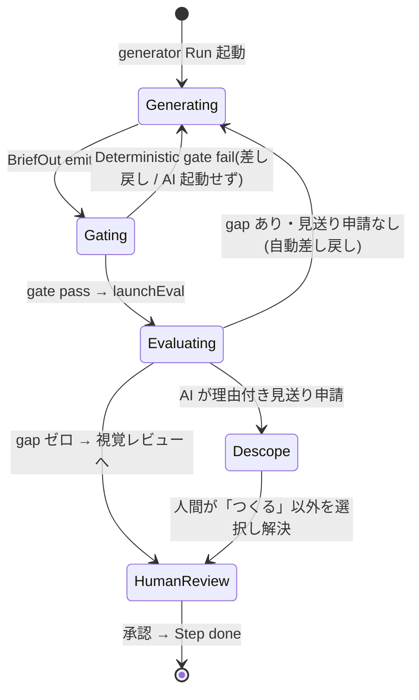

# S6 — ドメインモデル(全体) — v0.0.2

## メタ
- 工程: S6 (Domain Model)
- PhaseGroup: Build
- 役割: ドメインモデラー
- バージョン: v0.0.2
- ステータス: 確定
- 入力参照: [s1/index.md](../s1/index.md) / [s5/index.md](../s5/index.md) / [s4-tech-spec.md](../s4-tech-spec.md) / [brief.md](../brief.md)
- 作成日: 2026-06-11
- 更新日: 2026-06-11

> **このS6の方針(差分モデリング)**: ドメイン(`domain/`)は v0.0.1 で DDD で確立済み(集約 Project / Cycle(Run)/ Review / Task / Question / Facts、branded type + 自前 `Result`、event-sourced)。本書は **v0.0.2 が足す/変えるビジネスロジックだけ**を、既存集約の拡張または新規 VO/モデルとして起こす。**既存集約の再モデリングはしない**(過剰設計回避 / 完了条件「US と紐づかないモデルを作らない」)。

## スタック確認 (実 PJ と乖離させない)
- 言語: TypeScript(branded type + 自前 `Result<T,E>` = `domain/shared/result.ts`)
- フレームワーク: ドメイン層はフレームワーク非依存(Hono/React は外側)
- 永続化: ドメインは永続化を知らない。SQLite は infra(StepDef 契約は `pipelineDef` JSON 同居 / S4 D-01)
- 既存資産: `domain/{project,cycle,review,task,question,facts,events}`。**S5 index のアーキ前提と齟齬なし**(確認済み)
- ※ ドメインは DB/ORM/HTTP の語彙を持たない(S8 の領域)

## DDD 採用判断
- 採用: **DDD 採用(既存を継続)**
- 理由: 既存ドメインが集約・VO・不変条件・event-sourced で構築済み。v0.0.2 もこの語彙で拡張するのが一貫性・後方互換の両面で自然。新たに形式を変える理由がない。

## ユビキタス言語 (v0.0.2 追加分 / 既存語は踏襲)
| 用語 | 定義 | 別名NG |
|------|------|--------|
| 契約 (StepContracts) | Step が「何を出す/何で検証/いつ人間へ/詰まったら」を宣言する4点(output/verification/humanGate/escalation) | "設定", "config" |
| 成果物プロファイル (Profile) | タスク種別 → 必須 block 集合の純粋データ | "テンプレ"(UI 用語と混同) |
| block 矯正 (coerceBlocks) | 未知 block を捨て・既知不足を warn する前方互換の純粋関数 | "バリデーション"(throw を含意するため NG) |
| BriefIn / BriefOut | Run の型付き入力 / 出力(成果物+決定+申し送り+完全性) | "input/output"(曖昧) |
| 完全性ブロック (CompletenessBlock) | 要件 ↔ 対応 の照合元データ(BriefOut 内) | — |
| gap(漏れ) | requirements − addressed の差分 | "バグ", "不足"(曖昧) |
| 見送り (descope) | 要件を**理由付きで落とす申請**(人間承認必須・原則#6) | "削除", "スキップ"(黙って落とす含意 NG) |
| 役割 (role) | Run が generator か evaluator か | — |
| バグ修正一式 (bugfix dossier) | cause(2層)/impact/fix/prevention/video の必須 block 群 | — |
| 成果物 (Review) | レビュー成果 dossier。**`Result<T,E>` モナドと衝突するため型名は Review**(既存 S6 D-07 踏襲) | "Result"(コードの型と衝突) |

## 集約 / モデル一覧 (v0.0.2 差分)
- [step-contracts](./step-contracts.md) — Project/StepDef の契約拡張(Unit-01 / US-01)
- [artifact-profile](./artifact-profile.md) — Review 域: Profile + coerceBlocks + bugfix dossier(Unit-01 / US-01・05)
- [brief-completeness](./brief-completeness.md) — BriefIn/Out + 完全性評価(gap 算出)(Unit-03・05 / US-02・03)
- [run-role](./run-role.md) — Run.role と gen→gate→eval 状態遷移(Unit-03 / US-02)
- [descope-policy](./descope-policy.md) — 見送りの意思決定 + 既存 Question/Task へのマッピング(Unit-05 / US-03)

### 各 US のドメインロジック割当(完了条件①: 全 US が表現されているか)
| US | ドメインロジックの所在 | 備考 |
|----|----------------------|------|
| US-01 | step-contracts + artifact-profile | StepDef 拡張 + Profile/coerceBlocks |
| US-02 | run-role + brief-completeness | gen→gate→eval、BriefIn/Out、Deterministic gate(判定は純粋) |
| US-03 | descope-policy + brief-completeness | gap 算出は brief-completeness、見送り意思決定は descope-policy |
| US-04 | **新規ドメインなし** | Prompt Composer は app 層(副作用)。ドメイン不変条件を増やさない |
| US-05 | artifact-profile(bugfix dossier 節) | Profile の 1 エントリ |
| US-06 | step-contracts(編集対象の型のみ) | 編集 UI は web、定義の型は step-contracts |
| US-07 | **既存 Question/Review に吸収** | 視覚レビュー = 既存 `visual_review` Q(payload に `Review`)。描画は web |
| US-08 | **既存 Question/Run に吸収** | Q = 既存 `question` Q、停止 = Run `stalled`、resume = `applyAnswer`(既存 D-06) |
| US-09 | **新規ドメインなし** | フロント共通化(web のみ) |

→ ドメインロジックを**新規に増やすのは US-01/02/03/05 のみ**。US-04/06/07/08/09 は既存集約 or 外側の層に乗る(黙った descope ではなく、明示的に「ドメイン増分なし」と記録)。

## 横断的な状態遷移 (gen→gate→eval。詳細は run-role.md)

## 全体 質疑応答ログ (スタック・DDD 判断・モデル横断)

書き方: AI が `### Q-NN` で問いを追記。**ユーザーは IDE でこの md を開き `回答` に直接書き込む**。AI は次のやり取りで `確定` を埋める。

### Q-01 — 「見送り(descope)」を新しい Question kind にするか、既存 `decision`/`backtrack` の組合せで表すか
- 文脈: 既存 `Question.kind` に `decision`(statement)/ `backtrack`(toStep + proposal)がある。descope の人間選択肢は「つくる/見送る/後回し/前のステップからやり直す」で、要件本文+AI 理由+推奨ステップを運ぶ必要がある。`decision` は statement だけで情報が足りず、`backtrack` は戻り先専用。
- 提案: **新 kind `descope` を 1 つ足す**(payload = `{ requirement, aiReason, recommendedStep? }`)。「前のステップからやり直す」を選んだ時だけ既存 `backtrack` 経路に合流させる。理由 = 1 つの Q に descope の全情報を載せた方が Human Inbox の「1 依頼 = 1 カード」に合う(→ [[q-emission-per-task-unit]])。
- **回答**(ユーザー記入):
  > OK(推奨どおり / 2026-06-11)。
- **確定**(AI 記入):
  > 新 kind `descope` を足す。詳細(verdict 語彙・Task 化の橋渡し)は [descope-policy](./descope-policy.md) D-01。

### Q-02 — 差分モデリング方針(既存集約を再モデルせず増分のみ)でよいか
- 提案: 既存 Project/Cycle/Review/Task/Question は再掲しない。v0.0.2 が触る不変条件だけを各モデルファイルに「拡張」として書く。
- **回答**(ユーザー記入):
  > OK(推奨どおり / 2026-06-11)。
- **確定**(AI 記入):
  > 差分モデリングで確定。既存集約は再掲せず、増分と既存への吸収(割当表)で表す。

---

## 全体 AI が独自に決めたこと と 理由

### D-01 — DDD 継続 + 差分のみモデル化(既存集約を再掲しない)
- **理由**: 既存ドメインが DDD で完成済み。v0.0.2 は拡張であり、全集約の再モデリングは過剰設計(完了条件「US と紐づかないモデルを作らない」)。増分だけを起こし、既存への吸収は index の割当表で明示する。
- **判断**: 承認(2026-06-11 ユーザー一括承認)
- **上書き内容**(上書き時のみ):

### D-02 — US-04/06/07/08/09 は「ドメイン増分なし」と明示記録する
- **理由**: これらは app/web/infra か既存 Question/Review/Run に吸収される。モデルファイルを無理に作ると US と紐づかない過剰設計になる。割当表で「どこに乗るか」を残すことで黙った descope を防ぐ(原則#6 / 漏れ無し原則#2)。
- **判断**: 承認(2026-06-11 ユーザー一括承認)
- **上書き内容**(上書き時のみ):

---

## 棄却した集約案

### R-01 — descope 専用の新集約 `Descope` を立てる
- **棄却理由**: descope の申請は Question、結果は Task に落ちる。既存 2 集約で表現でき、新集約は重複境界を生む。新 Question kind の追加で足りる(Q-01)。

### R-02 — gen/eval を Run とは別の集約に分離する
- **棄却理由**: role は Run の discriminator(S5 Unit-03 / S4 C)。Run のライフサイクル(running/stalled/done/failed)をそのまま使える。別集約化は event-sourced の整合を二重化する。

## 次工程 (S7) への引き継ぎ
- フレームワーク非依存で実装すべきモデル: step-contracts(型) / artifact-profile(Profile + `coerceBlocks` 純粋関数) / brief-completeness(gap 算出の純粋関数) / run-role(状態遷移) / descope-policy(意思決定の純粋部)。
- 不変条件のうちコード化が複雑なもの: 完全性 gate の「全 gap 解消(または承認済み見送り)まで done にしない」hard gate。descope の不可逆(backlog 化)前の人間確認。
- テストで保証したいビジネスルール: ① coerceBlocks 前方互換(未知無視/不足 warn・throw しない)② gap=requirements−addressed の算出 ③ 理由なし gap→自動差し戻し / 理由付き→人間へ ④ Run.role 追加で既存 Run が従来動作(155 tests 回帰)。
- **既存コードへの破壊的変更(回帰ゲート必須・eval 指摘反映)**:
  - `coerceBlocks` の戻り値型変更(現状 `(raw)→{blocks,skipped}` → 本モデル `(profile,blocks)→{kept,missing}`)。既存呼び出し側の追従と 155 tests 回帰を S7 で必須化。
  - descope の実装には **Question 新 kind `descope` + 4 択 verdict 語彙(`Verdict`/`ALLOWED_VERDICTS` 拡張)+ descope 承認→backlog Task 化を仲介する新ドメイン命令**(現状 `deriveCommand` に Task 生成命令が無い)が必要。「既存集約に乗るだけ」ではない点を S7 で織り込む([descope-policy](./descope-policy.md) D-01)。
  - bugfix dossier は **新 block 型を増やさず構造化メタで表現**(S5 Unit-01 D-02)。新型追加時のみ `KNOWN_BLOCK_TYPES`/`coerceBlocks` 同期。

## 前サイクルからの引き継ぎ (手戻り時のみ追記)
- (なし。本サイクル内で S5 から順送り)
