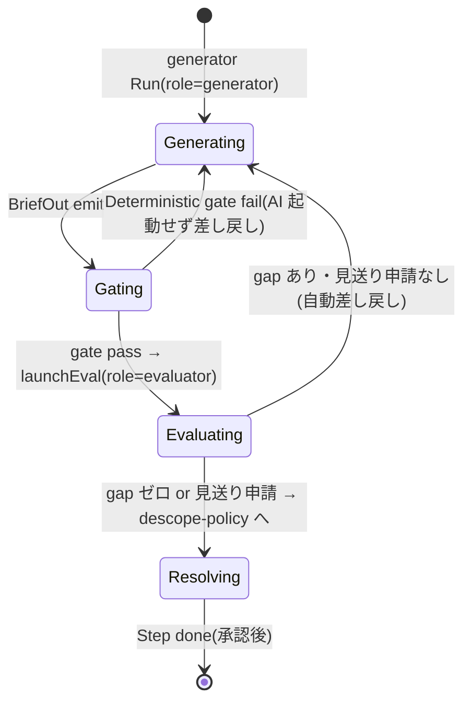

# モデル: Run の役割と gen→gate→eval(Run Role)

## メタ
- 親: [s6/index.md](./index.md)
- 対応 US: [US-02](../s1/us-02-engine-pipeline.md)(Run.role + パイプライン)
- 所属 Unit: [Unit-03](../s5/unit-03-engine-pipeline.md)
- 既存集約: Cycle(`domain/cycle/cycle.ts`)の `Run` を拡張(新集約ではない)
- ステータス: 確定

## モデル定義(DDD 採用 / Cycle 集約内 Run エンティティの拡張)

- **role**(値オブジェクト / discriminator): `Run.role?: 'generator' | 'evaluator'`(optional)。
  - generator: 成果物(BriefOut)を出す Run。
  - evaluator: generator の出力を verification 契約に照らして検証する Run(`launchEval` で起動)。
- 既存 `Run`(`id` / `attempt` / `state` / `startedAt` / `failureReason?`)はそのまま。`RunState`(running/stalled/done/failed)も不変。

## 不変条件
- `role` は **optional**。role なしの既存 Run は従来動作(後方互換 / 155 tests 回帰)。
- gen と eval は **I/O 型が異なる**(gen は BriefIn→BriefOut、eval は generator 出力 + verification → 判定)。role で判別する。
- **evaluator は generator の成果物が Deterministic gate を pass した後にしか起動しない**(無駄な AI 起動の抑制 / S4 §3.4)。
- emission→persist は既存 `DomainEventSink`(adapter は DB を書かない / S7 D-04)をそのまま使う。

## 状態遷移(1 Step 1 attempt の内部。横断図は index.md)

- `Generating`↔`Gating`↔`Evaluating` は Run の `running` 内の論理段。`stalled`(Q 停止 / US-08)・`failed` は既存遷移をそのまま使う。

## この集約固有の 質疑応答ログ

### Q-01 — gen と eval は別 Run(別 attempt)か、同一 Run 内の 2 フェーズか
- 提案: **別 Run**。`launchEval` が evaluator Run を新規に起こす(role で区別)。理由: gen と eval は別プロセス起動(scripted/live)で、stall/retry/failure を独立に扱えた方が既存 Run ライフサイクルに乗る。Cycle 集約は両 Run を Phase の `runs[]` に保持。
- **回答**(ユーザー記入):
  > OK(推奨どおり / 2026-06-11)。
- **確定**(AI 記入):
  > **別 Run** で確定。`launchEval` が evaluator Run を新規起動し role で区別。両 Run は Phase の `runs[]` に並ぶ。gen→gate→eval の進行は app 層の明示的状態(D-02)が持つ。

---

## この集約固有の AI が独自に決めたこと と 理由

### D-01 — role は Run の optional discriminator(別集約にしない)
- **理由**: S5 R-02 / S4 C。Run のライフサイクル(running/stalled/done/failed)をそのまま使える。別集約化は event-sourced の整合を二重化する。
- **判断**: 承認(2026-06-11 ユーザー一括承認)
- **上書き内容**(上書き時のみ):

### D-02 — gen→gate→eval の進行は RunState に入れず、app 層の**明示的な**オーケストレーション状態として 1 箇所に持つ
- **理由**(ドメイン的にこちらが clean / 後方互換は副次):
  - gen と eval は **別 Run**(D-01)。1 つの Run が「generating でもあり evaluating でもある」状態は存在しない。`gate` はそもそも Run ではない(AI 非依存の app 層チェック)。よって `generating/evaluating/gating` は RunState になり得ない。
  - generator か evaluator かは既に **`Run.role`** が表す。RunState に同じ区別を足すと **role と二重の真実**になる(不整合の温床)。
  - `RunState`(running/stalled/done/failed)は **1 実行の健康状態**、パイプラインの段は **複数 Run + gate にまたがる進行**で関心が直交。混ぜない。
  - **ただし暗黙にしない**: 進行を if 判定に散らさず、attempt の進行(gen→gate→eval→resolve)を **app 層の明示的なオーケストレーション状態**として 1 箇所で持つ。RunState には入れない。
- **判断**: 承認(2026-06-11 ユーザー一括承認)
- **上書き内容**(上書き時のみ):

---

## この集約固有の 棄却した案

### R-01 — gen/eval 用に新 RunState(generating/evaluating)を追加
- **棄却理由**: RunState 拡張は既存 event/persist/テストに広く波及。論理段は app 層で表現でき、ドメインの状態語彙は変えない方が後方互換に安全。
