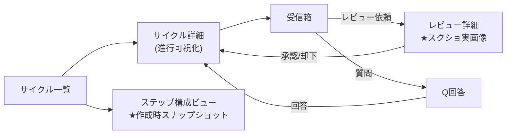

# S2 — 画面モック / フロー(全体) — v0.0.3

## メタ
- 工程: S2 Wireframe (Discovery)
- PhaseGroup: Discovery
- 役割: プロダクトデザイナー
- ステータス: **確定**(視覚モック after を実アプリ撮影で Biz レビュー済 2026-06-12)
- 入力参照: [s1/index.md](../s1/index.md) / [scope.md](../scope.md)
- 作成日: 2026-06-12
- 更新日: 2026-06-12

> **v0.0.3 は内部基盤サイクル**。① 正本一元化 + ② live を本物に、の大半はバックエンド/契約/正本整理で、**新規画面は追加しない**。
> 既存画面(v0.0.1/v0.0.2 で確定)を live 経路が駆動するだけのものは「変更なし」、見た目が変わるのは **レビュー詳細(スクショ実画像)** の 1 枚のみ。

## 画面一覧

| 既存画面 | 変更種別 | 対応 US | 概要 |
|-----|---------|---------|------|
| レビュー詳細 | **更新** | US-04, US-05 | スクショ枠が placeholder→**実画像**(US-05)。completeness テーブルを **live** が駆動(US-04・枠は既存のまま) |
| (設定)ステップ構成 / サイクルのステップ構成ビュー | **軽微更新** | US-02 | サイクル作成時に default を **snapshot コピー**。構成ビューに「このサイクルは作成時点で確定(以後デフォルトを変えても波及しない)」を明示 |
| 受信箱 | 変更なし | US-04 | live の completeness gap → descope カードが既存 UI に届くだけ(描画は v0.0.2 のまま) |
| Q回答 | 変更なし | US-04 | live 由来の Q も既存 UI で回答(v0.0.2 のまま) |
| サイクル詳細 / サイクル一覧 | 変更なし | — | live 経路でも進行可視化 UI は不変 |

- [SCR-01: レビュー詳細 — 実証拠ブロック(更新)](./scr-01-review-evidence.md)
- [SCR-02: ステップ構成 — 作成時スナップショット(軽微更新)](./scr-02-step-config-snapshot.md)

### 画面を持たない US(内部・バックエンド)

| US | 理由 |
|----|------|
| US-01 外部記憶境界是正 / 死蔵テーブル削除 | データ境界ルールと DB スキーマ整理。UI 表出なし |
| US-03 live prompt を実スキルから合成 | 実行プロンプトは内部。既存の「ステップ全文ビュー」は表示元が正本化されるだけで画面構造は不変 |

> S2 完了条件「全 US が画面 or フローでカバー」: US-01/03 は **画面を持たない内部処理**であることを明示してカバー(描く画面が無いことの確認も S2 の成果)。

## 画面遷移フロー

> フロー自体は v0.0.2 から不変。**live 経路でも人間の導線(Inbox を捌く)は同じ**であることが S2 の確認点。

## Biz との合意事項
| # | 論点 | 合意内容 |
|---|------|---------|
| 1 | 新規画面の要否 | 内部基盤サイクルのため新規画面なし。レビュー詳細のスクショ実画像化のみが見える変化 |

## US 漏れ・齟齬の検知ログ
| # | 検知内容 | S1 に戻った日 | 解決方針 |
|---|---------|-------------|---------|
| — | (なし) | — | — |

## 全体 質疑応答ログ (画面横断・フロー全体の議論)

### Q-01 — ステップ構成ビューに「作成時スナップショット(以後デフォルト変更が波及しない)」をどこまで明示するか
- **回答**(ユーザー記入):
  > (2026-06-12)控えめなバナー1行でよい。ただし文言の「(再現性のため)」は不要。
- **確定**(AI 記入):
  > 構成ビュー/設定 上部に控えめバナー1行。専用画面は作らない。文言は「ここでの編集は“これから作る”サイクルに反映/作成済みは作成時点に固定」まで(「(再現性のため)」は外す)。after モックを実アプリ撮影で確認済。

---

## 全体 AI が独自に決めたこと と 理由

### D-01 — v0.0.3 は新規画面ゼロ。既存画面の更新と「画面を持たない US の明示」で S2 を構成
- **理由**: ① 正本一元化と ② live 化はバックエンド主体。無理に画面を起こすと実態と乖離する(粒度ゲーミングの画面版)。描く画面が無いことの確認も S2 の正当な成果。
- **判断**(ユーザー記入): 承認 | 上書き | 保留
- **上書き内容**(上書き時のみ): 

### D-02 — 見える変化は「レビュー詳細のスクショ実画像化」1 点に集約
- **理由**: US-04(completeness)・受信箱・Q回答 は v0.0.2 の既存 UI を live が駆動するだけで描画は不変。新たに人間が目にする差分はスクショの placeholder→実画像のみ。
- **判断**(ユーザー記入): 承認 | 上書き | 保留
- **上書き内容**(上書き時のみ): 

---

## 棄却した画面案

### R-01 — 「live 実行ログ / ストリーミング表示」専用画面
- **棄却理由**: live mid-run の対話(Q→回答→resume の実モデル化)は v0.0.4 scope。v0.0.3 では既存の進行可視化で足りる。先取りは scope creep。

## 次工程 (S3) への引き継ぎ
- UI 設計で考慮すべき差分: レビュー詳細の実画像表示(アスペクト比・読み込み・失敗時 placeholder+理由)。
- 外部 I/F: なし(live は内部 orchestrator。新規の認証/決済/通知画面なし)。

## 前サイクルからの引き継ぎ (手戻り時のみ追記)
- (なし)
