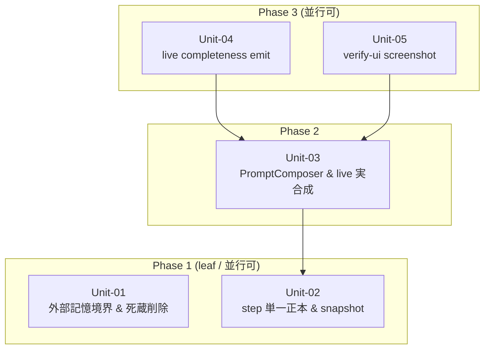

# S5 — Work Units (Unit 分割 + 依存マップ) — v0.0.3

## メタ
- 工程: S5 (Work Units)
- PhaseGroup: Build(起点)
- 役割: ソフトウェアアーキテクト
- バージョン: v0.0.3
- ステータス: **確定**(評価 AI レビュー済 → §評価AIレビュー記録 / Q-02 確定 2026-06-12)
- 入力参照: [s1/index.md](../s1/index.md)(US-01〜05) / [s2/index.md](../s2/index.md) / [s3/index.md](../s3/index.md) / [s4-tech-spec.md](../s4-tech-spec.md) / [scope.md](../scope.md) / [brief.md](../brief.md)
- 作成日: 2026-06-12
- 更新日: 2026-06-12

## アーキテクチャ前提
- スタック: **確定済み(S4 §1)**。Bun / Hono / SQLite(`bun:sqlite`)/ React+Vite / Playwright / TypeScript(branded type + `Result<T,E>`)/ Hexagonal + event-sourced。**v0.0.3 で新規 runtime 依存なし**。
- 既存資産: `domain/`(純粋)/ `app/ports/`(`orchestrator.ts` `repos.ts` `sys.ts` `composition.ts`)/ `app/services/`(`project-service.ts` `cycle-service.ts` `engine-service.ts`)/ `infra/orchestrator/`(`scripted.ts` `live.ts`)/ `web/`(features)。
- 後方互換が最優先: 既存の決定的回帰 + E2E を回帰ゲート。死蔵削除は波及を全消しするまで `tsc` が通らない(S4 §3.1)。

## I/F 決定方針
- 採用: **(b) AI 事前調査**
- 理由: S4 が v0.0.3 差分の技術契約・置き場所・不変条件を実コードに突合して確定済(評価 AI レビュー済 / S4 §9)。本 S5 はそれを Unit の I/F に翻訳するのみ。新規 I/F の発明はせず、既存ポート/型の拡張点 or 新設(PromptComposer / 撮影)として定義する。

## Unit 一覧
- [Unit-01 外部記憶境界是正 & 死蔵削除](./unit-01-source-of-truth-cleanup.md) — US-01
- [Unit-02 step 単一正本 & 作成時スナップショット](./unit-02-step-canonical-snapshot.md) — US-02
- [Unit-03 PromptComposer 新設 & live prompt 実合成](./unit-03-prompt-composer.md) — US-03
- [Unit-04 live completeness emit](./unit-04-live-completeness.md) — US-04
- [Unit-05 verify-ui screenshot 撮影 & 描画配線](./unit-05-verify-screenshot.md) — US-05

> 全 US が 1 Unit に割当(US-01→U01 / US-02→U02 / US-03→U03 / US-04→U04 / US-05→U05)。Unit に未割当の US なし。

## 依存 DAG (Unit 間依存方向 / Phase レイアウト)

**読み方**:
- 矢印は **依存方向**(`A --> B` = A は B に依存する / B が無いと A は完成しない)。
- **上から下に読めば着手順**(上の Phase ほど先に作る)。Phase 内の Unit は並行に着手できる。
- 矢印は必ず **下の Phase → 上の Phase**(依存先は自分より先に作られる)。上から下に伸びる矢印があれば循環の疑い。

## 凡例
- **角括弧 `[X]`**: Unit(本ステップで定義した自前 Unit のみ)
- **実線矢印 `-->`**: 依存方向(`A --> B` = 「A は B が無いと完成しない」)
- **subgraph**: **Phase = 実装順の段**(Phase 1 = leaf = 最初に着手)。物理境界・プロトコル境界・テスト戦略では subgraph を切らない。
- 永続化 `[(X)]` / 外部サービス `{{X}}` は **描かない**(S6/S8 の領域)。

## 着手順テーブル (Phase subgraph と一対一対応)

| Phase | 着手可能な Unit | 理由 |
|-------|----------------|------|
| Phase 1(leaf) | Unit-01, Unit-02 | 他 Unit に依存しない。U01(削除/境界)は完全独立、U02(step 正本)は基盤 |
| Phase 2 | Unit-03 | U02 の skillRef 実 dir 解決が揃って初めて live prompt がスキル本文を引ける |
| Phase 3 | Unit-04, Unit-05 | live prompt が本物になって(U03)初めて、completeness/screenshot の実成果物が意味を持つ。両者は機能独立で並行可 |

## 依存方向の根拠
| 依存(A → B) | 根拠 |
|--------------|------|
| Unit-03 → Unit-02 | PromptComposer がスキル本文を引くのに U02 の skillRef→実 dir 解決を使う(S4 §3.2/3.3) |
| Unit-04 → Unit-03 | live が completeness を emit するには、U03 の eval payload 契約で「addressed を出せ」と指示している必要がある(S4 §3.4 / US-04 Q-01) |
| Unit-05 → Unit-03 | verify-ui 撮影は live evaluator 経路で起きる。U03 で live が本物に動いて初めて撮る対象が出る |

> Unit-01 は leaf(矢印なし)= 他 Unit と独立。先行/並行いつでも着手可。

## 読み手別の見方
- **エンジニア**: 担当 Unit の矢印の先(依存先)を見て、先にスタブを用意する相手を把握。詳細 I/F は各 Unit ファイル参照。
- **PM**: leaf(U01/U02)から並行着手できる。U03 が Phase 2 のクリティカルパス。**ただし U04/U05 の infra/単体実装は fixture で U03 と並行に進められ、U03 完了待ちは「実 AI 整合テスト」だけ**(S5 評価 AI / クリティカルパスは見かけより短い)。

## 全体 質疑応答ログ (アーキ全体・I/F 方針・Unit 横断・依存マップ)

### Q-01 — (なし。S4 で技術契約が確定済、Unit は 1US=1Unit で素直に割れた)
- **回答**(ユーザー記入):
  > 
- **確定**(AI 記入):
  > 

### Q-02 — Unit-02 の step 集合移行の範囲: ROADMAP ①-b の「v2 12 ステップ」へ**フル移行**(S8-S12 追加 + S2.5 退役)か、本サイクルは**S2.5 退役 + skillRef 実 dir 修正のみ**か
- **回答**(ユーザー記入):
  > (2026-06-12)ステップは可変の認識。
- **確定**(AI 記入):
  > step 数は可変(実装済 / ROADMAP)。よって `DEFAULT_STEPS` を v2 12(S2.5 退役)に更新するのは **default テンプレ値の変更**であって rigid migration ではない。app が可変 step を generic に扱うため回帰面は評価 AI の懸念より小さく、**step を直接参照する fixture/テストのみ追従**。Unit-02 に反映。

---

## 全体 AI が独自に決めたこと と 理由

### D-01 — 1 US = 1 Unit(US-03 を「契約」と「実装」で割らない)
- **理由**: 各 US が既に「独立してテスト可能な縦スライス」。US-03 は PromptComposer 新設 + live 配線で 1 つの完成価値(live prompt が本物になる)。割ると片方が未完 Unit になる。S1 D-03 と整合。
- **判断**(ユーザー記入): 承認 | 上書き | 保留
- **上書き内容**(上書き時のみ): 

### D-02 — Unit-01(死蔵削除)を leaf 独立 Unit にする
- **理由**: 死蔵削除は他 US の前提でも依存先でもない(S4 §8)。独立 Unit にすれば先行着手でき、`tsc` green を完了条件に閉じられる。
- **判断**(ユーザー記入): 承認 | 上書き | 保留
- **上書き内容**(上書き時のみ): 

### D-03 — Unit-04 と Unit-05 を分離(統合しない)
- **理由**: completeness emit(stream-json パース)と screenshot 撮影(Bun.spawn)は機能・置き場所が独立。1 Unit にすると 2 つの無関係な縦スライスを束ねることになる。Phase 3 で並行着手できる。
- **判断**(ユーザー記入): 承認 | 上書き | 保留
- **上書き内容**(上書き時のみ): 

---

## 棄却した Unit 案

### R-01 — 「live 化」を 1 Unit に統合(US-03+04+05)
- **棄却理由**: prompt 合成 / completeness パース / screenshot 撮影は別関心。1 Unit にすると並行性を殺し、巨大 Unit になる。3 Unit に分けて依存 DAG で順序付けるのが正しい。

### R-02 — US-02 の「step 正本」と「snapshot」を別 Unit に分割
- **棄却理由**: 両方とも step 定義の単一正本化という 1 つの縦スライス(file=default / DB=snapshot)。分けると snapshot が依存する正本が別 Unit になり結合が増える。1 Unit が自然。

## 次工程 (S6) への引き継ぎ
- ドメインモデリングの対象: 主に Unit-02(step 定義 vocab)と Unit-04(completeness の addressed 型)。U01 は削除中心でモデル新設は薄い。
- 技術詳細から守るべき境界: PromptComposer は Fs ポート経由(infra 直読み禁止)/ 画像は path 参照(DB 複製禁止)。
- 並行開発リスク: U03 が Phase 2 単独のクリティカルパス。U03 の I/F(compose の入出力)が遅れると U04/U05 が待つ → U03 の I/F を先に固める。

## 評価 AI レビュー記録(2026-06-12 / code-reviewer)

人間がソースを見ない内部設計のため評価 AI を起動しコード実体に突合([[dogfood-harness-principles-on-this-repo]])。初版 verdict = **NOT SOUND**。DAG 妥当性(非循環・矢印方向)・US 全割当・物理アーキ非混入・Phase 表 1:1 は PASS。修正した指摘:

| 重大度 | 指摘 | 是正 |
|---|---|---|
| CRITICAL | `Fs` ポートは `exists` のみで本文 read 不可。U03 の「Fs 経由で読む」が成立しない | U03 に **`Fs.read` 追加**(or 新規 reader ポート)をスコープ明示(D-02) |
| HIGH | snapshot は `createCycle` が `{phaseId,step}` のみコピー・`Phase` に snapshot 欄なし | U02 に **domain 変更(Phase/Cycle へ snapshot 欄)+ DB 列追加**を明示 |
| HIGH | `DEFAULT_STEPS` は現状 8(S2.5 込)。v2 12 移行の回帰面が未明示 | U02 にスコープ注意 + index Q-02 で**フル移行 vs S2.5退役のみ**を要確認に |
| MEDIUM | U04/U05 のクリティカルパス過大評価 | U04/U05/index に「infra/単体は fixture で U03 と並行可」を明記 |

DAG・層整合・carry 回収は PASS。残課題は Q-02(step 移行範囲)の判断。

## 前サイクルからの引き継ぎ (手戻り時のみ追記)
- (なし)
