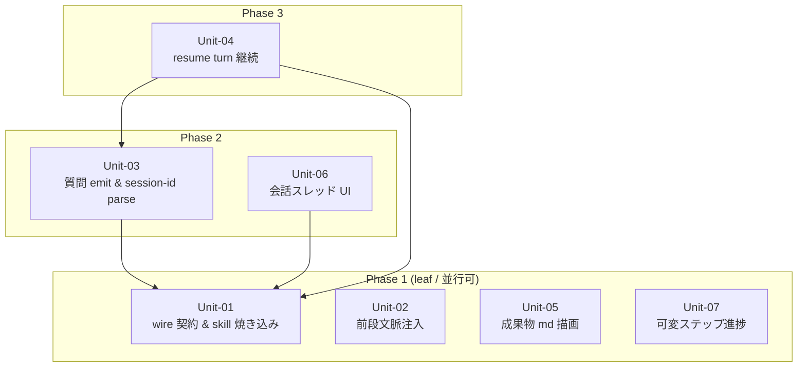

# S5 — Work Units (Unit 分割 + 依存マップ) / v0.0.4

## メタ
- 工程: S5 (Work Units)
- PhaseGroup: Build(起点)
- 役割: ソフトウェアアーキテクト
- ステータス: **確定**(2026-06-13 / 評価 AI レビューで確定検査。内部コード設計ゆえ人間承認不要 — S4 と同じ確立パターン。後述 §評価 AI レビュー記録)
- 入力参照: [s1/index.md](../s1/index.md), [s2/index.md](../s2/index.md), [s3/index.md](../s3/index.md), [s4-tech-spec.md](../s4-tech-spec.md), [brief.md](../../brief.md)
- 作成日: 2026-06-13
- 更新日: 2026-06-13

## アーキテクチャ前提
- スタック(S4 確定済を継承): TypeScript / Hono(backend)/ React + Vite(web)/ ローカル `claude` CLI(`claude -p` 完遂型)/ Bun(runtime・`Bun.spawn`)/ sqlite(studio 別 store)/ Playwright(視覚証拠)。
- 既存資産・制約(S5 が乗る境界): ドメインは [OrchestratorPort](../../../src/app/ports/orchestrator.ts) のみに依存。具象アダプタ(`scripted` | [live](../../../src/infra/orchestrator/live.ts))を合成根で束縛(S7 D-01)。アダプタは DB を書かず `DomainEventSink` に `DomainEvent` を push → app 層([engine-service.ts](../../../src/app/services/engine-service.ts))が 1 トランザクションで正規化・永続(S7 D-04)。
- 想定デプロイ形態: ローカル常駐(web 公開なし)。session-id 等の run 状態は sqlite 別 store、真実 source は `aidlc-docs/`(CLAUDE.md データモデル境界)。

## I/F 決定方針
- 採用: **AI 事前調査**(既存コードを Explore エージェントで実地調査し、各 Unit の I/F を**実在シンボル**に接地して定義した)。
- 理由: ブラウンフィールドで I/F の多くは既存型(`OrchestratorPort` / `Unit02Command` / `QuestionOption` / `ComposeInput` 等)の拡張。人間に白紙から聞くより、既存契約を調べて差分を提示するほうが速く正確(S4 と同じ姿勢)。新規に発生する wire スキーマ(`aidlc-question` / `aidlc-answers`)は S4 C3/C4 で既に意味論確定済。

## Unit 一覧
- [Unit-01 wire 契約 & skill 焼き込み](./unit-01-wire-contract.md) — 基盤(US-03/US-04 の共有契約 + US-05/06 の描画契約)
- [Unit-02 前段文脈注入](./unit-02-prior-context-injection.md) — US-01
- [Unit-03 質問 emit & session-id parse](./unit-03-question-emit-session-parse.md) — US-03
- [Unit-04 resume turn 継続](./unit-04-resume-turn.md) — US-04
- [Unit-05 成果物 Markdown 描画](./unit-05-markdown-render.md) — US-02
- [Unit-06 会話スレッド UI](./unit-06-conversation-ui.md) — US-05 / US-06
- [Unit-07 可変ステップ進捗](./unit-07-variable-step-progress.md) — US-07

### 再分割(S8→S4 手戻り / 2026-06-14)
- [BU 再分割 — コンテキスト/IO 契約 + 設定ヒアリング](./backtrack-context-io-units.md) — BU-1 構造化コンテキスト resolver(DB+docs)/ BU-2 `aidlc-result` 出力 protocol / BU-3 設定ヒアリングフロー + per-step 粒度表。既存 Unit-01〜06 の一部を置換/拡張(ledger BT-01/02)。

## US → Unit 割り当て(完了条件①の証跡)

| US | 主担当 Unit | 備考 |
|----|------------|------|
| US-01 前段文脈注入 | Unit-02 | engine/app の contextPaths 配線。独立 leaf |
| US-02 md 描画 | Unit-05 | web ReviewBlocks summary。独立 leaf |
| US-03 質問 emit | Unit-03(+ Unit-01 のスキーマ) | live adapter parse。スキーマは Unit-01 |
| US-04 resume 継続 | Unit-04(+ Unit-01 の返信エンベロープ) | port 拡張 + live --resume + 永続 + scripted |
| US-05 QA スレッド | Unit-06 | web SCR-02。AnswerView 置換 |
| US-06 一括ヒアリング | Unit-06 | web SCR-04 + SCR-02。StepConfigPage 置換 |
| US-07 可変ステップ進捗 | Unit-07 | web SCR-05 / PhasePipeline。独立 leaf |

→ 全 7 US が Unit に割り当て済。Unit に割り当てられていない US なし。Unit-01 は単一 US を「所有」しないが、US-03/04 の wire 契約と US-05/06 の描画契約を支える**共有基盤**(後述 D-01)。

## 依存 DAG (Unit 間依存方向 / Phase レイアウト)

**読み方**:
- 矢印は **依存方向**(`A --> B` = A は B が無いと作れない/動かない)。
- **上から下に読めば着手順**。Phase 1 の 4 Unit は相互依存ゼロで完全並行着手可。Phase 2 は Unit-01 の wire スキーマが確定すれば着手可。Phase 3(Unit-04)は Unit-01 + Unit-03(session-id を取る parse)が揃ってから。
- 全矢印が**下から上**(Phase 2/3 → Phase 1)向き = 循環なし。上から下に伸びる矢印は無い。

### 実行時イベントフロー(S8 統合の関心事 / 意図的に DAG から除外)

会話 UI(Unit-06)は実行時に `QuestionRaised`(Unit-03 が emit)を描画し、返信を `aidlc-answers` として resume(Unit-04)へ送る。この**非同期イベント往復**は build-order(着手順)を縛らない — UI は Unit-01 の wire スキーマと scripted アダプタ(Unit-04 が turn パリティを提供)に対して並行に作れる。よって「着手順 DAG」を読みやすく保つため、この実行時エッジは矢印として描かず本節に明記する(end-to-end の結線は S8)。

## 凡例
- **角括弧 `[X]`**: Unit(本ステップで定義した自前 Unit のみ)。
- **実線矢印 `-->`**: build 依存(`A --> B` = 「A は B が無いと作れない/コンパイルできない/動かない」)。
- **subgraph**: **Phase = 実装着手順の段**のみ(Phase 1 = leaf = 最初に着手)。物理境界(web/backend、プロセス、Docker、プロトコル、認証)では切らない。
- **意図的に使わない記号**: 円柱 `[(X)]`(永続化)/ 六角 `{{X}}`(外部サービス)/ プロトコル種別の矢印太さ分け → S5 では描かない(S6/S8 の領域)。点線 `-.->`(弱い依存)も本サイクルでは使わず、実行時イベント往復は上の専用節に prose で記述(着手順 DAG を濁さないため)。

## 着手順テーブル (Phase subgraph と一対一対応)

| Phase | 着手可能な Unit | 理由 |
|-------|----------------|------|
| Phase 1(leaf) | Unit-01, Unit-02, Unit-05, Unit-07 | 他 Unit に依存しない。Unit-01 は新規 wire スキーマ + 既存 skill 本文修正(自己完結)/ Unit-02・05・07 は既存コードへの独立差分 |
| Phase 2 | Unit-03, Unit-06 | Unit-01 の wire スキーマ(`aidlc-question` parse / question 描画)が揃えば着手可 |
| Phase 3 | Unit-04 | Unit-01 の返信エンベロープ + Unit-03 が取得する session-id が前提 |

**重要**: この表は図中の Phase subgraph と一対一対応(P1=4 Unit / P2=2 Unit / P3=1 Unit)。Phase 構成を変えたら図と表の両方を同期する。

## 依存方向の根拠
| 依存(A → B) | 根拠 (なぜ A は B に依存するか) |
|--------------|-------------------------------|
| Unit-03 → Unit-01 | live adapter が `aidlc-question` block を parse して `QuestionRaised` に変換するには、Unit-01 が定義する wire スキーマ(JSON 形・必須項目・★おすすめちょうど 1)が先に要る |
| Unit-06 → Unit-01 | 会話 UI が question を 4 部テンプレに描画し、返信を `aidlc-answers` にシリアライズするには、Unit-01 の wire 型が先に要る |
| Unit-04 → Unit-01 | resume の `claude --resume -p <返信エンベロープ>` に渡す入力が Unit-01 の `aidlc-answers` 形 |
| Unit-04 → Unit-03 | `--resume` は session-id が必須。session-id を init 行から取得して emit に添える parse は Unit-03 が担う。これが無いと resume できない |

## 読み手別の見方
- **エンジニア**: 自分の Unit の `外部依存` と `I/F 定義` を見て、先に必要な相手(矢印の先)のスタブ/型を用意。Phase 1 担当は他を待たず即着手可。
- **PM**: Phase 1 に 4 Unit が並ぶ = 初手から 4 並行で進められる。クリティカルパスは Unit-01 → Unit-03 → Unit-04(resume が主軸の心臓 / S4 引き継ぎ「優先実装基盤 = session-id 永続」)。

## 全体 質疑応答ログ (アーキ全体・I/F 方針・Unit 横断・依存マップ)

書き方: AI が `### Q-NN` で問いを追記。ユーザーは IDE でこの md を開き `回答` に直接書き込む(複数行・コードブロック OK)。AI は次のやり取りで `確定` を埋める。

### Q-01 — (Biz 判断は発生していない)
- 本 S5 は内部コードの分割設計のみで、Biz/プロダクトの新規判断を含まない(責務契約①: 事業部は内部コードを前提にしない)。本サイクルの Biz 論点は S1 index Q-01〜03 / D-04 で確定済。Unit の刻み方は S1 D-03 で「AI 開発部の裁量(最終要件が変わらなければ可)」とユーザーが明示委任済。
- よって S4 と同じく**評価 AI の敵対的レビューで確定**(§評価 AI レビュー記録)。完了条件⑦「エンジニアが納得」は、本サイクルでは AI 開発部(=本 AI)が評価 AI レビューを通すことで充足する(2026-06-13 ユーザー確認:「内部の話 / AI レビューまでにして」)。人間 human-gate は Biz/プロダクト・実機/視覚レビューでのみ発生し、S5 には無い。ユーザー上書き希望時は随時反映。

---

## 全体 AI が独自に決めたこと と 理由

書き方: AI が `### D-NN` で決定と理由を追記。ユーザーは `判断` を `承認 / 上書き / 保留` から選び、上書きするなら `上書き内容` に直接書く。

### D-01 — wire 契約 + skill 焼き込みを独立 Unit(Unit-01)として切り出す
- **理由**: `aidlc-question` / `aidlc-answers` スキーマは US-03(emit)・US-04(返信)・US-05/06(描画・入力)の 4 US が共有する。各 US Unit に重複定義させると S8 で必ず食い違う(完了条件: I/F を空欄で進めない)。さらに skill 本文への emit/突合契約の焼き込みは「道具では直らない層」(CLAUDE.md / S4 引き継ぎ)で web/backend いずれにも属さない横断作業。これを 1 Unit に集約し全員の Phase 1 依存先にすると、スキーマが 1 箇所で確定し下流の再発明を防げる。単一 US を所有しないが、共有基盤として正当。
- **判断**: AI 裁量で確定(責務契約①: 内部コード設計。評価 AI レビュー N-1 が「人間承認不要」を確認 / 2026-06-13)。ユーザー上書き希望時は随時反映。
- **上書き内容**(上書き時のみ):

### D-02 — US-02(md 描画)を会話 UI(Unit-06)に混ぜず独立 Unit(Unit-05)にする
- **理由**: US-02 は SCR-03 レビュー詳細の ReviewBlocks summary を md 描画する独立差分で、wire 契約にも会話スレッドにも依存しない leaf。会話 UI(SCR-02/04)と束ねると、独立に着手できる leaf を Phase 2 に巻き込み並行性を損なう。別 Unit にして Phase 1 で並行着手させる。
- **判断**: AI 裁量で確定(責務契約①: 内部コード設計。評価 AI レビュー N-1 が「人間承認不要」を確認 / 2026-06-13)。ユーザー上書き希望時は随時反映。
- **上書き内容**(上書き時のみ):

### D-03 — US-05(QA スレッド)と US-06(一括ヒアリング)を 1 Unit(Unit-06)に統合する
- **理由**: S1 Q-01 / S2 合意①で「設定ヒアリングも確認質問も同一の対話ビュー(SCR-02)に積む。器を二重に作らない」が確定済。US-05 と US-06 は同じスレッド器・同じ wire 描画・同じ返信シリアライズを共有し、SCR-04(設定確認面)は SCR-02 と同じ会話部品の上に乗る。別 Unit にすると同じスレッド実装を 2 回作るか相互依存が生じる。1 Unit に統合するのが S1/S2 確定方針と整合し重複を避ける。
- **判断**: AI 裁量で確定(責務契約①: 内部コード設計。評価 AI レビュー N-1 が「人間承認不要」を確認 / 2026-06-13)。ユーザー上書き希望時は随時反映。
- **上書き内容**(上書き時のみ):

### D-04 — resume の二義分岐(C2)を Unit-04 内に閉じ、Unit-03(質問 emit)と分離する
- **理由**: S4 C2 の「`question` 回答 → `--resume` 新経路 / `visual_review` 承認 → 既存 finalize」は resume 側(Unit-04)の分岐。質問の emit(Unit-03)とは検証単位が別(S1 D-03 の「経路 US-03 と 継続 US-04 を分ける」刻みに沿う)。Unit-03 は「質問が question カードで出る + session-id を取る」まで、Unit-04 は「答えると進む/承認すると終わる」を担う。session-id 取得だけ Unit-03 に置くのは、parse 点が live の同一 drain ループ(`awaitAndEmit`)にあり物理的に同居するため(S4 C1)。
- **判断**: AI 裁量で確定(責務契約①: 内部コード設計。評価 AI レビュー N-1 が「人間承認不要」を確認 / 2026-06-13)。ユーザー上書き希望時は随時反映。
- **上書き内容**(上書き時のみ):

---

## 棄却した Unit 案

### R-01 — session-id parse を Unit-04(resume)に含める
- **棄却理由**: session-id の parse 点は live の `awaitAndEmit` drain ループ(init 行を読む箇所)にあり、これは Unit-03 が触る同一コード領域(質問 emit も同 drain で結果テキストを走査する)。Unit-04 に置くと 2 Unit が同じ live 関数を奪い合い並行開発で衝突する。S4 C1 の「parse 点を固定」に従い、出力走査を担う Unit-03 に session-id 取得を同居させ、Unit-04 はそれを受け取って `--resume` する側に純化する(D-04)。

### R-02 — US ごとに 7 Unit(1US=1Unit)に均等分割
- **棄却理由**: US-05/06 は同一スレッド器を共有(D-03)、wire 契約は 4 US 横断(D-01)。1US=1Unit にすると共有契約が重複定義され S8 で食い違う。Unit は「並行開発できる責務境界」で切るべきで US 数に合わせない(粒度ゲーミング禁止 / CLAUDE.md #3)。

### R-03 — 物理境界(web / backend)で 2 Unit に大別
- **棄却理由**: web/backend は物理デプロイ境界であり並行開発の単位ではない(SKILL 禁止事項: 物理境界で subgraph/Unit を切らない)。実際 US-03(backend)と US-06(web)は wire 契約を挟んで並行に進められ、束ねるとクリティカルパスが見えなくなる。

## 次工程 (S6) への引き継ぎ
- ドメインモデリングの対象になる Unit: Unit-04(session-id を Run 状態に持たせるか / resume の二義をドメイン命令でどう表すか = 既存 `Unit02Command` で足りるかの確認)。Unit-01 の wire スキーマは「ドメイン型 `QuestionOption` / `Answer` ↔ wire JSON」のマッピング境界として S6 で型整合を確認。
- 技術詳細(DB/外部 I/F)から守るべき境界: session-id 永続(sqlite 別 store)は実行基盤の状態でドメインモデルに漏らさない(S4 D-01)。aidlc-docs に session-id を載せない。
- 並行開発時のリスク(締切クリティカル / 仕様未確定): クリティカルパス = Unit-01 → Unit-03 → Unit-04。Unit-01 の wire スキーマ確定が全下流の着手条件 = 最優先で確定させる。Unit-04 の `--resume` は CLI バージョン依存挙動が残リスク(S4: 失敗は `stalled`→retry に倒す)。

## 前サイクルからの引き継ぎ (手戻り時のみ追記)
- 何が漏れていたか:
- 暫定の解決方針:
- 棄却した案とその理由:

## 評価 AI レビュー記録(2026-06-13 / code-architect 評価エージェント)

S5 は全項目が内部コードの分割設計(責務契約①: 事業部は内部コードを前提にしない)で、人間 human-gate に該当する Biz/プロダクト判断を含まない。Unit の刻みは S1 D-03 でユーザーが「AI 開発部の裁量」と明示委任済。よって S4 の確立パターンを踏襲し、人間承認でなく**評価 AI の敵対的レビュー**で確定検査を実施(dogfood 作業規範)。

- **総合判定**: SOUND-WITH-FIXES → 指摘を全反映して解消。
- **完了条件①〜⑥**: 全 PASS(全 US 割当 / 各 Unit に責務+所属US+I/F / 依存一方向 / 循環なし / 物理アーキ非描画・subgraph は Phase のみ / Phase 図と着手順表が 1:1)。
- **N-1(人間判断の見落とし検査)**: 「人間 Biz ゲートなし」の分類は**正しい**と確認。turn 上限 10(暴走防止の内部ノブ)も 焼き込み skill 選定(内部コード作業)も Biz/プロダクト判断ではない。隠れた human-gate なし。
- **I/F 実在性 spot-check**: `ResumeRun`(port 拡張予定 / 現 `{runId,body?}`)、`PromptComposer.contextPaths`(既存・brief 既定)、`engine-service.artifactPaths()`(現 `[]` スタブ)、`live.ts awaitAndEmit/extractResultText`(init 行未 parse)、`ScriptedOrchestrator` / `Unit02Command` / `ReviewBlocks.BlockBody` / `PhasePipeline` — いずれもコードと一致(捏造・誤名なし)。
- **反映した指摘**:
  - B-1: Unit-04 の I/F が port `ResumeRun.sessionId?` と ドメイン `Unit02Command.resumeRun{runId,body?}` を混同 → port 拡張と ドメイン命令不変を明記分離(session-id はドメイン命令に載せない)。
  - S-1: Unit-03/04 が同一 `awaitAndEmit` を触り並行 merge 衝突リスク → Unit-03 が `extractSessionId` を独立純関数で先出し、Unit-04 は import のみ(本体非編集)を両ファイルに明記。
  - S-2: Unit-01 の焼き込み対象 skill が「着手時確定」と曖昧(クリティカルパス上) → 確定 4 skill リスト + Phase 1 Day-0 タスク化。
  - N-1(note): turn 上限の定数アンカ仮称 `MAX_HEARING_TURNS` を Unit-04 に明記(S7 のため)。
- **残リスク(NOTE)**: Unit-03/04 の `awaitAndEmit` 同居は純関数先出しで衝突面を最小化するが完全分離ではない。Unit-04 の `--resume` 挙動は CLI バージョン依存(S4: 失敗は stalled→retry)。
</content>
