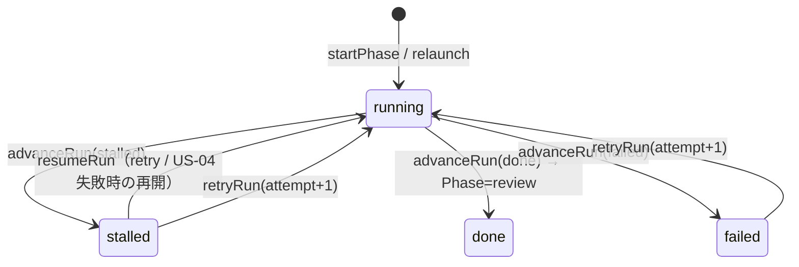

# S6 — ドメインモデル(全体) / v0.0.4

## メタ
- 工程: S6 (Domain Model)
- PhaseGroup: Build
- 役割: ドメインモデラー
- ステータス: **確定**(2026-06-13 / 評価 AI レビュー。内部コード設計ゆえ人間承認不要 — S4/S5 と同じ確立パターン)
- 入力参照: [s1/index.md](../s1/index.md), [s5/index.md](../s5/index.md), [s4-tech-spec.md](../s4-tech-spec.md)
- 作成日: 2026-06-13
- 更新日: 2026-06-13

## このサイクルの S6 の結論(先出し)

**v0.0.4 は新規ドメイン集約・ドメイン変更を一切要さない。** 既存の `Question` 集約 / `Cycle・Run` 集約 / `Review` モデルが 7 Unit の全ビジネスロジックを既にカバーする。S6 の仕事は「新規モデルを作る」ことではなく、**既存モデルが US を満たすことの逆引き確認**と、本サイクルが依存する**境界判断(何をドメインに入れない/入れるか)を明文化**することである(過剰設計の回避 / YAGNI)。

コード実地調査(2026-06-13)で確認した事実:
- 回答分岐(S4 C2)は既存 [`applyAnswer`/`deriveCommand`](../../../src/domain/question/question.ts) が既に実装済 — `question` 回答 → `Unit02Command.resumeRun` / `visual_review` 承認 → `approveTaskReview`。**ドメイン変更不要**。
- wire スキーマ(`aidlc-question`/`aidlc-answers`)の項目は既存 `QuestionOption`(`id/label/hint/recommended`)・`Answer`(`verdict/body/reason`)で過不足なく載る。**回答モデル不変**(コードコメント「回答モデルは不変」と一致)。
- session-id は現 `Run` 実体に**フィールドが無く**、追加すべきでない(実行基盤の状態 / S4 D-01・`cycle.ts` の「Cycle は store/SDK/HTTP を知らない INV-9」境界)。

## スタック確認 (PDF 警告: 実 PJ と乖離すると AI が的外れな質問を返す)
- 言語: TypeScript / フレームワーク: Hono(backend)・React(web) / 永続化: sqlite(studio 別 store)/ 既存資産: ドメインは `src/domain/`(`question` / `cycle` / `review` / `events`)に確立済。
- ※ [s5/index.md](../s5/index.md) アーキ前提と齟齬なし(S5 と同じ境界:ドメインは `OrchestratorPort` のみに依存・アダプタは DB を書かない)。

## DDD 採用判断
- 採用: **DDD 採用(前サイクル継承)**。`src/domain/` は集約ルート・エンティティ・値オブジェクト・不変条件(INV-N)・ドメインイベントの語彙で既に構成済。
- 理由: 本サイクルで DDD 採用/未採用を選び直す事由なし。既存の集約境界をそのまま使う。

## ユビキタス言語 (用語集) — v0.0.4 で確認/追加する語のみ

| 用語 | 定義 | 別名NG |
|------|------|--------|
| turn | `claude -p`(または `--resume`)1 回の完遂。会話の 1 往復単位(S1 Q-02) | セッション(turn の集合が session)|
| session-id | claude CLI が払い出す会話継続キー。`--resume` の引数。**実行基盤の状態でドメイン外**(infra store に runId で紐づく) | run-id(別概念。run は studio の実行単位) |
| wire 契約 | AI↔人間 の質問/返信の JSON スキーマ(`aidlc-question`/`aidlc-answers`)。ドメイン型 ↔ wire JSON の**境界変換**(Unit-01)で、ドメイン型そのものではない | — |
| resume(turn 継続) | `question` 回答で次 turn を起動する経路。承認 finalize(`done`)とは別命令(`resumeRun` vs `approveTaskReview`) | 承認(別経路)|
| batch(一括回答) | 1 run が出した複数 `question` への回答をまとめて 1 つの `aidlc-answers` に積み、1 回の `--resume` で渡す処理単位(N 問→N 答→1 resume / S2 確定)| 1問1往復(別の旧モデル)|

## 集約 / モデル一覧(本サイクルが触れる既存集約のビュー)

- [question-aggregate](./question-aggregate.md) — `Question` 集約の v0.0.4 ビュー(US-03/04/05/06 / 回答分岐・wire 境界)
- [cycle-run-aggregate](./cycle-run-aggregate.md) — `Cycle・Run` 集約の v0.0.4 ビュー(US-04 / session-id をドメイン外に保つ境界・resume 状態遷移)

> US-01(前段文脈)/ US-02(md 描画)/ US-07(進捗)はドメインロジックを持たない(app/web の振る舞い)。本サイクルでドメインに現れる US は US-03/04(質問・回答・継続)のみ。下記「US → モデル 逆引き」参照。

## US → モデル 逆引き(完了条件①+⑤の binding ゲート)

| US | ビジネスロジックの在処 | 既存モデルで表現できるか | 矛盾 |
|----|----------------------|------------------------|------|
| US-01 前段文脈注入 | app service(`PromptComposer` への path 解決)。ドメインルールなし | — (ドメイン対象外) | なし |
| US-02 md 描画 | web 描画。ドメインルールなし | — (ドメイン対象外) | なし |
| US-03 質問 emit | live が `QuestionRaised{kind:"question", payload.options}` を emit。`raiseQuestion` で `Question`(state=open)生成 | ✓ 既存 `Question`/`QuestionOption`/`QuestionRaised` で表現可 | なし |
| US-04 resume 継続 | 回答 → `applyAnswer` → `Unit02Command.resumeRun` / `Run` の stalled↔running 遷移 | ✓ 既存 `applyAnswer`/`deriveCommand`/`resumeRun`(cycle)で表現可 | なし |
| US-05 QA スレッド | web 描画(`Question[]` 時系列)。ドメインルールは US-03/04 と同一 | ✓ 既存で表現可 | なし |
| US-06 一括ヒアリング | 同上(設定も同じ `Question`/`Answer` 器)| ✓ 既存で表現可 | なし |
| US-07 可変ステップ進捗 | web 描画(`Phase`/`Run` state の表示)。ドメインルールなし | — (ドメイン対象外) | なし |

→ 触る US の binding/AC と矛盾なし。整合不能な点は無く S1 に戻す Q は発生しない(完了条件⑤充足)。

## 横断的な状態遷移(本サイクルで使う Run 遷移 / 既存)

> US-04 の「答えると次 turn」は **新 Run を起こさず同 Run を `--resume`** する(infra の振る舞い)。ドメイン上は `question` 回答が `resumeRun` 命令を生み、turn 失敗時のみ `stalled→running`(retry)としてこの図に現れる。turn 継続そのものは session-id(infra)で実現しドメイン状態を増やさない。

## 全体 質疑応答ログ (スタック・DDD 判断・モデル横断)

### Q-01 — (Biz 判断なし)
- 本 S6 は既存ドメインの reuse 確認で、新規モデル判断も Biz 判断も発生しない。DDD は前サイクル継承。よって S4/S5 同様、評価 AI レビューで確定検査(§の判定は下記 D を参照)。人間 human-gate は実機/視覚レビュー(S8/S9)まで発生しない。

---

## 全体 AI が独自に決めたこと と 理由

### D-01 — v0.0.4 で新規集約を作らず、既存 `Question`/`Cycle・Run`/`Review` の reuse として S6 を構成する
- **理由**: コード実地調査で 7 Unit の全ロジックが既存集約でカバーされることを確認(回答分岐・wire 項目・状態遷移すべて既存)。新規集約や代理モデルを作るのは過剰設計(SKILL 禁止「US と紐づかないモデルを作る」)。S6 出力は「reuse 確認 + 境界判断の明文化」とし、触る 2 集約だけ薄いビュー md を置く(コード重複を避ける / DRY)。
- **判断**: AI 裁量で確定(責務契約①: 内部コード設計 / 2026-06-13 評価 AI レビュー)。ユーザー上書き希望時は随時反映。

### D-02 — session-id をドメイン(`Run`)に持たせず infra store に runId で紐づける
- **理由**: `Run` 実体に session-id フィールドは無く、`cycle.ts` の「Cycle は store/SDK/HTTP を知らない(INV-9)」境界に従えば claude session は実行基盤の関心事。ドメインに漏らすと境界が崩れる(S4 D-01 と一致)。
- **判断**: AI 裁量で確定(責務契約①: 内部コード設計 / 2026-06-13 評価 AI レビュー)。ユーザー上書き希望時は随時反映。

### D-03 — 「★おすすめちょうど 1」をドメイン不変条件にせず wire/UI バリデーションに置く
- **理由**: 既存 `QuestionOption.recommended?` は基数制約を持たない optional bool。ドメインは検証済 payload を受け取る前提で、選択肢構造の検証は wire 境界(Unit-01 / S7)の責務。ドメイン不変条件に昇格させると、ドメインが wire の表示制約を知ることになり層が混ざる。
- **判断**: AI 裁量で確定(責務契約①: 内部コード設計 / 2026-06-13 評価 AI レビュー)。ユーザー上書き希望時は随時反映。

---

## 棄却した集約案

### R-01 — `Session` を新規集約として導入(session-id・turn 列・履歴を持つ)
- **棄却理由**: turn 履歴は claude 側が session 内に保持し `--resume` で引き継ぐ(S4 R-02)。studio 側に session 集約を作ると二重管理・文脈ドリフト。session-id は infra store の 1 カラムで足りる(D-02)。

### R-02 — wire スキーマ(`aidlc-question`/`aidlc-answers`)をドメイン型として定義
- **棄却理由**: wire はシリアライズ境界で、ドメインは既存 `QuestionOption`/`Answer` で表現済。wire 型をドメインに置くと「回答モデル不変」を破り境界が滲む。wire↔ドメインの変換は Unit-01 の共有モジュール(S7)に置く。

## 次工程 (S7) への引き継ぎ
- フレームワーク非依存で実装すべき集約・モデル: **新規なし**。S7 のドメインコード作業は既存集約に対して**ゼロ変更**が原則。S7 の主作業はドメインでなく wire 変換純関数(Unit-01)+ 各 Unit の infra/app/web 実装。
- コード化が複雑な不変条件: 「★おすすめちょうど 1」の検証(wire 境界 / Unit-01)— 0 件も 2 件以上も可視エラーで弾く(原則④)。ドメイン不変条件ではない(D-03)。
- テストで保証したいビジネスルール: 既存 `applyAnswer` の分岐(`question`→`resumeRun` / `visual_review`→`approveTaskReview`)が live・scripted 両経路で同一に効くこと(S4 C6 scripted パリティ)。回帰で守る(既存テストを緩めない / real-AI tests additive)。

## 前サイクルからの引き継ぎ (手戻り時のみ追記)
- 何が漏れていたか:
- 暫定の解決方針:
- 棄却した案とその理由:

## 評価 AI レビュー記録(2026-06-13 / code-architect 評価エージェント)

S6 は既存ドメインの reuse 確認のみで Biz/プロダクト判断を含まない(責務契約①)。DDD は前サイクル継承。よって S4/S5 と同じく評価 AI の敵対的レビューで確定検査(dogfood 作業規範)。

- **総合判定**: SOUND-WITH-FIXES → 指摘を全反映して解消。
- **「ドメイン変更なし」の falsification 結果**: **TRUE(変更不要は正しい)**とコード実地で確認。
  - `deriveCommand` の `case "question": → resumeRun`(question.ts 151-156)は既存・無条件で実装済。
  - `ALLOWED_VERDICTS["question"] = {"answer"}`(question.ts 85)= UI が送る verdict と一致。ドメインギャップなし。
  - **batch(N問→N答→1resume)**: `Answer.body` が `aidlc-answers` JSON 文字列を**不透明に運ぶ**だけで成立(ドメインは N 個を parse しない / 突合は resumed agent が skill 契約で行う / S4 C4)。回答モデル変更不要。
- **完了条件①〜⑤**: 全 PASS(各 US ロジックの在処明示 / PM レビュー可 / DDD 採用明示 / ユビキタス言語定義 / binding 逆引き矛盾なし)。
- **N-1(人間判断の見落とし検査)**: 隠れた human-gate なし。D-01〜D-03 はいずれも内部コード設計(D-03「★おすすめ1」の wire 配置も S4 C3 で確定済の層判断で Biz ゲートではない)。
- **session-id 境界**: 「ドメイン外(infra store)」は S4 D-01・`cycle.ts` INV-9・Unit-04 と整合と確認。
- **反映した指摘**:
  - S-1: batch 時に `applyAnswer` をどの Question に当てるか(app 層の選定)が未記載 → question-aggregate.md に明記(ドメイン形状変更ではなく app の責務である旨)。
  - S-2: ユビキタス言語に `batch` が欠落 → 上表に追加。
  - N-1(note): 本レビュー記録を本節に記入(完了の前提)。
</content>
