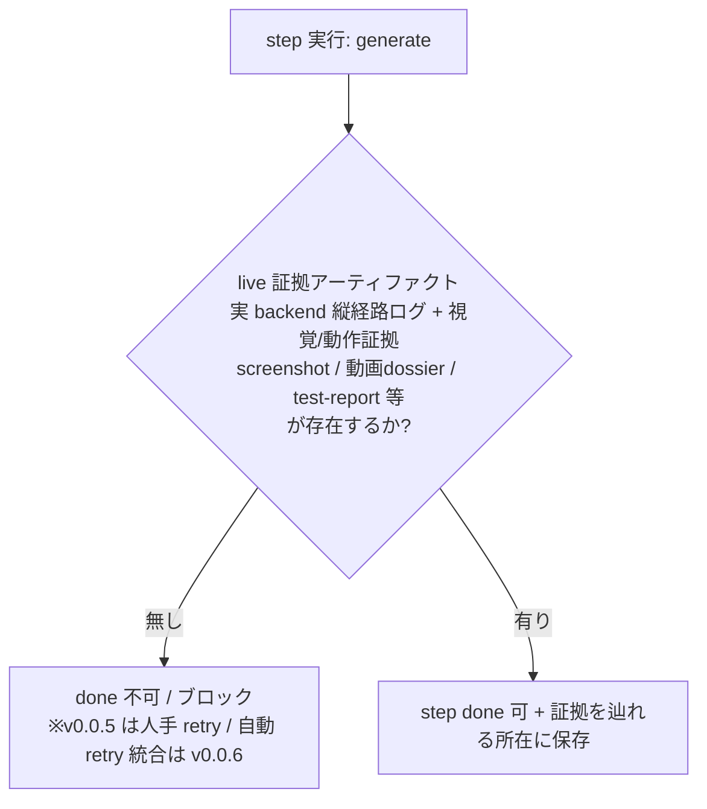
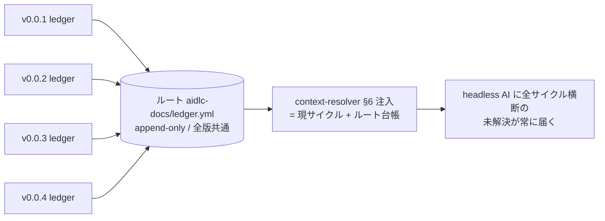
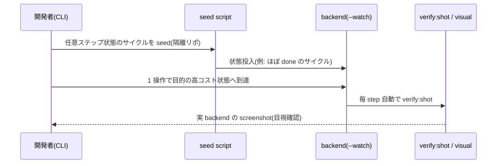
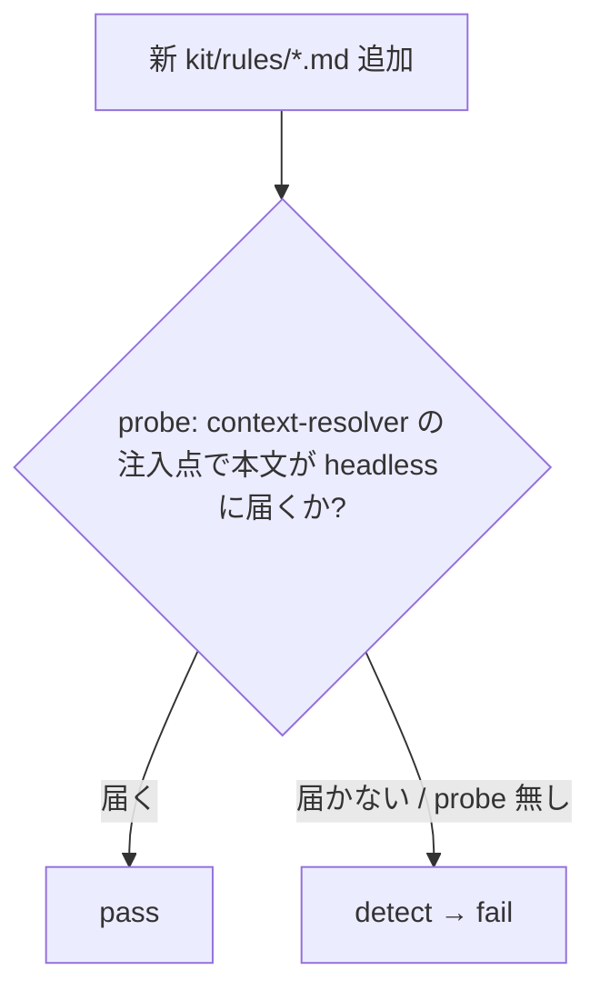

# S2 — 画面モック / フロー(全体)

## メタ
- 工程: S2 (Mock / Flow)
- PhaseGroup: Discovery
- 役割: プロダクトデザイナー
- ステータス: 確定
- 入力参照: `aidlc-docs/v0.0.5/s1/`(US-01〜09)
- 作成日: 2026-06-20
- 更新日: 2026-06-20

## このサイクルの S2 方針

v0.0.5 は「検証/台帳の土台」で、大半が backend / プロセス / スクリプトの機構。**新規画面はほぼ無く、状態遷移図・データフロー・シーケンス主体**で US の意図を Biz に伝える。UI surface があるのは既存画面の修正(US-06 / US-08)と削除(US-09)のみ。

各 US の S2 表現:

| US | 表現 | 所在 |
|---|---|---|
| US-01 live証拠ハードゲート | 状態遷移フロー | 本 index フロー① |
| US-02 ルートledger再設計 | データフロー | 本 index フロー② |
| US-03 reconcileコード化 | 判定フロー | 本 index フロー③ |
| US-04 seeded+安価live | CLI シーケンス(画面なし=US-04 surface判断) | 本 index フロー④ |
| US-05 binding-rule probe | 判定フロー | 本 index フロー⑤ |
| US-06 scripted日本語化 | 画面(既存レビュー表示の文言) | [SCR-01](./scr-01-review-summary-display.md) |
| US-07 multiturn allowed | ルーティング分岐(UI surface なし) | 本 index フロー⑥ |
| US-08 threadバッジ整合 | 画面(既存スレッドのバッジ状態) | [SCR-02](./scr-02-thread-status-badge.md) |
| US-09 dead code削除 | 画面削除(surface 消滅 / 新規なし) | 本 index「画面削除」節 |

## 画面一覧
- [SCR-01 レビュー summary 表示(scripted 日本語化 / US-06)](./scr-01-review-summary-display.md)
- [SCR-02 会話スレッドの状態バッジ(US-08)](./scr-02-thread-status-badge.md)

## 画面削除
- **US-09**: `StepConfigPage.tsx` を廃止。設定 readback は既存 `StepConfigReadback` に一本化済(S8)。新規画面は発生せず、surface が 1 枚消える(dead code 削除)。

## 状態 / データ / シーケンスフロー

### フロー① — US-01 live 証拠ハードゲート(step done 判定)



> 証拠の**形式は step の性質に応じて選ぶ**: 静的 UI = screenshot / 操作・遷移 = 動画(dossier)/ backend・スクリプト = test-report・実行ログ。screenshot に固定しない(US-01 D-02 / ユーザー指摘で補正)。

### フロー② — US-02 ルート単一 append-only ledger と全サイクル横断注入



### フロー③ — US-03 reconcile のコード化(S1 完了ゲート)

```mermaid
flowchart TD
  S[S1 着手] --> C{前(全)サイクルの未解決 carried<br/>+ escalation 付き項目が<br/>当サイクルで US 化済か?}
  C -->|未 US 化が残る| F[S1 を fail / 進行ブロック]
  C -->|全件 US 化済| P[S1 続行可]
  C -.2サイクル連続 carried 検出.-> E[自動 escalate = US 化必須]
```

### フロー④ — US-04 seeded + 安価 live(CLI シーケンス)



### フロー⑤ — US-05 binding-rule 到達 probe



### フロー⑥ — US-07 multi-turn ルーティング分岐

```mermaid
flowchart LR
  RX[シナリオ受信] --> A{server.ts allowed 配列に<br/>"multi-turn" が有るか?}
  A -->|有(本 US 修正後)| M[multi-turn ルートで処理]
  A -->|無(現状)| H[happy にフォールバック ※これがバグ]
```

## Biz との合意事項
| # | 論点 | 合意内容 |
|---|------|---------|
| 1 | US-04 の surface | CLI / script のみ(専用 UI は作らない)。2026-06-20 ユーザー確定。 |
| 2 | 本サイクルの S2 主体 | 新規画面ほぼ無し・フロー主体。UI は既存修正(US-06/08)+ 削除(US-09)のみ。 |

## US 漏れ・齟齬の検知ログ
| # | 検知内容 | S1 に戻った日 | 解決方針 |
|---|---------|-------------|---------|
| 1 | US-01 の証拠定義を「配信 screenshot」に狭めていた(証拠は動画 dossier / test-report 等も取り得る、とユーザーが既出で指摘) | 2026-06-20(S2 中) | US-01 AC + D-02 / US-04 AC を「視覚/動作証拠(screenshot / 動画 / test-report 等、step 性質で選択)」に一般化。S2 フロー①も更新。 |

## 全体 質疑応答ログ (画面横断・フロー全体の議論)

### Q-01 — US-04(seeded+安価live)の surface
- **回答**(人間の回答を AI が記入):
  > CLI / script のみ(推奨)。
- **確定**(AI 記入):
  > 専用 dev UI は作らず、seed 投入・--watch・verify:shot をコマンド/スクリプトで提供。S2 では CLI シーケンス(フロー④)で表現。

---

## 全体 AI が独自に決めたこと と 理由

### D-01 — 本サイクルは状態遷移図/データフロー/シーケンス主体(新規画面を作らない)
- **理由**: US-01〜05・07 は backend/プロセス/スクリプトの機構で、画面より状態機械の方が意図を正確に伝える(S1 index 次工程引き継ぎ)。UI surface があるのは既存修正(US-06/08)と削除(US-09)のみ。
- **種別**: 技術判断(AI 自走で確定)
- **上書き**: なし

### D-02 — US-07 は UI surface 無し(機構のみ)
- **理由**: server.ts の allowed 配列修正で UI に出ない。フロー⑥(ルーティング分岐)で表現し scr ファイルは作らない。
- **種別**: 技術判断(AI 自走で確定)
- **上書き**: なし

---

## 棄却した画面案

### R-01 — US-04 に seed 状態選択の専用 dev UI を作る
- **棄却理由**: Q-01 でユーザーが CLI/script のみを選択。

## 次工程 (S3) への引き継ぎ
- **UI 設計で考慮すべき画面**: SCR-01(レビュー summary 表示 / 文言の可読性)・SCR-02(状態バッジ / レビュー準備完了の視覚状態)。本サイクルは UI 変更が軽微なので S3 は小さい。
- **外部 I/F が出てくる画面**: なし(本サイクルは内部機構中心)。
- **S3 が薄い見込み**: 新規画面ゼロ・既存 2 枚の微修正のみ。S3 はトークン/視覚方向の新規策定をほぼ要しない。

## 前サイクルからの引き継ぎ (手戻り時のみ追記)
- 何が漏れていたか: (手戻り時に追記)
- 暫定の解決方針:
- 棄却した案とその理由:
