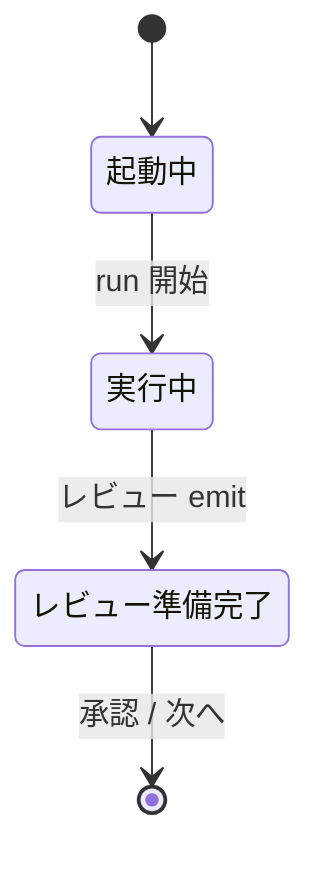

# SCR-02: 会話スレッドの状態バッジ(レビュー準備完了の整合)

## メタ
- 親: 画面要素の一覧
- 対応 US: [US-08](../s1/us-08-thread-badge.md)
- ステータス: 確定

## 目的
会話スレッドのヘッダ/ステップ状態バッジが、レビュー emit 後も run=running のため「起動中/実行中」のまま固着する。本文は F-12 で「できあがりを確認する」CTA に解消済だが、**バッジがレビュー準備完了と不一致**。バッジ表示を本文 CTA と整合させる(既存画面の状態表示修正)。

## 主要要素
- 表示要素: スレッドヘッダのステップ状態バッジ
- 状態: `起動中 / 実行中` → レビュー emit 後は `レビュー準備完了`(本文 CTA と一致)
- 不変: スレッド本文・CTA(F-12 で解消済)

## モック (ASCII / Before→After)

```
Before(不整合):
+--------------------------------------------------+
|  S8 統合スレッド            [● 実行中] ← run=running  |
|  本文: できあがりを確認する  ← CTA は準備完了を示す      |
+--------------------------------------------------+   ← バッジと本文が矛盾

After(整合):
+--------------------------------------------------+
|  S8 統合スレッド        [✓ レビュー準備完了]          |
|  本文: できあがりを確認する                          |
+--------------------------------------------------+
```

## 状態遷移(バッジ)



## この画面固有の 質疑応答ログ
(未解決 Q なし)

---

## この画面固有の AI が独自に決めたこと と 理由

### D-01 — バッジの「レビュー準備完了」状態をレビュー emit で立てる
- **理由**: run=running を直接の表示根拠にするとレビュー待ちでも「実行中」に見える。レビュー emit を状態源にし本文 CTA と一致させる。
- **種別**: 技術判断(AI 自走で確定)
- **上書き**: なし

---

## この画面固有の 棄却した案
(なし)
