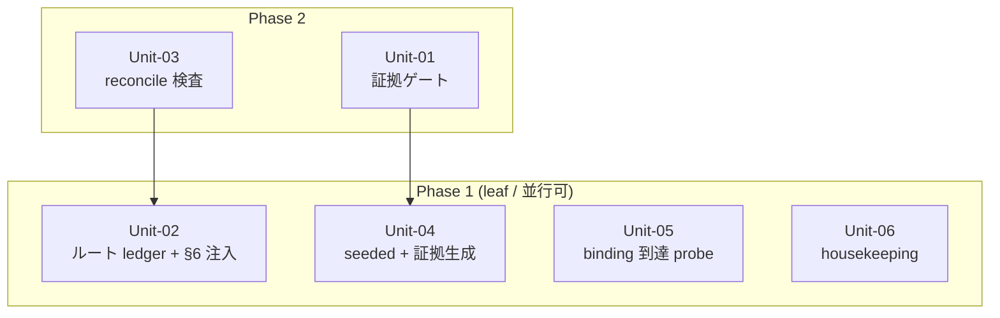

# S5 — Work Units (Unit 分割 + 依存マップ)

## メタ
- 工程: S5 (Work Units)
- 役割: ソフトウェアアーキテクト
- ステータス: 確定
- 入力参照: s1(US-01〜09) / s2(SCR・フロー) / s4-tech-spec.md
- 作成日: 2026-06-20
- 更新日: 2026-06-20

## アーキテクチャ前提
- スタック: Bun / TypeScript / SQLite / React+Vite / Playwright / claude CLI spawn(S4 確定 / 新規追加なし)
- 既存資産・制約: SQLite=唯一の真実 / context-resolver(composer)が headless prompt を組む / verify:shot(同梱 Chromium)/ 版別 ledger + ルート brief.md
- 想定デプロイ形態: ローカル常駐(127.0.0.1)シングルユーザー

## I/F 決定方針
- 採用: **AI 事前調査**(既存コード = context-resolver / reconcile.ts / live.ts / verify:shot を調べて I/F 案を出す)
- 理由: 本サイクルは既存機構の拡張が中心で、実コードの現契約に合わせる必要があるため。

## Unit 一覧
- [Unit-01 証拠ゲート(evidence-gate)](./unit-01-evidence-gate.md) — US-01
- [Unit-02 ルート ledger + §6 注入(root-ledger)](./unit-02-root-ledger.md) — US-02
- [Unit-03 reconcile 検査スクリプト(reconcile-check)](./unit-03-reconcile-check.md) — US-03
- [Unit-04 seeded + 安価 live + 証拠生成(seeded-evidence)](./unit-04-seeded-evidence.md) — US-04
- [Unit-05 binding-rule 到達 probe(binding-probe)](./unit-05-binding-probe.md) — US-05
- [Unit-06 housekeeping(独立小修正)](./unit-06-housekeeping.md) — US-06/07/08/09

## 依存 DAG (Unit 間依存方向 / Phase レイアウト)

**読み方**:
- 矢印は **依存方向**(`A --> B` = A は B を呼ぶ / A は B が無いと動かない)。依存先(矢印の先)は必ず先行 Phase。
- **着手順の正は下の「着手順テーブル」**(Phase 1=leaf を最初に着手)。Mermaid の縦位置でなくテーブルと Phase ラベルを順序の根拠にする(矢印は依存方向の表示であって着手順の矢印ではない)。
- Phase 内の Unit は並行に着手できる。矢印が同一 Phase 内で循環していたら Unit 分割の見直し。

## 凡例
- **角括弧 `[X]`**: Unit(本ステップで定義した自前 Unit のみ)
- **実線矢印 `-->`**: 依存方向(`A --> B` = A は B が無いと動かない)
- **subgraph**: **Phase = 実装順の段**(物理境界には使わない)
- 永続化・外部サービス・プロトコル種別は描かない(S6/S8 の領域)

## 着手順テーブル (Phase subgraph と一対一対応)

| Phase | 着手可能な Unit | 理由 |
|-------|----------------|------|
| Phase 1(leaf) | Unit-02, Unit-04, Unit-05, Unit-06 | 他 Unit に依存しない |
| Phase 2 | Unit-01, Unit-03 | Phase 1(Unit-04 / Unit-02)が揃えば作れる |

## 依存方向の根拠
| 依存(A → B) | 根拠 |
|--------------|------|
| Unit-01 → Unit-04 | 証拠ゲート(Unit-01)は Unit-04 が生成する証拠 manifest の形式を消費して done を機械検証する |
| Unit-03 → Unit-02 | reconcile 検査(Unit-03)は Unit-02 が作るルート ledger を入力に未 US 化を判定する |

## 読み手別の見方
- **エンジニア**: Phase 1 の 4 Unit は並行着手可。Unit-01 は Unit-04 の manifest I/F、Unit-03 は Unit-02 のルート ledger I/F を先にスタブ化する。
- **PM**: leaf が 4 本あり並行度が高い。Phase 2 は 2 本のみ。

## 全体 質疑応答ログ (アーキ全体・I/F 方針・Unit 横断・依存マップ)

### Q-01 — I/F 決定方針(人間事前 / AI 事前調査)
- **回答**(人間の回答を AI が記入):
  > (技術判断 / 既存コード拡張中心のため AI 事前調査を既定)
- **確定**(AI 記入):
  > AI 事前調査。既存 context-resolver / reconcile.ts / live.ts / verify:shot の現契約に合わせて各 Unit の I/F 案を出す。S6/S8 で実コードと突合。

---

## 全体 AI が独自に決めたこと と 理由

### D-01 — housekeeping 4 US を 1 Unit(Unit-06)に束ねる
- **理由**: US-06/07/08/09 は相互依存なし・他 Unit にも依存しない独立 leaf 小修正(scripted fixture / server.ts / thread バッジ / dead code)。S1 では粒度の都合で個別 US だが、並行開発の単位(Unit)としては 1 人が一括で捌ける 1 Unit が自然。US 個別性は所属 US リンクで保持。
- **種別**: 技術判断(AI 自走で確定)
- **上書き**: なし

### D-02 — Unit-05(probe)は leaf(他 Unit に依存しない)
- **理由**: probe は「注入経路で本文が届くか」を assert する汎用機構で、context-resolver の既存注入点に対して独立に作れる。新 rule(Unit-02 等が触る)への適用は probe 完成後にテストとして当てる。
- **種別**: 技術判断(AI 自走で確定)
- **上書き**: なし

---

## 棄却した Unit 案

### R-01 — housekeeping を web/backend で 2 Unit に分割
- **棄却理由**: 4 件とも独立 leaf の小修正で、分割しても並行度の利得が小さく Unit 数が増えるだけ。1 Unit に束ねる(D-01)。

## 次工程 (S6) への引き継ぎ
- **ドメインモデリングの対象**: Unit-01(証拠 manifest = Evidence 概念)/ Unit-02(ルート台帳 = LedgerEntry 概念)が中心。Unit-03〜06 は機構/スクリプト寄りでドメイン薄め。
- **技術詳細から守るべき境界**: 証拠は file(_evidence/)・ledger は file(yaml)で、DB(run/状態の真実)とは分離。
- **並行リスク**: Unit-01 と Unit-04 の manifest I/F 合意が先行クリティカル(Phase 1→2 の橋)。

## 前サイクルからの引き継ぎ (手戻り時のみ追記)
- 何が漏れていたか: (手戻り時に追記)
- 暫定の解決方針:
- 棄却した案とその理由:
