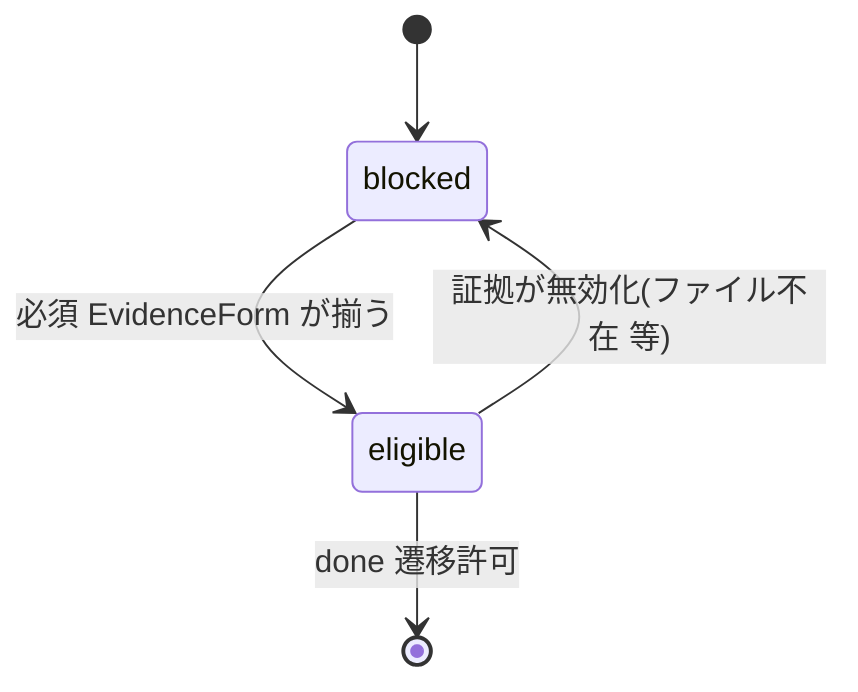

# 集約: Evidence(証拠)

## メタ
- 親: ドメインモデルの一覧
- 対応 US: [US-01](../s1/us-01-live-evidence-gate.md)
- 所属 Unit: [Unit-01](../s5/unit-01-evidence-gate.md), [Unit-04](../s5/unit-04-seeded-evidence.md)
- ステータス: 確定

## モデル定義(軽量 DDD)

- **集約ルート**: `EvidenceManifest`
  - `step`: StepId(どの step の証拠か)
  - `forms`: `EvidenceForm[]`(集めた証拠の集合)
- **値オブジェクト**: `EvidenceForm`
  - `kind`: `"screenshot" | "video" | "test-report" | "log"`
  - `path`: 証拠ファイルの所在(後から人間が辿れる)
  - `capturedAt`: 取得時刻
- **派生**: `StepDoneEligibility` = `"eligible" | "blocked"`(下記不変条件から純粋関数で導出)

## 不変条件
- **必須充足**: step を done にできる(`eligible`)のは、`forms` に **① 実 backend 縦経路の `log` ② step 性質に応じた視覚/動作証拠(静的UI=screenshot / 操作・遷移=video / backend・script=test-report)** が揃うとき。いずれか欠落なら `blocked`。
- **形式は step 性質で選ぶ**(screenshot 固定にしない / US-01 D-02)。必須の「視覚/動作証拠」は kind のいずれか 1 つ以上で満たせる。
- **観測事実で裏取り**: `path` のファイルが実在することが前提(OS 観測)。claude の自己申告 done を eligibility の根拠にしない。
- `capturedAt` は当該サイクル実行中のものであること(古い証拠の使い回しを許さない)。判定基準: 当該 step の Run 開始時刻 ≤ `capturedAt`(= その Run の実行中に取得された証拠のみ有効)。Run 時刻は既存 run store(SQLite)から取得し S8 で配線する。

## 状態遷移

## この集約固有の 質疑応答ログ
(未解決 Q なし)

---

## この集約固有の AI が独自に決めたこと と 理由

### D-01 — 必須は「log + 視覚/動作証拠 1 つ以上」。視覚/動作の種別は step 性質で選択
- **理由**: US-01 AC + D-02。縦経路ログは常に必須、可視証拠は step 性質に応じ screenshot/video/test-report のいずれかで満たす。これで「screenshot 固定」を避けつつ機械検証可能。
- **種別**: 技術判断(AI 自走で確定)
- **上書き**: なし

---

## この集約固有の 棄却した案

### R-01 — 証拠を screenshot 必須に固定
- **棄却理由**: 動画/test-report も証拠たり得る(US-01 D-02 / [evidence-forms-not-screenshot-only])。固定しない。
