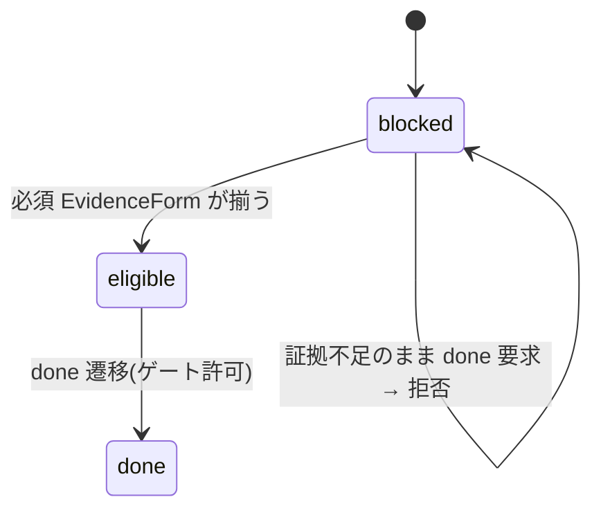

# S6 — ドメインモデル(全体)

## メタ
- 工程: S6 (Domain Model)
- 役割: ドメインモデラー
- ステータス: 確定
- 入力参照: s1(US-01〜09) / s5(Unit-01〜06)
- 作成日: 2026-06-20
- 更新日: 2026-06-20

## スタック確認
- 言語: TypeScript(ドメイン層は pure / 技術非依存。既存 `src/domain/*` と同形)
- フレームワーク: なし(domain は純粋関数 + 型)
- 永続化: 証拠 = file(`_evidence/`)/ ledger = file(yaml)/ run・状態 = SQLite(S8 の領域)
- 既存資産: `src/domain/` に cycle / review / task / question 等。本サイクルは **Evidence** と **LedgerEntry** を新規追加。
- S5 アーキ前提と矛盾なし。

## DDD 採用判断
- 採用: **軽量 DDD 採用**(値オブジェクト + 不変条件 + 状態遷移)。既存 `src/domain` の pure domain と整合。集約は 2 つだけで小さい。
- 理由: ビジネスルール(証拠の充足・台帳の state 規約)を不変条件として表現したい。HTTP/DB は持ち込まない(S7 で技術非依存実装、S8 で配線)。

## ユビキタス言語 (用語集)
| 用語 | 定義 | 別名NG |
|------|------|--------|
| Evidence(証拠) | step が実際に動いたことを示す観測事実の集合 | 「ログ」だけ・「スクショ」だけに矮小化しない |
| EvidenceForm | 証拠の 1 形式: `screenshot` / `video` / `test-report` / `log` | 「画像」(動画/レポートを含むため) |
| EvidenceManifest | ある step の証拠一覧(forms)とその所在 | — |
| StepDoneEligibility | step を done にできるか(`eligible` / `blocked`) | 「完了」(自己申告 done と混同しない) |
| LedgerEntry | 確定/持ち越し 1 件(id/decision/state...) | 「タスク」「backlog 項目」 |
| LedgerState | `carried` / `done` / `dropped` | — |
| ReconcileStatus | carried 項目が次サイクルで US 化済か(`reconciled` / `unreconciled`) | — |
| Escalation | 同提案が 2 サイクル連続 carried = US 化必須の昇格 | — |

## 集約 / モデル一覧
- [evidence(証拠)](./evidence.md) — US-01 / Unit-01・04
- [ledger-entry(台帳項目)](./ledger-entry.md) — US-02・03 / Unit-02・03

## 横断的な状態遷移

step done の機械ゲート(Evidence 充足で eligible):

## 全体 質疑応答ログ
(本サイクルは技術非依存モデルで未解決の事業 Q なし。証拠形式は US-01 で、台帳 state は ledger 規約で確定済)

---

## 全体 AI が独自に決めたこと と 理由

### D-01 — 新規集約は Evidence と LedgerEntry の 2 つだけ(他 Unit はドメイン薄)
- **理由**: Unit-03(reconcile)は LedgerEntry を読む検査スクリプト、Unit-04(seeded)/Unit-05(probe)/Unit-06(housekeeping)は機構/スクリプトでビジネス不変条件が薄い。ドメイン化は Evidence/LedgerEntry に集中(US と紐づかないモデルを作らない)。
- **種別**: 技術判断(AI 自走で確定)
- **上書き**: なし

### D-02 — EvidenceForm の種別は閉じた列挙(screenshot|video|test-report|log)
- **理由**: US-01 D-02 で「step 性質で形式を選ぶ」と確定。種別を型で閉じると done ゲートが必須充足を機械検証しやすい。
- **種別**: 技術判断(AI 自走で確定)
- **上書き**: なし

---

## 棄却した集約案

### R-01 — Run/Step を作り直して Evidence を内包させる
- **棄却理由**: Run/Step は既存 domain(cycle 配下)にある。Evidence は独立集約として step を参照するに留め、既存を作り直さない。

## 次工程 (S7) への引き継ぎ
- **フレームワーク非依存で実装すべき**: Evidence(forms 充足判定 = `stepDoneEligibility`)/ LedgerEntry(state 不変条件・reconcile 判定・escalation 検出)。いずれも純粋関数で書け、テスト容易。
- **不変条件のうちコード化が複雑**: reconcile 判定(ルート台帳の carried × 次サイクル US 群の突合)。
- **テストで保証したいルール**: ① 必須 EvidenceForm 欠落で blocked ② carried/into・dropped/reason・done/closedIn の必須 ③ 2 連続 carried で escalation。

## 前サイクルからの引き継ぎ (手戻り時のみ追記)
- 何が漏れていたか: (手戻り時に追記)
- 暫定の解決方針:
- 棄却した案とその理由:
