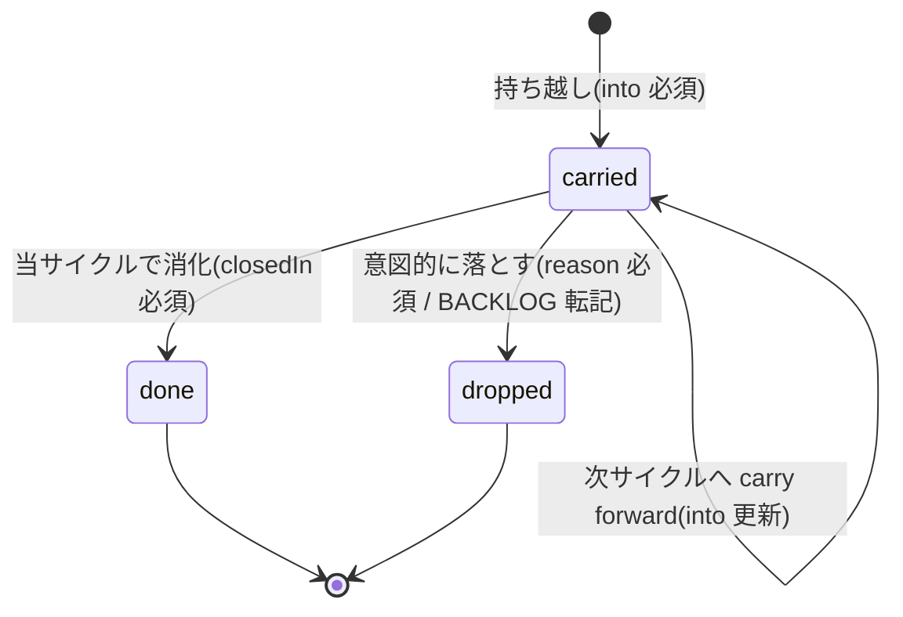

# 集約: LedgerEntry(台帳項目)

## メタ
- 親: ドメインモデルの一覧
- 対応 US: [US-02](../s1/us-02-root-ledger.md), [US-03](../s1/us-03-reconcile-codify.md)
- 所属 Unit: [Unit-02](../s5/unit-02-root-ledger.md), [Unit-03](../s5/unit-03-reconcile-check.md)
- ステータス: 確定

## モデル定義(軽量 DDD)

- **集約ルート**: `LedgerEntry`
  - `id`: 一意 ID(出典の D 番号 or 一意名)
  - `origin`: どの md で確定したか
  - `decision`: 決定内容
  - `state`: `LedgerState` = `"carried" | "done" | "dropped"`
  - `into?`: 渡し先バージョン(state=carried のとき必須)
  - `reason?`: 棄却理由(state=dropped のとき必須)
  - `closedIn?`: 消し込んだ md/commit(state=done のとき必須)
  - `escalation?`: 昇格メモ(2 サイクル連続 carried 等)
- **派生**: `ReconcileStatus` = `"reconciled" | "unreconciled"`(carried 項目が次サイクルで US 化されたか)

## 不変条件
- **state 必須フィールド**: `carried` ⇒ `into` 必須 / `dropped` ⇒ `reason` 必須 / `done` ⇒ `closedIn` 必須。欠落は不正エントリ。
- **reconciled 判定**: `into` が当該サイクルを指す `carried` は、そのサイクルの US 群に反映(US 化)されていれば `reconciled`、なければ `unreconciled`。
- **未 reconcile ゼロ規約**: `unreconciled` が 1 件でも残るサイクルの S1 は `確定` にできない(US-03 が機械強制)。
- **escalation 検出**: 同一論点が 2 サイクル連続で `carried` = `escalation` 対象(次サイクルで US 化必須 / backlog 不可)。
- **append-only(ルート台帳)**: closed なサイクルのエントリは改変しない。後続移送は現サイクル台帳に carry forward する。

## 状態遷移

注: `done` と `dropped` は終端状態(後戻りしない)。`dropped` から再着手したい場合は BACKLOG から新規 LedgerEntry を起こす。

## この集約固有の 質疑応答ログ
(未解決 Q なし)

---

## この集約固有の AI が独自に決めたこと と 理由

### D-01 — 既存 ledger 規約(kit/rules/ledger.md)をそのままドメイン不変条件にする
- **理由**: 形式は変えず「置き場(ルート集約)と注入範囲(全サイクル横断)」だけ変える(US-02)。reconcile(US-03)は本不変条件を機械検査するだけ。
- **種別**: 技術判断(AI 自走で確定)
- **上書き**: なし

---

## この集約固有の 棄却した案

### R-01 — dropped を別ファイル(dropped-log)に分離して LedgerState から外す
- **棄却理由**: drop は state であってファイルではない(本サイクルで確定した整理 / [[v005-cycle-split]])。BACKLOG 転記は別途だが state は LedgerEntry に持つ。
