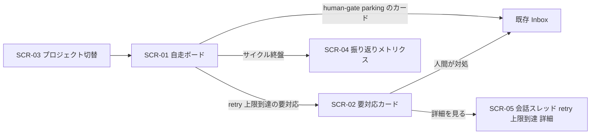
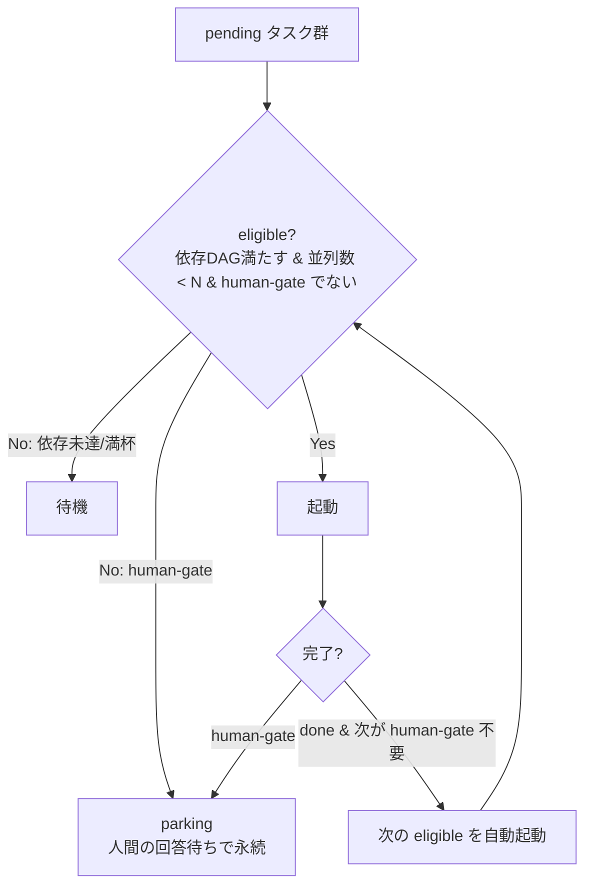
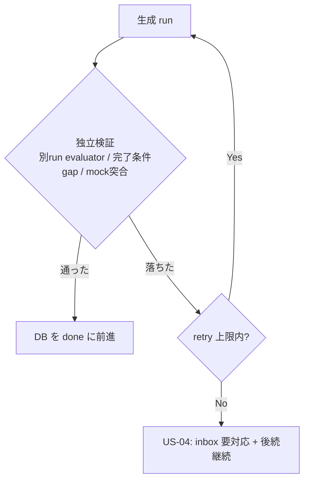
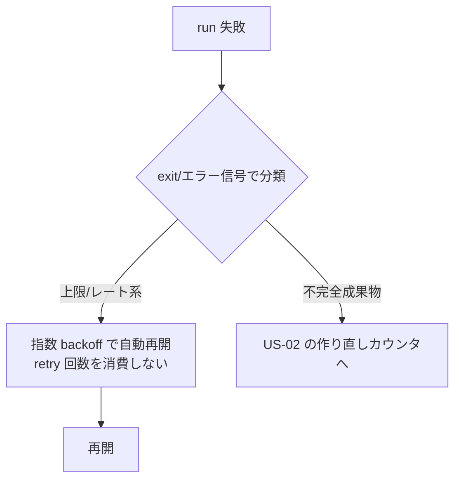

# S2 — 画面モック / フロー(全体)

## メタ
- 工程: S2 (Mock / Flow)
- PhaseGroup: Discovery
- 役割: プロダクトデザイナー
- ステータス: 確定
- 入力参照: このサイクルの要件一覧(US 群 13 件)
- 作成日: 2026-06-21
- 更新日: 2026-06-21

## 本サイクルの S2 方針

v0.0.6 は **自走エンジン core**。画面の大半(ボード / Inbox / レビュー / 会話スレッド / 進捗)は前サイクルまでに構築済。本 S2 は **自走エンジンが新たに導入する画面差分だけ**を起こす:

- **新規状態の可視化**: スケジューラが回す自走状態(実行中 / backoff待ち / parking / stall→自動retry)を既存ボードに足す(SCR-01)。
- **新規カード種別**: retry 上限到達の「要対応」例外カード(SCR-02)。
- **完全新規画面**: プロジェクト作成/切替/リセット(SCR-03)、振り返りメトリクス レポート(SCR-04)。
- **画面を持たない US**: 状態機械(US-02/03/05/06)は下の遷移フローで表現。基盤 US(US-07 実行基盤移行 / US-09 drift 検出 / US-10 reconcile project 化 / US-11 silent 再生成)は画面なし(US-07/08 は SCR-01 の状態として現れる)。

## 画面一覧
- [SCR-01 自走ボード(自走状態バッジ + 稼働中タスク一覧)](./scr-01-self-driving-board.md) — US-01 / US-05 / US-06 / US-07 / US-08
- [SCR-02 Inbox「要対応」例外カード(retry 上限到達)](./scr-02-inbox-retry-exhausted.md) — US-04
- [SCR-03 プロジェクト 作成 / 切替 / リセット](./scr-03-project-management.md) — US-12
- [SCR-04 振り返りメトリクス レポート](./scr-04-retro-metrics.md) — US-13
- [SCR-05 会話スレッド(retry 上限到達 詳細)](./scr-05-thread-retry-exhausted.md) — US-04 / US-05 / US-06

## 画面遷移フロー



## 状態機械フロー(画面を持たない US の表現)

### US-01 自走スケジューラ — 起動可否の判定ループ



### US-02 generate→独立検証→自動 retry



### US-03 上限/レート分類 + backoff(US-02 とは別カウンタ)



### US-05 起動毎 reconcile(resume 優先)/ US-06 stall

```mermaid
flowchart TD
  BOOT[起動時 reconcile] --> M{DB running と実pid突合<br/>(稼働台帳 US-08)}
  M -->|pid 生存 & 無音 > idle timeout| STALL[US-06: stall → retry]
  M -->|孤児(pid 不在)| S{session_id ある?}
  S -->|Yes| RESUME[resume 優先<br/>同一文脈継続 / O3 実証]
  S -->|No| RERUN[idempotent re-run]
  LATE[死んだ run の late-emit] -->|冪等に無視| IGN[RunNotFound で不整合化しない]
```

## Biz との合意事項
| # | 論点 | 合意内容 |
|---|------|---------|
| 1 | 自走状態の見せ方 | SCR-01 の 5 バッジ(実行中 / backoff待ち / parking / stall→retry / resume復帰)で確定(2026-06-21)。 |
| 2 | 「要対応」例外カードと routine human-gate の区別 | SCR-02 のラベル + 警告色 + 非ブロッキング明示で区別(承認)。 |

## US 漏れ・齟齬の検知ログ
| # | 検知内容 | S1 に戻った日 | 解決方針 |
|---|---------|-------------|---------|
| - | (現時点なし) | - | - |

## 全体 質疑応答ログ (画面横断・フロー全体の議論)

### Q-01 — 自走状態(実行中 / backoff待ち / parking / stall→自動retry)を既存ボードにどう統合するか
- **回答**(人間の回答を AI が記入):
  > 5 種(実行中 / backoff待ち / parking / stall→retry / resume復帰)で OK。
- **確定**(AI 記入):
  > 既存ボードの稼働中一覧 + 待ち/復帰中 に 5 バッジで統合(SCR-01)。別画面化はしない(brief の Dashboard 思想を維持 / R-01)。

---

## 全体 AI が独自に決めたこと と 理由

### D-01 — 既存画面は再描画せず、自走エンジンの差分だけを S2 で起こす
- **理由**: ボード / Inbox / レビュー / スレッド / 進捗は v0.0.1〜v0.0.4 で構築済。S2 の目的は「US を Biz が読んで一発で分かる絵」。v0.0.6 の US が新たに足す視覚要素(自走状態バッジ / 要対応カード / プロジェクト切替 / メトリクス)だけを起こすのが情報量の質として正しい(brief「情報量より質」)。
- **種別**: 技術判断(AI 自走で確定)
- **上書き**: なし

### D-02 — 基盤 US(US-07/09/10/11)は画面を持たせない
- **理由**: US-07(実行基盤の Agent SDK 移行)・US-09(drift 検出 probe)・US-10(reconcile project 化)・US-11(silent 再生成)は人間の視覚判断対象でない内部機構。US-07/08 の効果は SCR-01 の状態(last-activity / 稼働中一覧)として間接的に現れる。US-11 は「silent」が要件なので画面に出さないことが正しい挙動。
- **種別**: 技術判断(AI 自走で確定)
- **上書き**: なし

---

## 棄却した画面案

### R-01 — 自走状態を専用の新ダッシュボードに分離する
- **棄却理由**: 既存ボード(Active Cycles / AI待ち / Human待ち の象限)に自走状態を足す方が、人間の「1 画面で状況把握」を壊さない。別画面化は brief の Dashboard 最重要思想に反する。

## 次工程 (S3) への引き継ぎ
- UI 設計で考慮すべき画面・フロー境界: SCR-01 の自走状態バッジ(running / backoff / parking / stall→retry / 要対応)の色・アイコン体系。SCR-04 メトリクスのデータ可視化(設計システムの一部として扱う / design-quality)。
- 外部 I/F が出てくる画面: なし(本サイクルは内部自走。認証/決済/通知は対象外 = brief やらない)。

## 前サイクルからの引き継ぎ (手戻り時のみ追記)
- 何が漏れていたか: (手戻り時に追記)
- 暫定の解決方針:
- 棄却した案とその理由:
