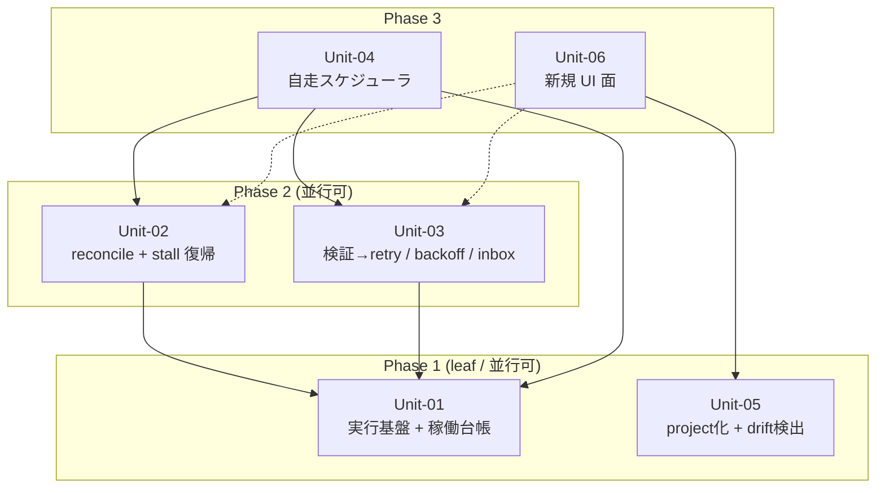

# S5 — Work Units (Unit 分割 + 依存マップ)

## メタ
- 工程: S5 (Work Units)
- 役割: ソフトウェアアーキテクト
- ステータス: 確定
- 入力参照: このサイクルの要件一覧(US 群 13 件) / 画面要素(SCR-01〜05) / 技術仕様(S4)
- 作成日: 2026-06-21
- 更新日: 2026-06-21

## アーキテクチャ前提
- スタック: Bun + TypeScript + SQLite(DB=唯一の真実)+ React/Vite + Playwright。AI 実行は CLI `claude -p` → Claude Agent SDK `query()` 逐次ストリームへ移行(US-07 / S4 D-02)。
- 既存資産・制約: domain(純粋ステートマシン)/ app/services(engine-service / context-resolver / reconcile / root-ledger 等)/ infra(orchestrator live・scripted / evidence / sqlite)の 4 層。依存は内向き。
- 想定デプロイ形態: シングルユーザー・ローカル常駐・単一 worktree(N>1 並行は v0.0.7)。

## I/F 決定方針
- 採用: **AI 事前調査**(b)
- 理由: 対象は studio 自身(dogfood)で既存コードベースが source。新規 I/F(稼働台帳 / SDK ストリーム / scheduler)は既存 app/services・infra の延長で AI が調査して案を出せる。人間に内部 I/F を聞くのは契約①に反する(内部コード非前提)。

## Unit 一覧
- [Unit-01 実行基盤 + 稼働台帳(monitoring substrate)](./unit-01-executor-registry.md) — US-07 / US-08
- [Unit-02 起動時 reconcile + stall 復帰](./unit-02-recovery.md) — US-05 / US-06
- [Unit-03 検証→自動 retry / 失敗分類 backoff / 上限→inbox / silent 再生成](./unit-03-retry-policy.md) — US-02 / US-03 / US-04 / US-11
- [Unit-04 自走スケジューラ](./unit-04-scheduler.md) — US-01
- [Unit-05 reconcile/ledger project 化 + ルール↔ゲート drift 検出](./unit-05-project-gate.md) — US-09 / US-10
- [Unit-06 新規 UI 面(プロジェクト管理 + 振り返りメトリクス)](./unit-06-ui-surfaces.md) — US-12 / US-13

## 依存 DAG (Unit 間依存方向 / Phase レイアウト)

**読み方**:
- 矢印は **依存方向**(`A --> B` = A は B を呼ぶ / A は B が無いと動かない)。
- **上から下に読めば着手順**(上の Phase ほど先に作る)。Phase 内の Unit は並行に着手できる。
- **矢印は下から上 or 同 Phase 内向き**(依存先は必ず自分より上の Phase = 先に作られている)。上から下に伸びる矢印は循環の疑い。

## 凡例
- **角括弧 `[X]`**: Unit(本ステップで定義した自前 Unit のみ)
- **実線矢印 `-->`**: 依存方向(`A --> B` = 「A は B が無いと動かない」)
- **点線矢印 `-.->`**: 弱い依存(B が生むデータを A が読むが、B の完成を待たずスキーマ合意で並行着手できる)
- **subgraph**: **Phase = 実装順の段**のみを表す(物理境界・プロトコル境界・デプロイ境界には使わない)
- 円柱 `[(X)]`(永続化)/ 六角 `{{X}}`(外部サービス)は S5 では描かない(S6/S8 の領域)。SQLite / Agent SDK は各 Unit の責務 1 行に文章で書く。

## 着手順テーブル (Phase subgraph と一対一対応)

| Phase | 着手可能な Unit | 理由 |
|-------|----------------|------|
| Phase 1(leaf) | Unit-01, Unit-05 | 他 Unit に依存しない。Unit-01 は全 self-healing の substrate、Unit-05 は gate/CLI 層で engine と独立 |
| Phase 2 | Unit-02, Unit-03 | Unit-01(executor + 稼働台帳)が揃えば作れる。互いに独立で並行可 |
| Phase 3 | Unit-04, Unit-06 | Unit-04 は Unit-01/02/03 を統べる司令塔。Unit-06 は Unit-05(repoPath)+ Unit-02/03 が生むデータを読む(弱依存はスキーマ合意で先行可) |

## 依存方向の根拠
| 依存(A → B) | 根拠 |
|--------------|------|
| Unit-02 → Unit-01 | reconcile は稼働台帳(pid/last-activity)を読んで孤児を判定、stall は last-activity を読んで idle を算出 |
| Unit-03 → Unit-01 | 失敗分類は executor の exit/エラー信号を読む。検証 NG の作り直しは executor を再起動する |
| Unit-04 → Unit-01 | スケジューラは executor を起動して step を回す |
| Unit-04 → Unit-02 | スケジューラは起動毎に reconcile を呼んで desired vs actual を再導出する |
| Unit-04 → Unit-03 | スケジューラは失敗時に retry/backoff/inbox ポリシーを適用する |
| Unit-06 → Unit-05 | プロジェクト管理 UI は repoPath パラメータ化された reconcile/ledger(Unit-05)を呼ぶ |
| Unit-06 ⇢ Unit-03 / Unit-02(弱) | 振り返りメトリクスは retry/backoff/stall/inbox の発生件数(Unit-02/03 が記録)を集計する。スキーマ合意で並行着手可 |

## 読み手別の見方
- **エンジニア**: 担当 Unit の矢印の先(依存先)を見て、先にスタブを用意すべき相手を把握。詳細 I/F は各 Unit ファイル。
- **PM**: leaf(Unit-01/05)から並行着手できる。Phase 3(Unit-04)が core の統合点。

## 全体 質疑応答ログ (アーキ全体・I/F 方針・Unit 横断・依存マップ)

### Q-01 — Unit 分割(6 Unit)の妥当性
- **回答**(人間の回答を AI が記入):
  > これで並行開発できる(承認 / 2026-06-21)。
- **確定**(AI 記入):
  > 6 Unit / 3 Phase / 循環なし / 全 13 US 割当済で確定。Unit-01(SDK 移行)を最優先で I/F 固定。

---

## 全体 AI が独自に決めたこと と 理由

### D-01 — 実行基盤(US-07)と稼働台帳(US-08)を 1 Unit に統合(Unit-01)
- **理由**: SDK 逐次ストリーム(US-07)が last-activity を供給し、稼働台帳(US-08)がそれを永続する。両者は「executor とその稼働事実」で一体。分割すると I/F が二重定義になる。全 self-healing の substrate なので leaf に置く。
- **種別**: 技術判断(AI 自走で確定)
- **上書き**: なし

### D-02 — reconcile(US-05)と stall(US-06)を 1 Unit に統合(Unit-02)
- **理由**: どちらも「稼働台帳を読んで異常 run を復帰させる self-healing」で、起動時(reconcile)と走行中(stall)の時間軸違いに過ぎない。late-emit 冪等化(US-06)も同じ復帰経路の整合性担保。
- **種別**: 技術判断(AI 自走で確定)
- **上書き**: なし

### D-03 — retry/backoff/inbox/silent 再生成(US-02/03/04/11)を 1 Unit に統合(Unit-03)
- **理由**: 4 つとも「step が完璧に通らなかった時に何をするか」= 失敗時ポリシーの一体。検証 NG→作り直し(US-02)/ 上限・レート→backoff(US-03)/ 作り直し上限→inbox+後続(US-04)/ 理由なし gap→silent 再生成(US-11)は同じ判定木の枝。分割すると失敗分類のロジックが分散する。
- **種別**: 技術判断(AI 自走で確定)
- **上書き**: なし

### D-04 — project 化(US-10)と drift 検出(US-09)を 1 Unit に統合(Unit-05)
- **理由**: 両者とも「gate/CLI 層(reconcile/ledger/probe)を studio 固定から project-agnostic な機械検査へ」硬化する作業。同じファイル群(scripts/ + root-ledger / probe)を触る。engine core と独立で leaf に置ける。
- **種別**: 技術判断(AI 自走で確定)
- **上書き**: なし

### D-05 — UI 面(US-12/13)を 1 Unit に統合(Unit-06)し最終 Phase に置く
- **理由**: どちらも「既存 store/CLI を読む新規 presentation 面」。US-12 は repoPath(Unit-05)に、US-13 は retry/stall データ(Unit-02/03)に依存するため、依存先が揃う Phase 3 が自然。UI 同士は独立だが presentation 層として 1 Unit にまとめ、内部で 2 画面に分ける。
- **種別**: 技術判断(AI 自走で確定)
- **上書き**: なし

---

## 棄却した Unit 案

### R-01 — US ごとに 13 Unit へ 1:1 分割する
- **棄却理由**: Unit は「並行開発できる責務境界」であって US と 1:1 ではない。失敗時ポリシー(US-02/03/04/11)や substrate(US-07/08)は密結合で、分けると I/F が過剰に増え並行性が下がる。

### R-02 — US-04 の inbox カードを UI Unit(Unit-06)に入れる
- **棄却理由**: 「上限到達→inbox 化 + 後続継続」のバックエンド判定は失敗時ポリシー(Unit-03)の一部。カードの描画は既存 Inbox + SCR-02 で、新規 UI 面(Unit-06)の対象ではない。

## 次工程 (S6) への引き継ぎ
- ドメインモデリングの対象になる Unit: Unit-01(run/稼働台帳の状態)/ Unit-02(復帰の状態遷移)/ Unit-03(失敗分類とポリシーの不変条件)/ Unit-04(eligibility と parking の規則)。Unit-05/06 はドメインより手続き/presentation 寄り。
- 技術詳細(DB/外部 I/F)から守るべき境界: 稼働台帳・session・run state は SQLite だが、ドメインのステートマシンは SQLite を知らない(infra に隔離)。Agent SDK も infra(orchestrator)に閉じる。
- 並行開発時のリスク: Unit-01(SDK 移行)は全 live 経路に触る横断作業で、Unit-02/03/04 の前提。Unit-01 の I/F(executor が出す signal / last-activity)を先に固めないと下流がブレる。

## 前サイクルからの引き継ぎ (手戻り時のみ追記)
- 何が漏れていたか: (手戻り時に追記)
- 暫定の解決方針:
- 棄却した案とその理由:
