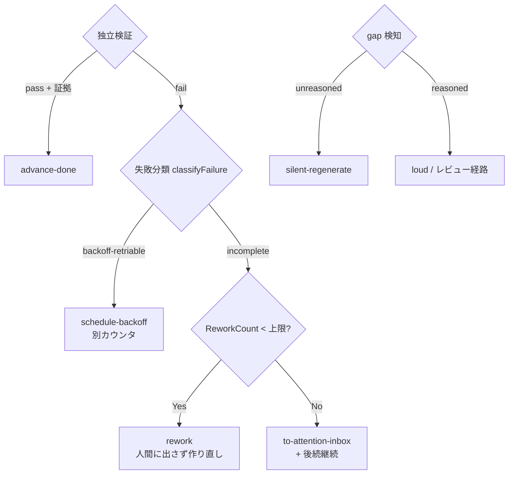

# 集約: failure-policy(失敗分類 → retry / backoff / inbox / silent 再生成)

## メタ
- 親: ドメインモデルの一覧
- 対応 US: [US-02](../s1/us-02-verify-auto-retry-loop.md), [US-03](../s1/us-03-backoff-on-limits.md), [US-04](../s1/us-04-retry-exhausted-inbox.md), [US-11](../s1/us-11-silent-regeneration.md)
- ステータス: 確定

## 集約ルート
**FailurePolicy** — 「Run が完璧に通らなかった時に何をするか」を決める純粋な判定木。Run 集約とは分離(index D-03)。入力は失敗 signal / 検証結果 / gap、出力は次アクション(作り直し / backoff / 要対応 inbox / silent 再生成)。

## 値オブジェクト
- **FailureKind**(VO / enum): `incomplete`(成果物 NG)/ `backoff-retriable`(上限・レート)。exit/エラー信号から分類(文章解釈しない)。
- **GapKind**(VO / enum): `reasoned`(理由ある契約逸脱)/ `unreasoned`(理由なし欠落)。
- **NextAction**(VO / enum): `rework` / `schedule-backoff` / `to-attention-inbox` / `silent-regenerate` / `advance-done`。

## 判定木(純粋関数)

## 不変条件
1. **検証 NG は人間に出さない**: `incomplete` は上限内なら `rework`(HumanTask を立てない / US-02 / 契約②)。
2. **backoff と rework は別カウンタ**: `backoff-retriable` は ReworkCount を消費しない(設計§5 / US-03)。
3. **上限到達のみ inbox**: `incomplete` が上限到達した時だけ `to-attention-inbox`。これは routine human-gate でなく例外通知(US-04 / SCR-02)。
4. **inbox 化はスケジューラを止めない**: `to-attention-inbox` は後続継続シグナルを伴う(非ブロッキング / US-04)。
5. **silent は unreasoned gap に限る**: `reasoned`(契約逸脱)は silent に握り潰さず loud に上げる(US-11 / 契約④)。
6. **分類は signal ベース**: FailureKind は claude の自然文でなく exit/エラー信号から決まる(設計§7-4)。

## この集約固有の 質疑応答ログ

### Q-01 — (未)
- **回答**(人間の回答を AI が記入):
  > 
- **確定**(AI 記入):
  > 

---

## この集約固有の AI が独自に決めたこと と 理由

### D-01 — FailurePolicy を純粋関数(判定木)として Run から分離
- **理由**: index D-03 / Unit-03。失敗時の分岐を 1 箇所に集約し、Run 集約は状態遷移に専念。判定木は入力(signal/検証/gap)→出力(NextAction)の純粋関数で、claude も SQLite も知らない(domain テストで全分岐を実証できる)。
- **種別**: 技術判断(AI 自走で確定)
- **上書き**: なし

---

## この集約固有の 棄却した案

### R-01 — 上限/レート失敗も rework カウンタで扱う
- **棄却理由**: 設計§5。時間で回復する失敗を作り直し上限で消費すると inbox 落ちが早まる。別カウンタが必須。
