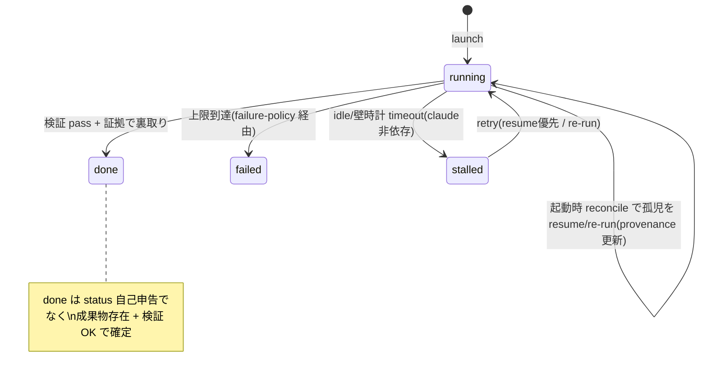

# 集約: run-lifecycle(Run の durable 状態機械 + 復帰)

## メタ
- 親: ドメインモデルの一覧
- 対応 US: [US-05](../s1/us-05-reconcile-resume.md), [US-06](../s1/us-06-stall-late-emit.md), [US-07](../s1/us-07-agent-sdk-monitoring.md), [US-08](../s1/us-08-liverun-registry.md)
- ステータス: 確定

## 集約ルート
**Run** — 1 回の AI 起動の一貫性境界。`RunState`(running/stalled/done/failed)+ カウンタ + 復帰 provenance を持つ。

## エンティティ / 値オブジェクト
- **RunState**(VO / enum): `running | stalled | done | failed`(既存・最小・増やさない)。
- **ReworkCount**(VO): 検証 NG での作り直し回数(上限あり)。
- **BackoffState**(VO): backoff-retriable の試行回数 + 次回再開予定(ReworkCount とは別カウンタ)。
- **RecoveryProvenance**(VO): この Run がどう来たか(`fresh | resumed | re-run | rework`)。board の「resume復帰」導出に使う。
- **稼働台帳エントリ**(read-model / 集約外 / infra): runId↔pid↔session_id↔last-activity。Run の観測投影であって真実源ではない(index D-02)。

## 状態遷移

## 不変条件
1. **done は観測事実で裏取り**: `status=done` でも成果物不在 / 検証 NG なら `done` に遷移しない(設計§7-2 / US-02)。
2. **late-emit を冪等に無視**: 既に terminal(done/failed)or 不在の runId への完了報告は状態を変えない(RunNotFound で不整合化しない / US-06)。
3. **resume 優先**: 孤児/stall の復帰は session_id があれば `resumed`、無ければ `re-run`(idempotent)。同一 Run を二重に起こさない(US-05)。
4. **stall は claude 非依存の timeout が権威**: claude の自己申告 stalled はヒント。最終判定は last-activity + timeout(US-06)。
5. **全遷移は冪等**: 同じ遷移コマンドを 2 回受けても 1 回分の効果(原子コミット / 設計§2)。
6. **board の 5 バッジは導出**: `RunState` + 失敗分類 + カウンタ + provenance + parking から導出する純粋関数(RunState を増やさない / index D-01)。

## board バッジ導出(presentation / domain state を増やさない)
| バッジ | 導出条件 |
|------|---------|
| 実行中 | RunState=running ∧ provenance≠resumed |
| resume復帰 | RunState=running ∧ provenance=resumed |
| stall→retry | RunState=stalled(retry in flight) |
| backoff待ち | RunState=failed ∧ 失敗分類=backoff-retriable ∧ 再開予定あり |
| parking | Phase が human-gate 待ち(Run でなく Phase/HumanTask 側) |

## この集約固有の 質疑応答ログ

### Q-01 — (未)
- **回答**(人間の回答を AI が記入):
  > 
- **確定**(AI 記入):
  > 

---

## この集約固有の AI が独自に決めたこと と 理由

### D-01 — 復帰の種類を RecoveryProvenance(VO)で持ち、RunState には入れない
- **理由**: index D-01。resume/re-run/rework は「どう来たか」であって「今どの状態か」ではない。RunState に混ぜると遷移表が指数的に増える。provenance を別 VO にして board 導出に使う。
- **種別**: 技術判断(AI 自走で確定)
- **上書き**: なし

---

## この集約固有の 棄却した案

### R-01 — 稼働台帳を Run 集約の中に持つ
- **棄却理由**: index D-02。pid/last-activity は infra の観測。集約に入れるとドメインが OS/SQLite を知ることになり層が壊れる。read-model として集約外に置く。
