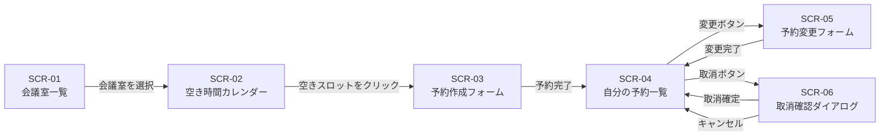

# S2 — 画面モック / フロー(全体)

## メタ
- 工程: S2 (Mock / Flow)
- PhaseGroup: Discovery
- 役割: プロダクトデザイナー
- ステータス: 確定
- 入力参照: このサイクルの要件一覧(US 群)
- 作成日: 2026-06-02
- 更新日: 2026-06-03

## 画面一覧
- [SCR-01 会議室一覧](#scr-01)
- [SCR-02 日別空き時間カレンダー](#scr-02)
- [SCR-03 予約作成フォーム](#scr-03)
- [SCR-04 自分の予約一覧](#scr-04)
- [SCR-05 予約変更フォーム](#scr-05)
- [SCR-06 取消確認ダイアログ](#scr-06)

## 画面遷移フロー



## Biz との合意事項
| # | 論点 | 合意内容 |
|---|------|---------|
| 1 | ダブルブッキング防止の UI | エラーメッセージをフォーム上部に表示し、送信ボタンは再度有効化する(再入力を促す) |
| 2 | 過去予約の変更・取消 | 開始時刻が現在時刻より過去のものは操作不可とし、ボタンをグレーアウト+ツールチップで理由を表示 |
| 3 | 取消確認の形式 | モーダルダイアログを使う(別画面遷移ではなくオーバーレイ) |
| 4 | カレンダーの表示単位 | 30 分スロット固定。15 分スロットは将来対応とする |

## US 漏れ・齟齬の検知ログ
| # | 検知内容 | S1 に戻った日 | 解決方針 |
|---|---------|-------------|---------|
| - | S2 作成時に特に漏れは検知されなかった | - | - |

## 全体 質疑応答ログ

### Q-01 — 予約作成後はどの画面に遷移するか? 作成したばかりの予約の詳細か、一覧か?
- **回答**(人間の回答を AI が記入):
  > 自分の予約一覧に戻ってほしい。作成した予約が一覧に並んでいるのが確認できれば十分。
- **確定**(AI 記入):
  > 予約作成完了後は SCR-04(自分の予約一覧)に遷移する。

### Q-02 — 取消確認は別画面か、モーダルか?
- **回答**(人間の回答を AI が記入):
  > モーダルでよい。別画面に飛ぶのは重い。
- **確定**(AI 記入):
  > SCR-06 は全画面ではなく SCR-04 上のモーダルオーバーレイとして実装する。

---

## 全体 AI が独自に決めたこと と 理由

### D-01 — カレンダーをタイムライン縦軸(時間 = Y 軸)形式にする
- **理由**: 横軸(時間 = X 軸)のガントチャート形式より、スマートフォン縦持ちでスクロールしやすい。社内システムとしてモバイル利用も想定されるため縦軸を選択した。
- **種別**: 技術判断(AI 自走で確定)
- **上書き**: なし

### D-02 — 予約変更フォームは予約作成フォームと共通 UI にする
- **理由**: フォームの入力項目が同一のため、画面を分けると保守コストが上がる。「新規作成モード」と「変更モード」をフォームタイトルとデフォルト値で区別する。
- **種別**: 技術判断(AI 自走で確定)
- **上書き**: なし

---

## 棄却した画面案

### R-01 — 会議室詳細画面(SCR-01 から遷移する別画面)
- **棄却理由**: 設備タグを一覧カードに表示すれば詳細画面を別途設ける必要がない。画面数を増やすほどの情報量がない。

## 次工程 (S3) への引き継ぎ
- UI 設計で考慮すべき画面・フロー境界: カレンダー(SCR-02)のタイムライン表示は密度の高い情報設計が必要。「予約済スロット」と「空きスロット」の色の差を明確にすること。
- 外部 I/F が出てくる画面: なし(認証は SSO で完結しており、この段階では外部 I/F は見えない)

---

# SCR-01: 会議室一覧 {#scr-01}

## メタ
- 親: 画面要素の一覧
- 対応 US: US-01
- ステータス: 確定

## 目的
社員が予約したい会議室を選ぶ起点となる画面。収容人数と設備を見て選択する。

## 主要要素
- 表示要素: 会議室カード(会議室名・収容人数・設備タグ)の一覧
- アクション: カードをタップ/クリックで SCR-02(カレンダー)に遷移
- 空状態: 「登録されている会議室がありません」メッセージ

## モック (ASCII)

```
+------------------------------------------+
| 会議室予約                      [自分の予約] |
+------------------------------------------+
| 会議室を選んでください                        |
+------------------------------------------+
| +--------------------------------------+ |
| | 第1会議室                             | |
| | 収容: 8名  [プロジェクター] [ホワイトボード]| |
| +--------------------------------------+ |
| +--------------------------------------+ |
| | 第2会議室                             | |
| | 収容: 4名  [ホワイトボード]             | |
| +--------------------------------------+ |
| +--------------------------------------+ |
| | 大会議室(3F)                          | |
| | 収容: 20名 [プロジェクター] [電話会議]   | |
| +--------------------------------------+ |
+------------------------------------------+
```

---

# SCR-02: 日別空き時間カレンダー {#scr-02}

## メタ
- 親: 画面要素の一覧
- 対応 US: US-02
- ステータス: 確定

## 目的
選択した会議室の特定日における時間別空き状況を確認し、空きスロットから予約フォームに遷移する。

## 主要要素
- 表示要素: 日付ヘッダー(前日・翌日ナビゲーション)、30 分単位の時間スロット縦リスト
- 予約済スロット: 背景色付き + 予約者名・件名テキスト
- 空きスロット: 白背景、クリック可能
- アクション: 空きスロットをクリックで SCR-03(予約作成)に遷移(会議室・日付・開始時刻自動入力)

## モック (ASCII)

```
+------------------------------------------+
| [< 前日]  第1会議室  2026年6月10日(水)  [翌日 >] |
+------------------------------------------+
| 09:00 |                                  |
| 09:30 | [予約済] 田中: 週次定例             |
| 10:00 | [予約済] 田中: 週次定例             |
| 10:30 |                                  |
| 11:00 |                                  |
| 11:30 | [予約済] 鈴木: 採用面談             |
| 12:00 |                                  |
| 12:30 |                                  |
| 13:00 | [予約済] 山田: 技術レビュー          |
| 13:30 | [予約済] 山田: 技術レビュー          |
| 14:00 |                                  |
|  ...  |                                  |
+------------------------------------------+
  空白行をクリックすると予約作成フォームへ
```

---

# SCR-03: 予約作成フォーム {#scr-03}

## メタ
- 親: 画面要素の一覧
- 対応 US: US-03
- ステータス: 確定

## 目的
会議室・日付・時間帯・件名を入力して予約を作成する。ダブルブッキング検知はサーバー側で行い、エラーを画面に返す。

## 主要要素
- 入力フィールド: 会議室(セレクト)、日付(日付ピッカー)、開始時刻(時刻ピッカー)、終了時刻(時刻ピッカー)、件名(テキスト)
- アクション: 「予約する」ボタン、「キャンセル」ボタン
- エラー表示: フォーム上部にエラーバナー(重複の場合・時刻不正の場合)

## モック (ASCII)

```
+------------------------------------------+
| <- 戻る   予約を作成する                     |
+------------------------------------------+
| [!] この時間帯はすでに予約されています           |  <- エラー時のみ表示
+------------------------------------------+
| 会議室                                    |
| [第1会議室             v]                 |
|                                          |
| 日付                                     |
| [2026-06-10         ]                    |
|                                          |
| 開始時刻      終了時刻                      |
| [10:30 v]   [11:30 v]                    |
|                                          |
| 件名                                     |
| [________________________]               |
|                                          |
|        [キャンセル]  [予約する]              |
+------------------------------------------+
```

---

# SCR-04: 自分の予約一覧 {#scr-04}

## メタ
- 親: 画面要素の一覧
- 対応 US: US-04
- ステータス: 確定

## 目的
自分が作成した予約を時系列で管理し、変更・取消の起点となる画面。

## 主要要素
- タブ: 「今後の予約」「過去の予約」
- 表示要素: 予約カード(会議室名・日付・時刻・件名・ステータス)
- アクション: 「変更」「取消」ボタン(過去予約はグレーアウト)
- 空状態: 「予約はありません」メッセージ

## モック (ASCII)

```
+------------------------------------------+
| 自分の予約                      [会議室一覧] |
+------------------------------------------+
| [今後の予約]  [過去の予約]                   |
+------------------------------------------+
| +--------------------------------------+ |
| | 第1会議室                             | |
| | 2026/06/12(金) 13:00〜14:00           | |
| | 件名: プロジェクト進捗確認               | |
| | ● 予約済                              | |
| | [変更]  [取消]                        | |
| +--------------------------------------+ |
| +--------------------------------------+ |
| | 大会議室(3F)                          | |
| | 2026/06/15(月) 10:00〜11:30           | |
| | 件名: 四半期レビュー                    | |
| | ● 予約済                              | |
| | [変更]  [取消]                        | |
| +--------------------------------------+ |
+------------------------------------------+
```

---

# SCR-05: 予約変更フォーム {#scr-05}

## メタ
- 親: 画面要素の一覧
- 対応 US: US-05
- ステータス: 確定

## 目的
既存の予約内容を変更する。SCR-03 と同じフォーム構造に既存値をセットして表示する。

## 主要要素
- 入力フィールド: SCR-03 と同じ(既存値プリフィル)
- アクション: 「変更を保存」ボタン、「キャンセル」ボタン
- エラー表示: SCR-03 と同じ(重複エラー・時刻不正)

## モック (ASCII)

```
+------------------------------------------+
| <- 戻る   予約を変更する                     |
+------------------------------------------+
| 会議室                                    |
| [第1会議室             v]                 |
|                                          |
| 日付                                     |
| [2026-06-12         ]                    |
|                                          |
| 開始時刻      終了時刻                      |
| [13:00 v]   [14:00 v]                    |
|                                          |
| 件名                                     |
| [プロジェクト進捗確認______________]         |
|                                          |
|      [キャンセル]  [変更を保存]             |
+------------------------------------------+
```

---

# SCR-06: 取消確認ダイアログ {#scr-06}

## メタ
- 親: 画面要素の一覧
- 対応 US: US-06
- ステータス: 確定

## 目的
誤タップによる意図しない取消を防ぐ確認ステップ。SCR-04 上のモーダルオーバーレイとして表示する。

## 主要要素
- 表示要素: 取消対象の予約情報(会議室・日付・時刻・件名)
- アクション: 「取り消す」(破壊的アクション・強調色)、「やめる」

## モック (ASCII)

```
+------------------------------------------+
|                                          |
|    +------------------------------+      |
|    | 予約を取り消しますか？          |      |
|    |                              |      |
|    | 第1会議室                     |      |
|    | 2026/06/12 13:00〜14:00      |      |
|    | プロジェクト進捗確認             |      |
|    |                              |      |
|    |  [やめる]    [取り消す]        |      |
|    +------------------------------+      |
|                                          |
+------------------------------------------+
```
