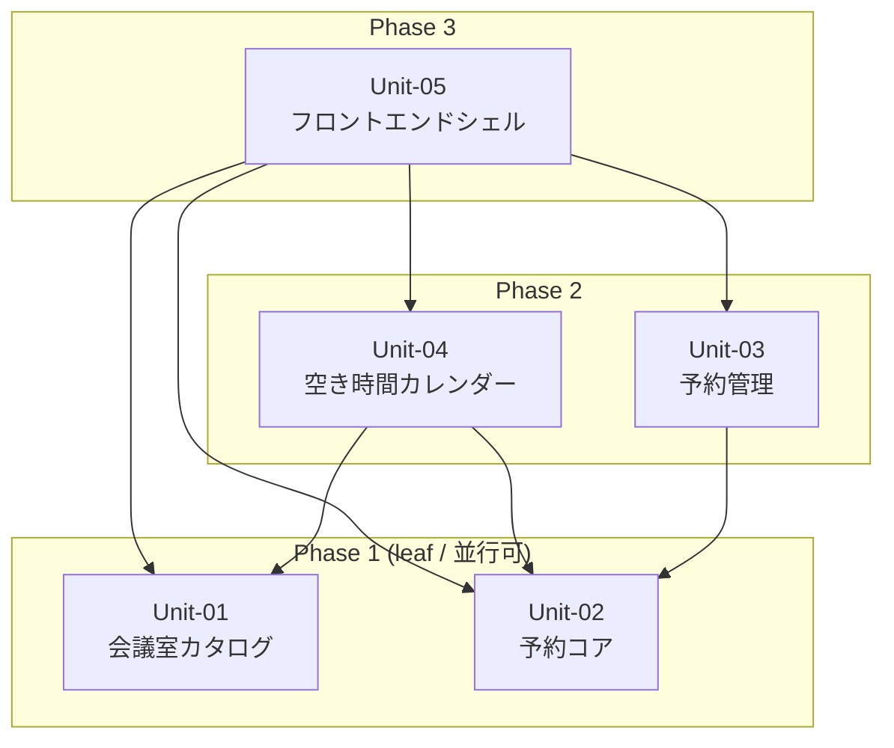

# S5 — Work Units (Unit 分割 + 依存マップ)

## メタ
- 工程: S5 (Work Units)
- 役割: ソフトウェアアーキテクト
- ステータス: 確定
- 入力参照: このサイクルの要件一覧(US 群) / 画面要素 / 技術仕様
- 作成日: 2026-06-05
- 更新日: 2026-06-06

## アーキテクチャ前提
- **スタック**: React + TypeScript(フロントエンド) / Node.js + Express + Prisma(バックエンド) / PostgreSQL 16
- **既存資産・制約**: 社内 SSO プロキシが `X-Employee-Id` ヘッダーを付与する。認証処理はアプリ外。
- **想定デプロイ形態**: 社内オンプレ Kubernetes。フロントエンドは Nginx で配信、バックエンドは Node.js Pod

## I/F 決定方針
- **採用**: AI 事前調査
- **理由**: 既存コードベースがない新規開発のため、AI が US と画面モックから I/F 案を起こしてエンジニアがレビューする方式を採用した

## Unit 一覧
- [Unit-01 会議室カタログ](#unit-01)
- [Unit-02 予約コア(作成・重複チェック)](#unit-02)
- [Unit-03 予約管理(変更・取消・一覧)](#unit-03)
- [Unit-04 空き時間カレンダー表示](#unit-04)
- [Unit-05 フロントエンドシェル(ルーティング・認証コンテキスト)](#unit-05)

## 依存 DAG (Unit 間依存方向 / Phase レイアウト)

**読み方**:
- 矢印は **依存方向**(`A --> B` = A は B を呼ぶ / A は B に依存する)。
- **上から下に読めば着手順**(Phase 1 が最初に着手できる leaf Unit)。
- Phase 内の Unit は並行に着手できる。

## 凡例
- **角括弧 `[X]`**: Unit(本ステップで定義した自前 Unit のみ)
- **実線矢印 `-->`**: 依存方向(`A --> B` は「A は B を呼ぶ / A は B が無いと動かない」)
- **subgraph**: Phase = 実装順の段を表現する(Phase 1 = leaf = 最初に着手)

**意図的に使わない記号**:
- 円柱 `[(X)]` 永続化、六角 `{{X}}` 外部サービス → S5 では描かない

## 着手順テーブル (Phase subgraph と一対一対応)

| Phase | 着手可能な Unit | 理由 |
|-------|----------------|------|
| Phase 1(leaf) | Unit-01, Unit-02 | 他 Unit に依存しない。並行開発可能 |
| Phase 2 | Unit-03, Unit-04 | Unit-01, Unit-02 の I/F が揃えば着手できる |
| Phase 3 | Unit-05 | 全 Unit の I/F が揃ってからルーティングと画面組み立てを行う |

**重要**: この表は図中の Phase subgraph と一対一対応している。

## 依存方向の根拠
| 依存(A → B) | 根拠(なぜ A は B に依存するか) |
|--------------|-------------------------------|
| Unit-03 → Unit-02 | 予約管理(変更・取消)は予約コアが定義する予約エンティティの I/F に依存する |
| Unit-04 → Unit-01 | カレンダー表示は会議室情報(名前・収容人数)を表示するために会議室カタログに依存する |
| Unit-04 → Unit-02 | カレンダーは指定日の予約一覧を取得するために予約コアの読み取り I/F に依存する |
| Unit-05 → Unit-01〜04 | フロントエンドシェルはすべての Unit の画面を組み立てるため全 Unit に依存する |

## 読み手別の見方
- **エンジニア**: 自分の担当 Unit がどの Unit に依存しているか(矢印の先)を見て、先にスタブを用意すべき相手を把握する。詳細 I/F は各 Unit セクションを参照。
- **PM**: Phase 1 の 2 Unit から並行着手できることを確認し、進捗計画に使う。

## 全体 質疑応答ログ

### Q-01 — 「空き時間カレンダー」は Unit として独立させるべきか? 予約コアに統合するべきか?
- **回答**(人間の回答を AI が記入):
  > カレンダーは画面表示ロジックが大きいので、独立した Unit にしてほしい。
- **確定**(AI 記入):
  > Unit-04 として独立させる。カレンダーの UI ロジック(スロット生成・状態色分け)は Unit-04 が持ち、データ取得は Unit-02 の読み取り I/F を呼ぶ形にする。

---

## 全体 AI が独自に決めたこと と 理由

### D-01 — Unit 数を 5 にする
- **理由**: US が 6 本と少なく、Unit を増やすと依存が複雑になる。会議室カタログ(読み取り専用)・予約コア(作成+重複チェック)・予約管理(変更・取消・一覧)・カレンダー表示・フロントエンドシェルの 5 区分が最小の凝集単位と判断した。
- **種別**: 技術判断(AI 自走で確定)
- **上書き**: なし

### D-02 — 予約コアと予約管理を分ける
- **理由**: 予約作成(= ダブルブッキング防止ロジックが核心)と、変更・取消・一覧取得(= CRUD 操作)の責務が異なる。コアを小さく保つことでダブルブッキングロジックの変更が他の Unit に波及しにくくなる。
- **種別**: 技術判断(AI 自走で確定)
- **上書き**: なし

---

## 棄却した Unit 案

### R-01 — 「認証 Unit」を独立させる
- **棄却理由**: 社内 SSO プロキシが `X-Employee-Id` ヘッダーを注入するため、アプリ側に認証ロジックが存在しない。Unit として独立させるものがない。

## 次工程 (S6) への引き継ぎ
- ドメインモデリングの対象になる Unit: Unit-01(会議室エンティティ)、Unit-02(予約エンティティ + 重複チェック不変条件)
- 技術詳細(DB/外部 I/F)から守るべき境界: Unit-02 の重複チェックはドメインロジックとして表現し、DB の `SELECT FOR UPDATE` はリポジトリ層に閉じ込める(S6 のドメインモデルには持ち込まない)
- 並行開発時のリスク: Unit-02 の I/F(特に重複チェックの返り値設計)が確定するまで Unit-03・04 のスタブが仮定に基づく実装になる

---

# Unit-01: 会議室カタログ {#unit-01}

## メタ
- 親: 作業単位の一覧
- 所属 US: US-01
- ステータス: 確定

## 責務
会議室の一覧を提供する読み取り専用の Unit。会議室名・収容人数・設備情報を管理し、クライアントが一覧取得できる I/F を公開する。

## 外部依存
- なし(他 Unit に依存しない leaf Unit)

## I/F 定義 (この Unit が公開する契約)
| 操作 | 入力 | 出力 | エラー |
|------|------|------|--------|
| getRooms | (なし) | `Room[]` ※ Room = `{ id: string, name: string, capacity: number, features: string[] }` | 500 Internal Server Error |
| getRoomById | `roomId: string` | Room | 404 Not Found |

---

# Unit-02: 予約コア(作成・重複チェック) {#unit-02}

## メタ
- 親: 作業単位の一覧
- 所属 US: US-03
- ステータス: 確定

## 責務
予約の作成と重複チェックを担当するコアロジック。指定時間帯に同一会議室の既存予約がないかを検証し、問題がなければ予約を永続化する。ダブルブッキング防止の不変条件を守る責任を持つ。

## 外部依存
- なし(他 Unit に依存しない leaf Unit)

## I/F 定義 (この Unit が公開する契約)
| 操作 | 入力 | 出力 | エラー |
|------|------|------|--------|
| createBooking | `{ roomId: string, employeeId: string, startAt: DateTime, endAt: DateTime, title: string }` | Booking `{ id, roomId, employeeId, startAt, endAt, title, status: "active" }` | 409 Conflict(重複) / 422 Unprocessable(時刻不正) |
| getBookingsByRoomAndDate | `{ roomId: string, date: LocalDate }` | `Booking[]` | 500 |

---

# Unit-03: 予約管理(変更・取消・一覧) {#unit-03}

## メタ
- 親: 作業単位の一覧
- 所属 US: US-04, US-05, US-06
- ステータス: 確定

## 責務
自分の予約の一覧取得・変更・取消を提供する Unit。変更時の重複チェックは Unit-02 の I/F を通じて行う。本人確認(employeeId 一致)はこの Unit が行う。

## 外部依存
- Unit-02 の `createBooking`(変更は旧予約を cancelled に更新し、新しい予約を createBooking で作り直す実装方針)
- Unit-02 の `getBookingsByRoomAndDate`(変更時の重複チェック用参照)

## I/F 定義 (この Unit が公開する契約)
| 操作 | 入力 | 出力 | エラー |
|------|------|------|--------|
| getMyBookings | `{ employeeId: string, filter: "upcoming" \| "past" }` | `Booking[]` | 500 |
| updateBooking | `{ bookingId: string, employeeId: string, roomId: string, startAt: DateTime, endAt: DateTime, title: string }` | Booking | 403 Forbidden / 409 Conflict / 422 Unprocessable |
| cancelBooking | `{ bookingId: string, employeeId: string }` | `{ success: true }` | 403 Forbidden / 422 Unprocessable(過去の予約) |

---

# Unit-04: 空き時間カレンダー表示 {#unit-04}

## メタ
- 親: 作業単位の一覧
- 所属 US: US-02
- ステータス: 確定

## 責務
指定会議室の指定日における 30 分単位のタイムスロット一覧を生成し、各スロットの「予約済 / 空き」状態を算出して返す。表示ロジック(スロット生成・状態算出)はこの Unit が担い、データ取得は Unit-01・Unit-02 に委ねる。

## 外部依存
- Unit-01 の `getRoomById`(会議室名を取得)
- Unit-02 の `getBookingsByRoomAndDate`(その日の予約一覧を取得)

## I/F 定義 (この Unit が公開する契約)
| 操作 | 入力 | 出力 | エラー |
|------|------|------|--------|
| getCalendar | `{ roomId: string, date: LocalDate }` | `{ room: Room, date: LocalDate, slots: TimeSlot[] }` ※ TimeSlot = `{ startAt: DateTime, endAt: DateTime, status: "available" \| "booked", booking?: { id, employeeId, title } }` | 404(会議室なし) / 500 |

---

# Unit-05: フロントエンドシェル(ルーティング・認証コンテキスト) {#unit-05}

## メタ
- 親: 作業単位の一覧
- 所属 US: US-01, US-02, US-03, US-04, US-05, US-06(全 US のフロントエンド画面を組み立てる)
- ステータス: 確定

## 責務
React アプリのエントリーポイント。ルーティング定義・SSO 由来の社員 ID を React Context 経由で全画面に配布・各画面コンポーネントのマウントを行う。

## 外部依存
- Unit-01〜04 の REST API エンドポイント(React Query 経由の fetch)
- SSO プロキシから `X-Employee-Id` ヘッダーを受け取った API レスポンス

## I/F 定義 (この Unit が公開する契約)
| 操作 | 入力 | 出力 | エラー |
|------|------|------|--------|
| EmployeeContext | SSO プロキシ経由の認証(アプリ透過) | `{ employeeId: string }` を全子コンポーネントに配布 | 認証失敗時は SSO プロキシが 401 を返す。アプリは「ログインが必要です」画面を表示 |
