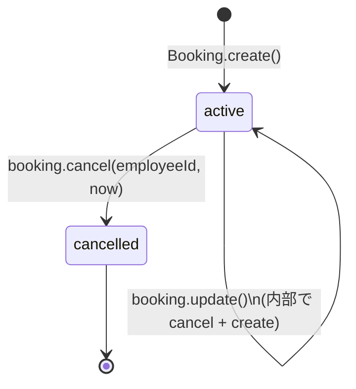
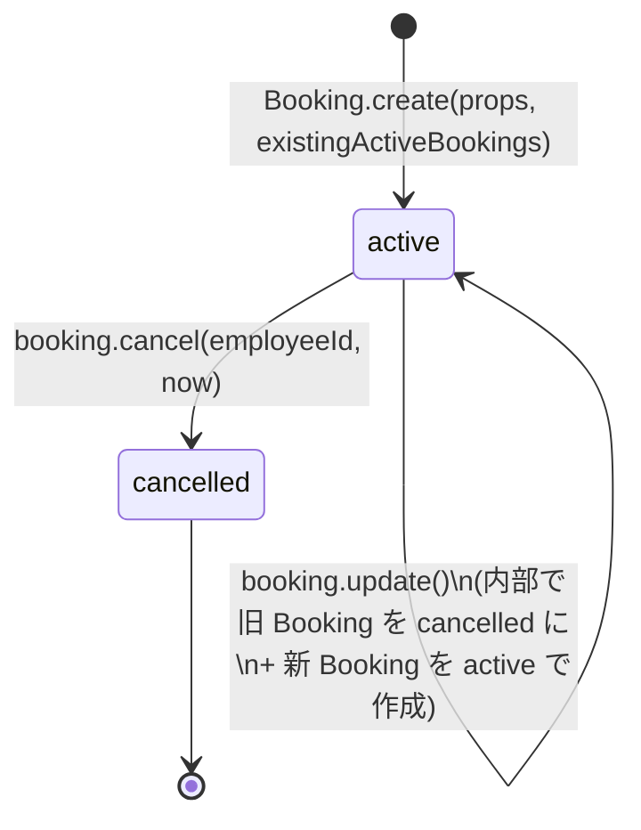

# S6 — ドメインモデル(全体)

## メタ
- 工程: S6 (Domain Model)
- 役割: ドメインモデラー
- ステータス: レビュー中
- 入力参照: このサイクルの要件一覧(US 群) / 作業単位の分割
- 作成日: 2026-06-06
- 更新日: 2026-06-06

## スタック確認
- **言語**: TypeScript
- **フレームワーク**: Express(バックエンド) / React(フロントエンド) — ドメインモデルはフレームワーク非依存で設計する
- **永続化**: PostgreSQL 16 + Prisma — ドメインモデルには持ち込まない
- **既存資産**: なし(新規開発)
- ※ `s5/index.md` のアーキテクチャ前提と矛盾なし

## DDD 採用判断
- **採用**: DDD 採用
- **理由**: 「ダブルブッキング禁止」という核心的な不変条件があり、これをドメイン集約の責任として明示するのに DDD の語彙が適している。また「予約者本人しか変更・取消できない」という認可ルールもドメインモデルで表現できる。スタック(DB / HTTP)に依存せずビジネスルールを純粋にテストする場が必要なため DDD を採用する。

## ユビキタス言語 (用語集)
| 用語 | 定義 | 別名NG |
|------|------|--------|
| 会議室(Room) | 予約対象となる物理または仮想の空間。収容人数と設備タグを持つ | 部屋、スペース |
| 予約(Booking) | 特定の会議室を特定の時間帯に使用する権利。予約者・時間帯・件名で構成される | 申請、登録、予約枠 |
| 予約者(Booker) | 予約を作成した社員。EmployeeId で一意に識別される | 申請者、ユーザー |
| 時間帯(TimeSlot) | 開始日時(StartAt)と終了日時(EndAt)の対。予約の存在範囲を示す | 時間、スロット |
| ダブルブッキング(DoubleBooking) | 同一会議室の同一時間帯に 2 件以上の有効な予約が存在する状態。絶対に起きてはならない | 重複予約、コンフリクト |
| 有効な予約(ActiveBooking) | ステータスが `active` の予約。取消済み(`cancelled`)は重複チェックの対象外 | 確定予約 |
| 取消(Cancellation) | 予約のステータスを `cancelled` に変更する操作。物理削除はしない | 削除 |
| 過去の予約 | 開始日時が現在時刻より前の予約。変更・取消の対象外 | 終了済み予約 |

## 集約 / モデル一覧
- [Room 集約](#room-aggregate)
- [Booking 集約](#booking-aggregate)

## 横断的な状態遷移

Booking の状態遷移:



## 全体 質疑応答ログ

### Q-01 — 変更(update)は既存 Booking を更新するか、cancel + 新規 create か?
- **回答**(人間の回答を AI が記入):
  > cancel + 新規 create の方がシンプルでよい。変更履歴を追えるし、キャンセル済みのレコードも残る。
- **確定**(AI 記入):
  > update は `cancel(oldBooking) + create(newBooking)` のドメイン操作として実装する。Booking 集約の `update()` メソッドがこの流れを 1 トランザクションで行う。

---

## 全体 AI が独自に決めたこと と 理由

### D-01 — DoubleBooking チェックを Booking 集約の不変条件として定義する
- **理由**: ダブルブッキング禁止はシステムの核心的なビジネスルールであり、予約の作成・変更の両操作で守られなければならない。DB の排他ロックは技術的な最終防衛線だが、ドメイン層でも「この不変条件を守らない操作は例外を投げる」ことを明示することで、将来の実装者がルールを把握できる。
- **種別**: 技術判断(AI 自走で確定)
- **上書き**: なし

### D-02 — Room を読み取り専用の集約にする
- **理由**: 今サイクルのスコープでは会議室の追加・変更は行わない。読み取り専用にすることで、Room 集約のロジックをシンプルに保てる。
- **種別**: 技術判断(AI 自走で確定)
- **上書き**: なし

### D-03 — EmployeeId を値オブジェクトにする
- **理由**: 社員 ID は単なる文字列ではなく「社員を一意に識別する意味のある識別子」。値オブジェクトにすることで、`string` を直接渡すことによる ID 取り違えを型システムで防げる。
- **種別**: 技術判断(AI 自走で確定)
- **上書き**: なし

---

## 棄却した集約案

### R-01 — Employee 集約を定義する
- **棄却理由**: 今サイクルで Employee エンティティを管理する操作(作成・更新)がない。社員 ID は SSO プロキシから渡ってくる識別子に過ぎず、ドメインモデル内では EmployeeId 値オブジェクトとして扱えば十分。

## 次工程 (S7) への引き継ぎ
- フレームワーク非依存で実装すべき集約・モデル: Room / Booking / EmployeeId / TimeSlot / RoomId / BookingId
- 不変条件のうちコード化が複雑なもの: `TimeSlot.overlaps()` および `Booking.assertNoOverlap()` — 重複判定の境界条件(半開区間 `[startAt, endAt)`)を正確にテストすること
- テストで保証したいビジネスルール:
  1. 同じ会議室の重複する時間帯への予約作成は DoubleBookingError を投げる
  2. 隣接する時間帯(10:00〜11:00 と 11:00〜12:00)は重複しない
  3. 自分以外の employeeId での変更・取消は UnauthorizedError を投げる
  4. 過去(startAt < now)の予約への変更・取消は PastBookingError を投げる
  5. 取消済みの予約への再操作は BookingAlreadyCancelledError を投げる

---

# 集約: Room {#room-aggregate}

## メタ
- 親: ドメインモデルの一覧
- 対応 US: US-01, US-02
- 所属 Unit: Unit-01
- ステータス: レビュー中

## モデル定義

### (DDD 採用)
- **集約ルート**: `Room`
- **エンティティ**:
  - `Room`: 会議室本体。RoomId で一意に識別される
- **値オブジェクト**:
  - `RoomId`: 会議室を一意に識別する識別子(文字列ラッパー)
  - `Feature`: 設備タグの列挙型 — `Projector` / `Whiteboard` / `VideoConference`

| フィールド | 型 | 制約 | 意味 |
|----------|----|----|------|
| id | RoomId | 必須・不変 | 会議室の一意識別子 |
| name | string | 必須・非空文字列 | 会議室の表示名(例: 第1会議室) |
| capacity | number | 必須・1 以上の整数 | 最大収容人数 |
| features | Feature[] | 必須・重複なし | 設備タグの一覧(空配列可) |

## 不変条件
- `name` は空文字列であってはならない
- `capacity` は 1 以上の整数でなければならない
- `features` に同じ Feature が重複してはならない

## 状態遷移
なし(読み取り専用の集約)

---

## この集約固有の AI が独自に決めたこと と 理由

### D-01 — Feature を列挙型(enum)にする
- **理由**: 将来的に設備タグでフィルタリングする機能が追加される可能性がある。文字列にすると入力ミスによる不一致が起きやすい。列挙型にすることで使える値を閉じる。
- **種別**: 技術判断(AI 自走で確定)
- **上書き**: なし

---

# 集約: Booking {#booking-aggregate}

## メタ
- 親: ドメインモデルの一覧
- 対応 US: US-03, US-04, US-05, US-06
- 所属 Unit: Unit-02, Unit-03
- ステータス: レビュー中

## モデル定義

### (DDD 採用)
- **集約ルート**: `Booking`
- **エンティティ**:
  - `Booking`: 予約本体。BookingId で一意に識別される
- **値オブジェクト**:
  - `BookingId`: 予約を一意に識別する識別子(文字列ラッパー)
  - `EmployeeId`: 社員を一意に識別する識別子(文字列ラッパー。SSO から渡される)
  - `TimeSlot`: 開始日時(startAt)と終了日時(endAt)の対。重複判定ロジックを内包する
  - `BookingStatus`: 予約のステータス列挙型(`active` / `cancelled`)

| フィールド | 型 | 制約 | 意味 |
|----------|----|----|------|
| id | BookingId | 必須・不変 | 予約の一意識別子 |
| roomId | RoomId | 必須・不変 | 予約対象の会議室 |
| employeeId | EmployeeId | 必須・不変 | 予約作成者の社員 ID |
| slot | TimeSlot | 必須 | 予約時間帯(startAt < endAt を保証) |
| title | string | 必須・非空文字列・最大 100 文字 | 予約件名 |
| status | BookingStatus | 必須・初期値 `active` | 予約の現在状態 |
| createdAt | DateTime | 必須・不変・作成時自動付与 | 予約作成日時 |

## 不変条件

1. **ダブルブッキング禁止**: `Booking.create()` および `booking.update()` を呼び出す際、呼び出し元は同一 `roomId` の既存 `active` な予約群を外から注入しなければならない。内部で `assertNoOverlap(existingActiveBookings)` を実行し、重複がある場合は `DoubleBookingError` を投げる。
2. **時刻整合性**: `slot.startAt < slot.endAt` でなければならない。違反する場合は `InvalidTimeSlotError` を投げる。
3. **本人のみ変更・取消可**: `booking.cancel(requestEmployeeId, now)` および `booking.update(requestEmployeeId, ...)` は `requestEmployeeId === this.employeeId` を検証する。違反する場合は `UnauthorizedError` を投げる。
4. **過去の予約は変更・取消不可**: `slot.startAt < now` の予約に対して `cancel` または `update` を呼び出した場合は `PastBookingError` を投げる。
5. **取消済みは再操作不可**: `status === "cancelled"` の予約に対して `cancel` または `update` を呼び出した場合は `BookingAlreadyCancelledError` を投げる。

## ドメインメソッド

| メソッド | 入力 | 出力 | 例外 |
|--------|------|--------|------|
| `Booking.create(props, existingActiveBookings)` | 生成プロパティ(roomId / employeeId / slot / title) + 既存の有効予約一覧 | 新しい `Booking` | DoubleBookingError / InvalidTimeSlotError |
| `booking.cancel(requestEmployeeId, now)` | 取消を要求した社員 ID + 現在時刻 | status が `cancelled` に変更された新しい `Booking` | UnauthorizedError / PastBookingError / BookingAlreadyCancelledError |
| `booking.update(requestEmployeeId, newSlot, newRoomId, newTitle, existingActiveBookings, now)` | 変更を要求した社員 ID + 新しい時間帯・会議室・件名 + 既存の有効予約一覧 + 現在時刻 | キャンセルされた旧 Booking と新しい Booking のペア | UnauthorizedError / PastBookingError / DoubleBookingError / InvalidTimeSlotError |

## TimeSlot 値オブジェクトの詳細

半開区間 `[startAt, endAt)` で重複を判定する:

```
// 概念定義(実装言語非依存の擬似コード)
class TimeSlot:
  startAt: DateTime  // inclusive
  endAt: DateTime    // exclusive

  constructor(startAt, endAt):
    if startAt >= endAt: throw InvalidTimeSlotError

  overlaps(other: TimeSlot) -> boolean:
    return startAt < other.endAt AND other.startAt < endAt
    // 例: [10:00, 11:00) と [11:00, 12:00) は重複しない
    // 例: [10:00, 11:00) と [10:30, 11:30) は重複する
```

## 状態遷移



## この集約固有の 質疑応答ログ

### Q-01 — TimeSlot の重複判定は閉区間か半開区間か? 10:00〜11:00 と 11:00〜12:00 は重複するか?
- **回答**(人間の回答を AI が記入):
  > 重複しないようにしてほしい。11:00 に前の会議が終わって次の会議が始まる、というのは普通のことなので。
- **確定**(AI 記入):
  > 半開区間 `[startAt, endAt)` を採用する。`startAt < other.endAt && other.startAt < this.endAt` で判定する。これにより 10:00〜11:00 と 11:00〜12:00 は重複しない。

---

## この集約固有の AI が独自に決めたこと と 理由

### D-01 — ドメインメソッドを不変(immutable)にする
- **理由**: `cancel()` / `update()` は既存の Booking を変更するのではなく、変更後の新しい Booking を返す。これにより副作用が外に漏れず、テストが pure function として書ける。
- **種別**: 技術判断(AI 自走で確定)
- **上書き**: なし

### D-02 — `existingActiveBookings` を外から注入する
- **理由**: 重複チェックに DB アクセスを内包するとドメインコードが永続化に依存する。一覧をメソッド引数として外から渡すことで、ドメインコードは純粋なビジネスロジックに留まり、単体テストが容易になる。
- **種別**: 技術判断(AI 自走で確定)
- **上書き**: なし

### D-03 — BookingStatus を列挙型にし、論理削除とする
- **理由**: 取消済み予約の履歴を保持する要件があるため(US-04 の「過去の予約」タブ)、物理削除はしない。status フィールドで `active` / `cancelled` を区別し、重複チェックは `active` のみを対象にする。
- **種別**: 技術判断(AI 自走で確定)
- **上書き**: なし

---

## この集約固有の 棄却した案

### R-01 — 重複チェックに DB の UNIQUE 制約のみを使う
- **棄却理由**: DB 制約だけに依存するとドメインコードにビジネスルールが現れなくなり、将来の開発者がルールを把握できない。また、DB エラーをそのままビジネスエラーとして扱うのはレイヤー分離の観点から避けるべき。ドメイン層でのチェックと DB の排他ロックの二重防衛を採用する。
