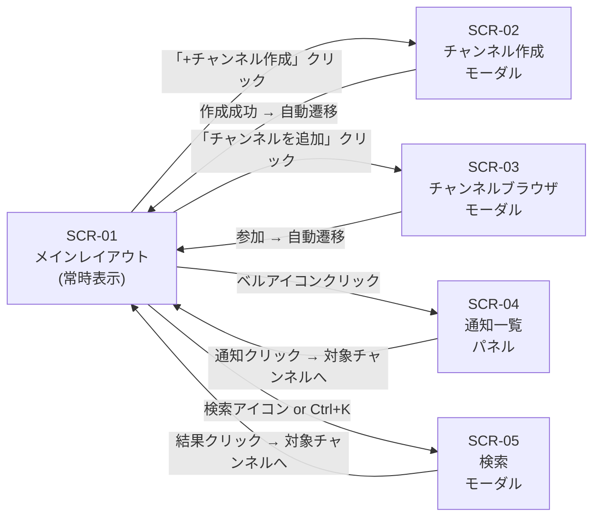

# S2 — 画面モック / フロー(全体)

## メタ
- 工程: S2 (Mock / Flow)
- PhaseGroup: Discovery
- 役割: プロダクトデザイナー
- ステータス: 確定
- 入力参照: US-01〜US-06(社内チャット v0.0.1)
- 作成日: 2026-05-13
- 更新日: 2026-05-13

## 画面一覧
- [SCR-01 メインレイアウト(サイドバー + タイムライン)](./scr-01-main-layout.md)
- [SCR-02 チャンネル作成モーダル](./scr-02-create-channel.md)
- [SCR-03 チャンネルブラウザモーダル](./scr-03-channel-browser.md)
- [SCR-04 通知一覧パネル](./scr-04-notification-panel.md)
- [SCR-05 メッセージ検索モーダル](./scr-05-search-modal.md)

## 画面遷移フロー

## Biz との合意事項
| # | 論点 | 合意内容 |
|---|------|---------|
| 1 | 未読の既読化タイミング | チャンネルを開いた時点で全既読(US-04 D-01) |
| 2 | モーダル vs フルページ | チャンネル作成・ブラウザ・検索はモーダル。タイムラインはフルページ |
| 3 | サイドバーの幅 | 固定 240px。v0.0.1 はリサイズ不要 |

## US 漏れ・齟齬の検知ログ
| # | 検知内容 | S1 に戻った日 | 解決方針 |
|---|---------|-------------|---------|
| - | 検知なし | - | - |

## 全体 質疑応答ログ

### Q-01 — ログイン画面はスコープ内か?
- **回答**(人間の回答を AI が記入):
  > v0.0.1 は認証なし。全員がデフォルトユーザーでアクセスできる形。認証は v0.0.2 で追加。
- **確定**(AI 記入):
  > v0.0.1 はログイン画面なし。SCR-01 が起点。

---

## 全体 AI が独自に決めたこと と 理由

### D-01 — タイムラインをメインコンテンツエリアとし、サイドバーを左固定にする
- **理由**: Slack・Discord をはじめとするチャットアプリの標準レイアウト。10〜30人規模のユーザーが学習コストなく使えるため。
- **種別**: 技術判断(AI 自走で確定)
- **上書き**: なし

---

## 棄却した画面案

### R-01 — ユーザープロフィール編集画面
- **棄却理由**: v0.0.1 はユーザー管理をスコープ外とした。

## 次工程 (S3) への引き継ぎ
- UI 設計で考慮すべき画面・フロー境界: サイドバーとタイムラインの間のコンテキスト維持、モーダルの重なり管理
- 外部 I/F が出てくる画面: SCR-01(WebSocket によるリアルタイム更新)
