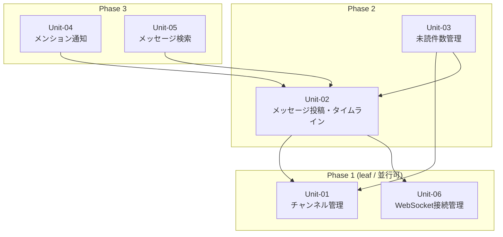

# S5 — Work Units (Unit 分割 + 依存マップ)

## メタ
- 工程: S5 (Work Units)
- 役割: ソフトウェアアーキテクト
- ステータス: 確定
- 入力参照: US-01〜US-06 / SCR-01〜SCR-05 / S4 技術仕様
- 作成日: 2026-05-15
- 更新日: 2026-05-15

## アーキテクチャ前提
- スタック: React + TypeScript / Node.js Fastify / PostgreSQL / WebSocket
- 既存資産: なし(新規プロジェクト)
- 想定デプロイ形態: Docker Compose セルフホスト

## I/F 決定方針
- 採用: AI 事前調査
- 理由: 新規 PJ のため既存コードがなく、AI が技術仕様から I/F 案を起こすのが効率的。

## Unit 一覧
- [Unit-01 チャンネル管理](./unit-01-channel.md)
- [Unit-02 メッセージ投稿・タイムライン](./unit-02-message.md)
- [Unit-03 未読件数管理](./unit-03-unread.md)
- [Unit-04 メンション通知](./unit-04-mention.md)
- [Unit-05 メッセージ検索](./unit-05-search.md)
- [Unit-06 WebSocket 接続管理](./unit-06-websocket.md)

## 依存 DAG (Unit 間依存方向 / Phase レイアウト)

**読み方**: 矢印は依存方向(`A --> B` = A は B を呼ぶ)。Phase 1 が最初に着手。Phase 内は並行可。

## 凡例
- **角括弧 `[X]`**: Unit
- **実線矢印 `-->`**: 依存方向
- **subgraph**: Phase = 実装順の段

## 着手順テーブル

| Phase | 着手可能な Unit | 理由 |
|-------|----------------|------|
| Phase 1(leaf) | Unit-01, Unit-06 | 他 Unit に依存しない |
| Phase 2 | Unit-02, Unit-03 | Phase 1 が揃えば作れる |
| Phase 3 | Unit-04, Unit-05 | Unit-02 が揃えば作れる |

## 依存方向の根拠
| 依存(A → B) | 根拠 |
|------------|------|
| Unit-02 → Unit-01 | メッセージはチャンネルに属す。チャンネル存在確認が必要 |
| Unit-02 → Unit-06 | 新着メッセージを WebSocket で配信するため |
| Unit-03 → Unit-01 | 未読件数はチャンネル×ユーザーの組み合わせで管理 |
| Unit-03 → Unit-02 | メッセージ投稿イベントを受けて未読をインクリメント |
| Unit-04 → Unit-02 | メンションはメッセージ本文のパースが前提 |
| Unit-05 → Unit-02 | 全文検索対象はメッセージテーブル |

## 全体 AI が独自に決めたこと と 理由

### D-01 — WebSocket 接続管理を独立 Unit にした
- **理由**: WebSocket の接続リスト管理(どのユーザーがどのソケットか)はメッセージ Unit と未読 Unit の両方から参照される共有インフラ。独立させないと双方向依存になる。
- **種別**: 技術判断(AI 自走で確定)
- **上書き**: なし

## 次工程 (S6) への引き継ぎ
- ドメインモデリングの対象: Unit-01(チャンネル集約)、Unit-02(メッセージ集約)、Unit-03(未読件数値オブジェクト)、Unit-04(通知集約)
- 技術詳細から守るべき境界: WebSocket の接続管理(Unit-06)はドメインではなくインフラ層
- 並行開発リスク: Unit-03(未読)は Unit-02(メッセージ)の投稿イベントモデルが確定しないと設計できない
