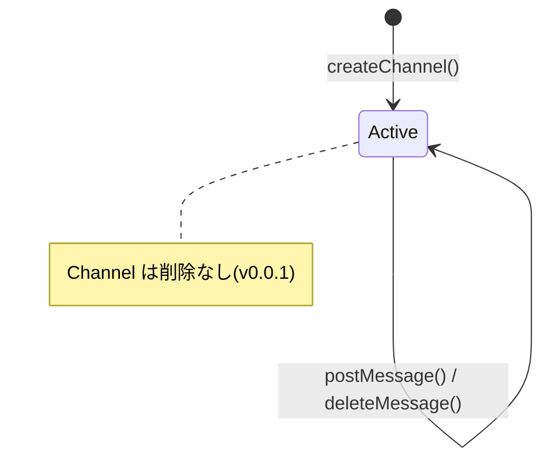

# S6 — ドメインモデル(全体)

## メタ
- 工程: S6 (Domain Model)
- 役割: ドメインモデラー
- ステータス: 確定
- 入力参照: US-01〜US-06 / S5 Work Units
- 作成日: 2026-05-16
- 更新日: 2026-05-16

## スタック確認
- 言語: TypeScript
- フレームワーク: Fastify(インフラ層のみ。ドメインは非依存)
- 永続化: PostgreSQL + Drizzle ORM(インフラ層のみ)
- 既存資産: なし

## DDD 採用判断
- 採用: DDD 採用
- 理由: チャンネル・メッセージ・未読件数・通知の不変条件が明確で集約境界が引きやすい。エンジニアチームが DDD に慣れているため。

## ユビキタス言語 (用語集)
| 用語 | 定義 | 別名NG |
|------|------|--------|
| チャンネル(Channel) | トピック単位の会話空間。名前でユニーク識別される | ルーム、グループ |
| メッセージ(Message) | チャンネルに投稿されたテキスト。作者と投稿日時を持つ | 発言、コメント、投稿 |
| メンバー(Member) | チャンネルに参加しているユーザー | 参加者、ユーザー |
| 未読件数(UnreadCount) | 特定ユーザーが特定チャンネルでまだ読んでいないメッセージの数 | バッジ数、通知数 |
| メンション(Mention) | メッセージ本文中の `@username` 形式の参照。対象ユーザーに通知を生成する | タグ、@付け |
| 通知(Notification) | メンションによって生成される受信者宛のアラート | アラート、お知らせ |

## 集約 / モデル一覧
- [Channel 集約](./channel.md)
- [Message 集約](./message.md)
- [UnreadCount 値オブジェクト](./unread-count.md)
- [Notification 集約](./notification.md)

## 横断的な状態遷移

## 全体 AI が独自に決めたこと と 理由

### D-01 — Channel に削除操作を設けない
- **理由**: v0.0.1 スコープ外。チャンネル削除は参加メンバーのデータへの影響が大きく、別途設計が必要。
- **種別**: 技術判断(AI 自走で確定)
- **上書き**: なし

## 次工程 (S7) への引き継ぎ
- フレームワーク非依存で実装すべき集約: Channel, Message, Notification
- 不変条件のうちコード化が複雑なもの: UnreadCount の「投稿者自身はインクリメントされない」ルール
- テストで保証したいビジネスルール: Mention の `@username` パターン抽出、UnreadCount の境界値(99+)
