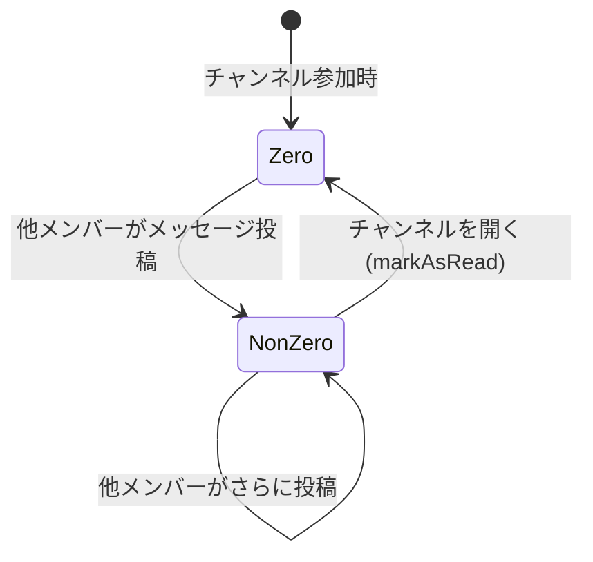

# 値オブジェクト: UnreadCount

## メタ
- 対応 US: [US-04](../S1/us-04-unread-count.md)
- 所属 Unit: [Unit-03](../S5/unit-03-unread.md)
- ステータス: 確定

## モデル定義

- **値オブジェクト**: `UnreadCount`
  - userId: string
  - channelId: string
  - count: number (非負整数)

## 不変条件
- count は 0 以上の整数
- 投稿者自身のチャンネルへの投稿は、その投稿者の未読件数をインクリメントしない
- チャンネルを開く(markAsRead)と count が 0 にリセットされる
- 表示上の上限は 99。99 を超えた場合は「99+」と表示する(ドメイン値は実数のまま保持)

## 状態遷移

