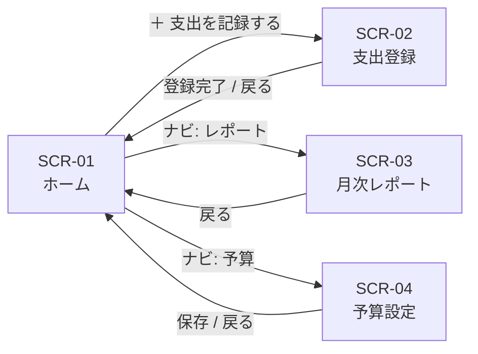

# S2 — 画面モック(ワイヤーフレーム)

| 項目 | 値 |
|---|---|
| ステップ | S2 |
| 対象 | expense v0.0.1 |
| ステータス | 確定 |
| 完了日 | 2026-06-18 |

---

## 画面一覧

| ID | 画面名 | 対応 US |
|---|---|---|
| SCR-01 | ホーム(直近一覧 + 予算バナー) | US-03, US-06 |
| SCR-02 | 支出登録フォーム | US-01 |
| SCR-03 | 月次レポート | US-04 |
| SCR-04 | 予算設定 | US-05 |

---

## SCR-01: ホーム

```
┌─────────────────────────────────────┐
│  家計簿                    [≡ メニュー] │
├─────────────────────────────────────┤
│ ┌─────────────────────────────────┐ │
│ │ ⚠ 今月の支出が予算の82%に達しています │ │
│ │   残り ¥18,000                  │ │
│ └─────────────────────────────────┘ │
│  (予算未設定または80%未満のとき非表示)  │
├─────────────────────────────────────┤
│ 直近の支出                           │
│ ┌─────────────────────────────────┐ │
│ │ 食費   2026-06-18   ¥1,200      │ │
│ │ スーパーで食材購入              │ │
│ ├─────────────────────────────────┤ │
│ │ 交通   2026-06-17   ¥250        │ │
│ │ 電車               (メモなし)   │ │
│ ├─────────────────────────────────┤ │
│ │ 娯楽   2026-06-15   ¥3,500      │ │
│ │ 映画チケット                    │ │
│ └─────────────────────────────────┘ │
│  (最大20件 / 空ならメッセージ表示)     │
├─────────────────────────────────────┤
│           [＋ 支出を記録する]          │
└─────────────────────────────────────┘
```

**状態一覧:**
- `default`: 支出あり + 予算警告あり(上記)
- `empty`: 支出ゼロ件 → 「まだ支出が登録されていません」メッセージ + CTA ボタン
- `no-budget`: 予算未設定 → バナー非表示

**インタラクション:**
- 行を長押し → 「削除」「詳細」メニューが表示される(US-02)
- 「＋ 支出を記録する」ボタン → SCR-02 に遷移

---

## SCR-02: 支出登録フォーム

```
┌─────────────────────────────────────┐
│  ← 戻る   支出を記録する             │
├─────────────────────────────────────┤
│                                     │
│  金額 (円)                           │
│  ┌─────────────────────────────┐   │
│  │  ¥ _____________________   │   │
│  └─────────────────────────────┘   │
│                                     │
│  日付                               │
│  ┌─────────────────────────────┐   │
│  │  2026-06-18  [カレンダー]   │   │
│  └─────────────────────────────┘   │
│                                     │
│  カテゴリ                           │
│  ┌──────┐ ┌──────┐ ┌──────┐       │
│  │ 食費 │ │ 交通 │ │日用品│       │
│  └──────┘ └──────┘ └──────┘       │
│  ┌──────┐ ┌──────┐ ┌──────┐       │
│  │ 娯楽 │ │ 医療 │ │その他│       │
│  └──────┘ └──────┘ └──────┘       │
│                                     │
│  メモ (任意・200文字まで)            │
│  ┌─────────────────────────────┐   │
│  │                             │   │
│  └─────────────────────────────┘   │
│                                     │
│          [  登録する  ]             │
└─────────────────────────────────────┘
```

**状態一覧:**
- `default`: 初期表示。日付は今日、カテゴリ未選択。
- `error`: 金額0以下またはメモ200文字超 → 該当フィールド下にインラインエラー文。

---

## SCR-03: 月次レポート

```
┌─────────────────────────────────────┐
│  ← 戻る   月次レポート               │
├─────────────────────────────────────┤
│        ◀  2026年 6月  ▶             │
│        合計支出: ¥82,000            │
├─────────────────────────────────────┤
│  カテゴリ別 内訳                     │
│  ┌─────────────────────────────┐   │
│  │       [円グラフ]            │   │
│  │   食費 45%  交通 12%        │   │
│  │   日用品 8%  娯楽 20%       │   │
│  │   医療 5%   その他 10%      │   │
│  └─────────────────────────────┘   │
│                                     │
│  月別推移                           │
│  ┌─────────────────────────────┐   │
│  │       [棒グラフ]            │   │
│  │  4月  5月  6月             │   │
│  └─────────────────────────────┘   │
└─────────────────────────────────────┘
```

**状態一覧:**
- `default`: 支出あり(上記)
- `empty`: 当月支出ゼロ → 「この月の支出はありません」イラスト + メッセージ

---

## SCR-04: 予算設定

```
┌─────────────────────────────────────┐
│  ← 戻る   予算設定                   │
├─────────────────────────────────────┤
│                                     │
│  対象月: 2026年6月                   │
│                                     │
│  月の予算 (円)                       │
│  ┌─────────────────────────────┐   │
│  │  ¥ 100,000                  │   │
│  └─────────────────────────────┘   │
│                                     │
│  現在の支出: ¥82,000 (82%)          │
│  ████████████████████░░░░  82%      │
│                                     │
│          [  保存する  ]             │
└─────────────────────────────────────┘
```

**状態一覧:**
- `default`: 既存予算あり(上記)
- `new`: 予算未設定 → 金額欄が空。プログレスバー非表示。

---

## 画面遷移フロー



---

## Biz 合意事項

- ナビゲーションはボトムタブ(ホーム / レポート / 予算)を想定。
- 削除は SCR-01 の長押しメニューから実行。専用削除画面は設けない。
- SCR-03 の空状態はイラストを使用することを想定(S3 でデザイン確定)。

---

## Q&A ログ

### Q-01: SCR-03 の空状態はどのような表示にするか?

**回答(D-01):** → イラスト(グラフ0本)+ 「この月の支出はありません」テキスト。CTAなし。

---

## AI 独自決定

| ID | 決定内容 | 根拠 |
|---|---|---|
| D-01 | SCR-03 空状態: イラスト+テキスト | 空状態を分かりやすく伝える。S3 でイラスト仕様を確定する。 |
| D-02 | ボトムタブ3本(ホーム/レポート/予算)をナビとして採用 | モバイルファーストの標準パターン。主要3画面への到達が1タップ以内。 |

---

## 次工程 S3 への引き継ぎ

- SCR-01〜04 のワイヤーフレームが確定済み。
- SCR-03 空状態のイラストスタイルを S3 で決定すること。
- 予算バナーの状態(通常/警告/超過)の色分けを S3 で確定すること。
- ボトムタブのアイコン選定は S3 のスコープ。
