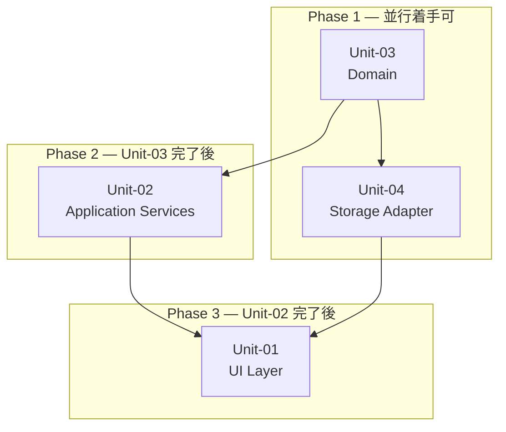

# S5 — 並行作業単位 + 依存 DAG

| 項目 | 値 |
|---|---|
| ステップ | S5 |
| 対象 | expense v0.0.1 |
| ステータス | 確定 |
| 完了日 | 2026-06-18 |

---

## 作業単位 一覧

| Unit ID | 名称 | 担当レイヤー | 対応 US | 依存 Unit |
|---|---|---|---|---|
| Unit-03 | Domain | `src/domain/` | US-01〜06 | なし(leaf) |
| Unit-04 | Storage Adapter | `src/infra/storage/` | US-01〜06 | Unit-03 |
| Unit-02 | Application Services | `src/app/` + `src/store/` | US-01〜06 | Unit-03 |
| Unit-01 | UI Layer | `src/pages/` + `src/components/` | US-01〜06 | Unit-02, Unit-03 |

---

## 依存 DAG

---

## 着手順テーブル

| フェーズ | Unit | 先行条件 | 並行可否 |
|---|---|---|---|
| Phase 1 | Unit-03 (Domain) | なし | ○ |
| Phase 1 | Unit-04 (Storage) | なし(型定義のみ Unit-03 参照) | Unit-03 と並行可 |
| Phase 2 | Unit-02 (App Services) | Unit-03 完了 | ○ |
| Phase 3 | Unit-01 (UI Layer) | Unit-02, Unit-04 完了 | — |

---

## Unit 詳細

### Unit-03: Domain

**スコープ:** `src/domain/money.ts`, `src/domain/expense.ts`, `src/domain/budget.ts`

実装内容:
- `Money` 値オブジェクト(正整数・不変)
- `Category` enum(食費/交通/日用品/娯楽/医療/その他)
- `Expense` 集約ルート(createExpense / updateExpenseMemo)
- `Budget` 集約ルート(createBudget / getBudgetStatus / isWarning)

完了条件:
- 全ドメイン型・関数のユニットテストが PASS すること
- フレームワーク・I/O の import がゼロであること

### Unit-04: Storage Adapter

**スコープ:** `src/infra/storage/expenseStorage.ts`, `src/infra/storage/budgetStorage.ts`

実装内容:
- `ExpenseRepository`: `save`, `findById`, `findAll`, `delete`, `findByMonth`
- `BudgetRepository`: `save`, `findByMonth`
- IndexedDB 操作は idb ライブラリ経由

完了条件:
- 統合テスト(fake-indexeddb 使用)が PASS すること
- 戻り値型が `domain/` 型と一致すること

### Unit-02: Application Services

**スコープ:** `src/app/expenseService.ts`, `src/app/budgetService.ts`, `src/store/expenseStore.ts`, `src/store/budgetStore.ts`

実装内容:
- `addExpense(params)`: バリデーション → Expense 生成 → Storage 保存 → Store 更新
- `deleteExpense(id)`: Storage 削除 → Store 更新
- `getRecentExpenses()`: Storage 取得 → Store 同期
- `getMonthlyReport(monthKey)`: 集計計算
- `setBudget(monthKey, amount)`: Budget 生成 → Storage 保存 → Store 更新
- `getBudgetStatus(monthKey)`: getBudgetStatus ドメイン関数を呼び出す

完了条件:
- 各サービス関数の単体テスト(Storage をモック)が PASS すること

### Unit-01: UI Layer

**スコープ:** `src/pages/`, `src/components/`

実装内容:
- `HomePage`: SCR-01 相当。ExpenseRow リスト + BudgetBanner + 登録ボタン
- `AddExpensePage`: SCR-02 相当。フォーム + バリデーション
- `ReportPage`: SCR-03 相当。月切り替え + PieChart + BarChart + EmptyState
- `BudgetPage`: SCR-04 相当。予算入力 + プログレスバー
- 共通コンポーネント: `BudgetBanner`, `ExpenseRow`, `CategoryChip`, `EmptyState`, `PrimaryButton`

完了条件:
- 各 US の Happy Path が実機ブラウザで動作すること(S9 シナリオテストで検証)

---

## 依存根拠

| 依存関係 | 根拠 |
|---|---|
| Unit-04 → Unit-03 | Storage の戻り値型は `Expense` / `Budget` ドメイン型に依存する |
| Unit-02 → Unit-03 | App Service はドメインファクトリ関数と型を直接使用する |
| Unit-01 → Unit-02 | UI は App Service / Zustand Store を通じてデータを取得・更新する |
| Unit-01 → Unit-04 | 直接依存なし。Unit-02 経由で間接的に依存する |

---

## Q&A ログ

### Q-01: Unit-04 の Storage Adapter は Unit-03 と並行して実装できるか?

**回答(D-01):** → 型定義(インターフェース)を先に Unit-03 側で確定させれば、実装は並行可能。型が未確定の間は Storage の戻り値型が決まらないため、Phase 1 内で Unit-03 の型定義を最初に確定する運用とする。

---

## AI 独自決定

| ID | 決定内容 | 根拠 |
|---|---|---|
| D-01 | Unit-03/04 を Phase 1 として並行着手可とする | 型定義先行で Storage を書けるため。実装コストを削減。 |
| D-02 | Store(Zustand)を Unit-02 スコープに含める | Store は App Service の薄いラッパーであり、独立 Unit にする粒度ではない。 |

---

## 次工程 S6 への引き継ぎ

- Unit-03 スコープ(money/expense/budget)のドメインモデルを S6 で詳細化すること。
- S7 でのコード実装は Unit-03 から開始し、型定義確定後に Unit-04 に移行する。
- S8 では Unit-01/02/04 を統合して全 US の動線を閉じる。
