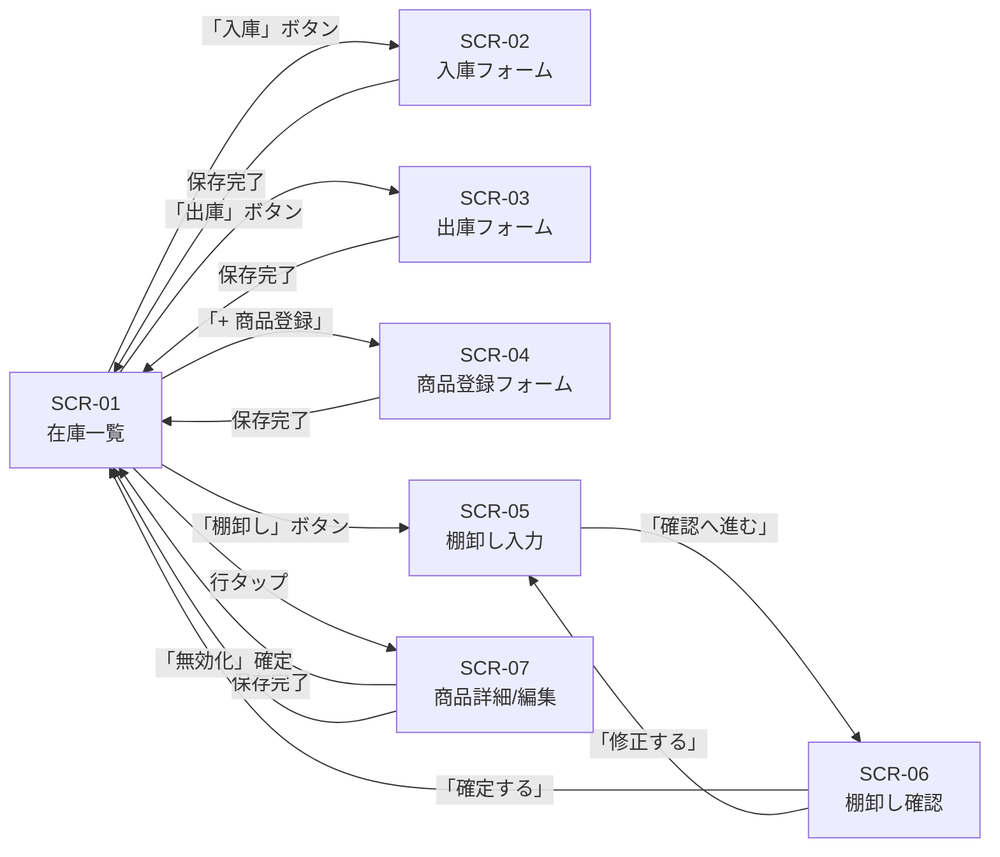

# S2 — 画面モック / フロー(全体)

## メタ
- 工程: S2 (Mock / Flow)
- PhaseGroup: Discovery
- 役割: プロダクトデザイナー(UX)
- バージョン: v0.0.1
- ステータス: 確定
- 入力参照: S1 US 一覧(US-01〜US-07)
- 作成日: 2026-06-12
- 更新日: 2026-06-13

---

## 画面一覧

| # | 画面名 | 対応 US |
|---|-------|--------|
| SCR-01 | 在庫一覧 | US-02, US-05 |
| SCR-02 | 入庫フォーム | US-03 |
| SCR-03 | 出庫フォーム | US-04 |
| SCR-04 | 商品登録フォーム | US-01 |
| SCR-05 | 棚卸し — 商品選択 + 実数入力 | US-06 |
| SCR-06 | 棚卸し — 差分確認 | US-06 |
| SCR-07 | 商品詳細 / 編集画面 | US-07 |

---

## 画面遷移フロー



---

## SCR-01: 在庫一覧

**対応 US**: US-02, US-05

**目的**: アプリを開いてすぐに全商品の在庫状況を確認し、発注が必要な商品を即座に特定できる。

**主要要素**
- ヘッダー: アプリ名 + アラートバッジ(要注意/在庫切れの件数)
- 検索バー: 商品名の部分一致フィルタ
- フィルタタブ: すべて / 要注意 / 在庫切れ
- 商品リスト行: 商品名・単位・現在庫数・閾値・ステータスラベル・最終更新日時
- フローティングボタン群: 「入庫」「出庫」「+ 商品登録」「棚卸し」

**モック**

```
+--------------------------------------------------+
| [在庫管理]                    [!3件 要注意]      |
+--------------------------------------------------+
| [検索 商品名...]                                 |
| [すべて] [要注意 3] [在庫切れ 1]                 |
+--------------------------------------------------+
| [在庫切れ] ミルク(1L)          在庫: 0本  閾値:5 |
|           最終更新: 06-13 08:15                  |
+--------------------------------------------------+
| [要注意]   コーヒー豆(200g)    在庫: 5袋  閾値:10|
|           最終更新: 06-13 09:42                  |
+--------------------------------------------------+
| [在庫十分] 砂糖(1kg)           在庫: 30袋 閾値:5 |
|           最終更新: 06-12 17:30                  |
+--------------------------------------------------+
| [在庫十分] 紅茶ティーバッグ    在庫: 12箱 閾値:3 |
|           最終更新: 06-11 14:00                  |
+--------------------------------------------------+
                         [入庫] [出庫] [棚卸し] [+]
```

---

## SCR-02: 入庫フォーム

**対応 US**: US-03

**目的**: 搬入された商品の数量をすばやく記録し、在庫数に即時反映させる。

**主要要素**
- 画面タイトル: 「入庫登録」
- 商品選択: 検索入力 + ドロップダウン(有効な商品のみ)
- 選択中商品の現在庫数表示(選択後に表示)
- 入庫数量: 数値入力(最小1)
- メモ: テキスト入力(任意、最大100文字)
- 「登録する」ボタン / 「キャンセル」

**モック**

```
+--------------------------------------------------+
| ←  入庫登録                                     |
+--------------------------------------------------+
| 商品 *                                           |
| [コーヒー豆(200g)              v]                |
|  現在庫: 5袋                                     |
+--------------------------------------------------+
| 入庫数量 *                                       |
| [ 20 ]  袋                                       |
+--------------------------------------------------+
| メモ (任意)                                      |
| [定期便 6/13入荷分                              ] |
+--------------------------------------------------+
|          [キャンセル]    [登録する]               |
+--------------------------------------------------+
```

---

## SCR-03: 出庫フォーム

**対応 US**: US-04

**目的**: 売り場への払い出しや使用を記録し、在庫数を正確に管理する。

**主要要素**
- 画面タイトル: 「出庫登録」
- 商品選択: 検索入力 + ドロップダウン(有効な商品のみ)
- 選択中商品の現在庫数表示
- 出庫数量: 数値入力(最小1、現在庫数超過の場合エラー)
- インラインエラー: 「在庫数(N袋)を超えて出庫できません」
- メモ: テキスト入力(任意)
- 「登録する」ボタン / 「キャンセル」

**モック**

```
+--------------------------------------------------+
| ←  出庫登録                                     |
+--------------------------------------------------+
| 商品 *                                           |
| [コーヒー豆(200g)              v]                |
|  現在庫: 5袋                                     |
+--------------------------------------------------+
| 出庫数量 *                                       |
| [ 10 ]  袋                                       |
| ❌ 在庫数(5袋)を超えて出庫できません             |
+--------------------------------------------------+
| メモ (任意)                                      |
| [                                               ] |
+--------------------------------------------------+
|          [キャンセル]    [登録する]               |
+--------------------------------------------------+
```

---

## SCR-04: 商品登録フォーム

**対応 US**: US-01

**目的**: 新しい商品マスタレコードをシステムに追加する。

**主要要素**
- 画面タイトル: 「商品登録」
- 商品名: テキスト入力(必須)
- 単位: テキスト入力(必須、例: 個・袋・本・箱)
- 初期在庫数: 数値入力(0以上整数、必須)
- アラート閾値: 数値入力(0以上整数。0=アラート無効)
- 重複商品名エラー表示
- 「登録する」ボタン / 「キャンセル」

**モック**

```
+--------------------------------------------------+
| ←  商品登録                                     |
+--------------------------------------------------+
| 商品名 *                                         |
| [コーヒー豆(200g)                               ] |
+--------------------------------------------------+
| 単位 *                                           |
| [袋                                             ] |
+--------------------------------------------------+
| 初期在庫数 *                                     |
| [ 0 ]                                            |
+--------------------------------------------------+
| アラート閾値  (0 = アラートなし)                 |
| [ 10 ]                                           |
+--------------------------------------------------+
|          [キャンセル]    [登録する]               |
+--------------------------------------------------+
```

---

## SCR-05: 棚卸し — 商品選択 + 実数入力

**対応 US**: US-06 (Step 1/2)

**目的**: 実際に数えた在庫数をシステムに入力し、差分確認画面に進む。

**主要要素**
- 画面タイトル: 「棚卸し (1/2)」
- 商品選択: 検索 + ドロップダウン(有効な商品のみ)
- システム在庫数の表示(選択後に表示)
- 実在庫数入力: 数値入力(0以上整数)
- メモ: テキスト入力(任意)
- 「確認へ進む」ボタン / 「キャンセル」

**モック**

```
+--------------------------------------------------+
| ←  棚卸し (1/2)                                 |
+--------------------------------------------------+
| 商品 *                                           |
| [コーヒー豆(200g)              v]                |
|  システム在庫: 25袋                              |
+--------------------------------------------------+
| 実際の在庫数 *                                   |
| [ 18 ]  袋                                       |
+--------------------------------------------------+
| メモ (任意)                                      |
| [週次棚卸し 6/13                                ] |
+--------------------------------------------------+
|          [キャンセル]    [確認へ進む]             |
+--------------------------------------------------+
```

---

## SCR-06: 棚卸し — 差分確認

**対応 US**: US-06 (Step 2/2)

**目的**: 調整前後の数字と差分を確認し、意図しない入力ミスを防いで確定する。

**主要要素**
- 画面タイトル: 「棚卸し確認 (2/2)」
- 商品名表示
- 調整前の在庫数
- 調整後の在庫数
- 差分(±N、割合)の強調表示
- ±20% 乖離時の警告バナー
- 「確定する」ボタン / 「修正する」(SCR-05に戻る)

**モック**

```
+--------------------------------------------------+
| ←  棚卸し確認 (2/2)                             |
+--------------------------------------------------+
| コーヒー豆(200g)                                 |
+--------------------------------------------------+
| ⚠️ 差分が 20% を超えています。入力を確認してください|
+--------------------------------------------------+
| 調整前                          25袋             |
| 調整後                          18袋             |
| 差分                          − 7袋  (−28%)      |
+--------------------------------------------------+
| メモ: 週次棚卸し 6/13                            |
+--------------------------------------------------+
|          [修正する]      [確定する]               |
+--------------------------------------------------+
```

---

## SCR-07: 商品詳細 / 編集画面

**対応 US**: US-07

**目的**: 既存商品の情報を確認・更新し、必要に応じて無効化する。

**主要要素**
- 画面タイトル: 商品名
- 読み取り専用表示: 初期在庫数・登録日
- 編集可能フィールド: 商品名・単位・アラート閾値
- 「保存する」ボタン
- 直近の入出庫/棚卸し履歴(最新5件)
- 「この商品を無効化する」リンク(確認ダイアログを挟む)

**モック**

```
+--------------------------------------------------+
| ←  コーヒー豆(200g)              [保存する]     |
+--------------------------------------------------+
| 商品名                                           |
| [コーヒー豆(200g)                               ] |
+--------------------------------------------------+
| 単位                                             |
| [袋                                             ] |
+--------------------------------------------------+
| アラート閾値  (0 = アラートなし)                 |
| [ 10 ]                                           |
+--------------------------------------------------+
| 初期在庫数: 0袋 (変更不可)   登録: 2026-06-01   |
+--------------------------------------------------+
| 直近の履歴                                       |
| 06-13 09:42  入庫 +20袋   定期便 6/13            |
| 06-12 16:00  出庫  −3袋   売り場補充              |
| 06-11 11:30  入庫 +15袋                          |
+--------------------------------------------------+
|           [この商品を無効化する]                 |
+--------------------------------------------------+
```

---

## Biz との合意事項

| # | 論点 | 合意内容 |
|---|------|---------|
| 1 | アラートバッジの配置 | ヘッダー右上に件数+ラベルを表示。フィルタタブにも件数バッジを置く |
| 2 | 棚卸し乖離確認の閾値 | ±20% を採用。割合の方が商品規模によらず機能する |
| 3 | 棚卸しの操作フロー | 2ステップ(入力→確認)。1ステップでは誤確定リスクが高い |
| 4 | 在庫一覧の行タップ先 | 商品詳細/編集画面へ遷移。履歴確認もここから |
| 5 | リストの並び順 | 在庫切れ → 要注意 → 在庫十分 の優先度順 |

---

## US 漏れ・齟齬の検知ログ

| # | 検知内容 | S1 に戻った日 | 解決方針 |
|---|---------|-------------|---------|
| — | 今回は US 漏れなし | — | — |

---

## 全体 質疑応答ログ

### Q-01 — 棚卸しは「1商品ずつ」か「全商品まとめて」か?
- **回答**(AI 代筆):
  > 一度に1商品ずつで十分。まとめてやるときは繰り返せばよい。
- **確定**(AI 記入):
  > SCR-05/06 を1商品対象の2ステップフローとして設計する。

### Q-02 — 在庫一覧でアラート商品を上部に固定するか、色だけで区別するか?
- **回答**(AI 代筆):
  > 上部固定 + 色の組み合わせがベスト。発注の抜け漏れを防ぎたい。
- **確定**(AI 記入):
  > SCR-01 のリストは在庫切れ → 要注意 → 在庫十分 の優先度順で表示する。

---

## 全体 AI が独自に決めたこと と 理由

### D-01 — 棚卸しを2画面(SCR-05/06)に分割した
- **理由**: 実数入力と差分確認を同一画面に収めると「入力したまま誤確定」するリスクが高い。S1 の US-06 AC に「確認画面で差分表示」が明示されているため2ステップを必須とした。
- **種別**: 技術判断(AI 自走で確定)
- **上書き**: なし

### D-02 — 入庫・出庫フォームはモーダルではなく独立画面とした
- **理由**: モバイル操作でモーダルは誤操作で閉じやすく、記録途中に入力内容が消える。独立画面にすることで「戻る」で意識的にキャンセルするフローになる。
- **種別**: 技術判断(AI 自走で確定)
- **上書き**: なし

### D-03 — フローティングボタンを4アクション(入庫・出庫・棚卸し・+登録)とした
- **理由**: 主要アクションがすべて在庫一覧からアクセスできると利便性が高い。4つはモバイル下部に1行で収まる上限と判断した。
- **種別**: 技術判断(AI 自走で確定)
- **上書き**: なし

---

## 棄却した画面案

### R-01 — 「商品別履歴画面」を独立させる案
- **棄却理由**: v0.0.1 では商品詳細画面(SCR-07)に直近5件を埋め込む形で代替できる。独立させる規模の要件がない。

### R-02 — ダッシュボード画面を起点にする案
- **棄却理由**: スタッフが最も使うアクションは在庫確認であるため在庫一覧が起点として最適。ダッシュボードはデータが増えてから追加で十分。

---

## 次工程 (S3) への引き継ぎ
- UI 設計で考慮すべき画面・フロー境界: SCR-05→SCR-06 の遷移アニメーション / SCR-01 のステータス色分けはブランドカラーに依存しないこと
- 外部 I/F が出てくる画面: 今サイクルはなし(認証・通知なし)
- アラート強調の視覚契約: 「在庫切れ」は赤系・「要注意」は黄系・「在庫十分」はニュートラルまたは緑系。S3 で色を確定する
