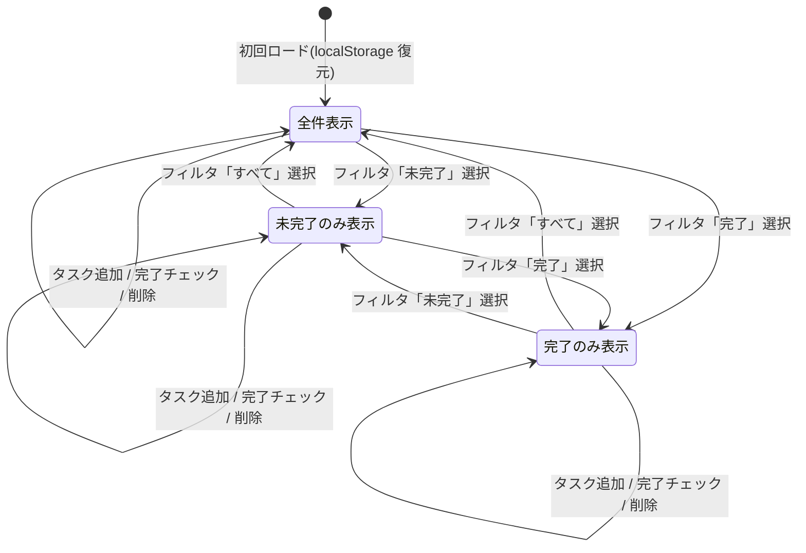

# S2 — 画面モック / フロー(全体)

## メタ
- 工程: S2 (Mock / Flow)
- PhaseGroup: Discovery
- 役割: プロダクトデザイナー
- ステータス: レビュー待ち
- 入力参照: このサイクルの要件一覧(US-01〜US-07)
- 作成日: 2026-06-18
- 更新日: 2026-06-18

---

## 画面一覧

| # | 画面名 | 対応 US |
|---|--------|---------|
| [SCR-01](#scr-01-タスク一覧画面) | タスク一覧画面 | US-01, US-02, US-03, US-04, US-05, US-06, US-07 |

> **設計判断**: このアプリは単一画面(SPA)で完結する。タスク追加フォームと一覧を同一画面に配置することで遷移コストをゼロにする(D-01 参照)。

---

## 画面遷移フロー

アプリは1画面で完結するため、画面間遷移はない。代わりに **タスク一覧画面内の状態遷移** を示す。



---

## Biz との合意事項

| # | 論点 | 合意内容 |
|---|------|---------|
| 1 | アプリは1画面か複数画面か | 1画面(SPA)で完結。設定画面等は v0.0.1 スコープ外 |
| 2 | タスク追加フォームは常時表示か折りたたみか | 常時表示。クリックで開くモーダルより直接入力が速い |
| 3 | 並び替えとフィルタは同一行に並べるか | 同一コントロールバーに横並びで配置する |
| 4 | レスポンシブ対応は v0.0.1 に含めるか | PC ブラウザ専用。モバイル対応は後回し |

---

## US 漏れ・齟齬の検知ログ

| # | 検知内容 | S1 に戻った日 | 解決方針 |
|---|---------|-------------|---------|
| - | 特になし。全 US が SCR-01 でカバー可能 | - | - |

---

## SCR-01: タスク一覧画面

### メタ
- 対応 US: US-01, US-02, US-03, US-04, US-05, US-06, US-07
- ステータス: レビュー待ち

### 目的
ユーザーが全タスクを確認・追加・完了チェック・削除・絞り込み・並び替えを行う唯一のメイン画面。

### 主要要素

#### ヘッダー領域
- アプリタイトル: 「ToDo」(左揃え)

#### タスク追加フォーム領域
- テキスト入力欄: `タスクを入力...` プレースホルダー付き(横幅 広め)
- 日付入力欄: `期限日(任意)` ラベル付き date ピッカー(`<input type="date">`)
- 追加ボタン: 「追加」
- エラー表示: タイトル空欄で追加しようとしたとき「タスクのタイトルを入力してください」を入力欄の下に表示

#### コントロールバー領域
- フィルタボタングループ: 「すべて」「未完了」「完了」(排他選択。選択中ボタンを強調表示)
- 並び替えドロップダウン: 選択肢は「作成順」「期限が近い順」(デフォルト: 作成順)

#### タスク一覧領域
- タスク行(繰り返し):
  - チェックボックス(完了状態トグル)
  - タスクタイトル(完了時は打ち消し線 + グレーアウト)
  - 期限日表示: 「期限: YYYY/MM/DD」(期限なしは空白)
  - 削除ボタン: ✕ アイコン(`aria-label="削除"` 付き)
- 空状態表示: タスクが0件のとき「タスクはありません」をリスト領域中央に表示

### モック (ASCII)

#### 通常状態(タスクあり・フィルタ「すべて」)

```
+--------------------------------------------------+
|  ToDo                                            |
+--------------------------------------------------+
|                                                  |
|  [タスクを入力.......................] [追加]     |
|  期限日(任意): [____-__-__]                       |
|                                                  |
+--------------------------------------------------+
|  [すべて*] [未完了] [完了]  並び替え: [作成順 v]  |
+--------------------------------------------------+
|                                                  |
|  [ ] タスクA                期限: 2026/06/25  [✕] |
|  [ ] タスクB(期限なし)                        [✕] |
|  [x] ~~タスクC 完了済み~~   期限: 2026/06/20  [✕] |
|                                                  |
+--------------------------------------------------+
```

#### フィルタ「未完了」選択時

```
+--------------------------------------------------+
|  ToDo                                            |
+--------------------------------------------------+
|  [タスクを入力.......................] [追加]     |
|  期限日(任意): [____-__-__]                       |
+--------------------------------------------------+
|  [すべて] [未完了*] [完了]  並び替え: [作成順 v]  |  ← 「未完了」が強調
+--------------------------------------------------+
|                                                  |
|  [ ] タスクA                期限: 2026/06/25  [✕] |
|  [ ] タスクB(期限なし)                        [✕] |
|                 ※ タスクC(完了済み)は非表示       |
|                                                  |
+--------------------------------------------------+
```

#### 並び替え「期限が近い順」選択時

```
+--------------------------------------------------+
|  ToDo                                            |
+--------------------------------------------------+
|  [タスクを入力.......................] [追加]     |
|  期限日(任意): [____-__-__]                       |
+--------------------------------------------------+
|  [すべて*] [未完了] [完了]  並び替え: [期限順 v]  |
+--------------------------------------------------+
|                                                  |
|  [x] ~~タスクC 完了済み~~   期限: 2026/06/20  [✕] |  ← 期限が一番近い
|  [ ] タスクA                期限: 2026/06/25  [✕] |
|  [ ] タスクB(期限なし)                        [✕] |  ← 期限なしは末尾
|                                                  |
+--------------------------------------------------+
```

#### 空状態(タスク0件)

```
+--------------------------------------------------+
|  ToDo                                            |
+--------------------------------------------------+
|  [タスクを入力.......................] [追加]     |
|  期限日(任意): [____-__-__]                       |
+--------------------------------------------------+
|  [すべて*] [未完了] [完了]  並び替え: [作成順 v]  |
+--------------------------------------------------+
|                                                  |
|              タスクはありません                  |
|                                                  |
+--------------------------------------------------+
```

#### バリデーションエラー状態(タイトル空欄で追加ボタン押下)

```
+--------------------------------------------------+
|  ToDo                                            |
+--------------------------------------------------+
|                                                  |
|  [                              ] [追加]         |  ← 入力欄に赤枠
|  タスクのタイトルを入力してください               |  ← エラーメッセージ
|  期限日(任意): [____-__-__]                       |
|                                                  |
+--------------------------------------------------+
```

### この画面固有の 質疑応答ログ

#### Q-01 — タスク追加フォームの日付入力欄はテキストボックスか、ブラウザネイティブの date ピッカーか
- **回答**(人間の回答を AI が記入):
  > ブラウザネイティブで十分。カスタムカレンダーは不要。
- **確定**(AI 記入):
  > `<input type="date">` を使用する。スタイリングは最小限。

#### Q-02 — 削除ボタンのラベルはアイコン(✕)か、テキスト「削除」か
- **回答**(人間の回答を AI が記入):
  > ✕ アイコンでよい。テキストだと行が詰まって見づらい。
- **確定**(AI 記入):
  > 削除ボタンは ✕ アイコン(または `×` 文字)で実装する。アクセシビリティのため `aria-label="削除"` を付与する。

### この画面固有の AI が独自に決めたこと と 理由

#### D-01 — アプリを単一画面(SPA)で設計
- **理由**: 全機能(追加・一覧・チェック・削除・フィルタ・並び替え)が1画面で完結できる規模。画面遷移コストがゼロになり「素早く整理する」というプロダクト目的に直結する。
- **種別**: 技術判断(AI 自走で確定)
- **上書き**: なし

#### D-02 — タスク追加フォームを一覧画面の上部に常時表示
- **理由**: 「思いついたときに素早く入力」を優先。モーダルやフローティングボタンは「開く」ワンステップが増え、追加の流れを断ち切る。Biz 合意事項 #2 で確認済み。
- **種別**: 技術判断(AI 自走で確定)
- **上書き**: なし

#### D-03 — フィルタと並び替えを同一コントロールバーに配置
- **理由**: 両者は「リストの見せ方を変える」という同じカテゴリの操作。同じ行に置くことで関連性が視覚的に明確になる。Biz 合意事項 #3 で確認済み。
- **種別**: 技術判断(AI 自走で確定)
- **上書き**: なし

#### D-04 — 完了タスクはグレーアウト + 打ち消し線で表現
- **理由**: 完了を視覚的に即認識できる標準的なパターン。実装コストが低く、ユーザーに余計な学習を強いない。
- **種別**: 技術判断(AI 自走で確定)
- **上書き**: なし

### この画面固有の 棄却した案

#### R-01 — タスク追加をモーダルで行う案
- **棄却理由**: モーダルは「開く」操作が増え、即時入力の利便性が下がる。常時フォーム表示に変更(D-02)。

#### R-02 — フィルタをタブ(Tab コンポーネント)で実装する案
- **棄却理由**: タブは一般的にコンテンツパネルの切り替えに使うUIパターン。フィルタボタングループの方が「表示を絞る」という操作の意図を正確に伝える。

---

## 全体 質疑応答ログ

### Q-01 — レスポンシブ対応(モバイル画面)は v0.0.1 に含めるか
- **回答**(人間の回答を AI が記入):
  > PC ブラウザ専用でよい。モバイル対応は後回し。
- **確定**(AI 記入):
  > v0.0.1 はデスクトップ幅(min-width 768px 想定)のみ対応。モバイルブレークポイントは実装しない。

---

## 全体 AI が独自に決めたこと と 理由

### D-01 — 全 US を SCR-01(タスク一覧画面)1枚でカバーする設計
- **理由**: US 数は7件だが、全て「タスク一覧に対する操作」という単一のコンテキストに収まる。画面を分割しても UX 上のメリットがないため1画面に集約した。
- **種別**: 技術判断(AI 自走で確定)
- **上書き**: なし

---

## 棄却した画面案

### R-01 — 設定画面(期限日フォーマット変更など)
- **棄却理由**: 期限日フォーマットは S1 D-01 で固定済み。設定画面は v0.0.1 スコープ外。

### R-02 — タスク詳細画面(編集・メモ追加)
- **棄却理由**: タスク編集は S1 Q-03 でスコープ外確定。詳細画面の必要性なし。

---

## 次工程 (S3) への引き継ぎ
- **UI 設計で考慮すべき画面・フロー境界**: SCR-01 のみ。コントロールバー(フィルタ + 並び替え)の視覚的な重さのバランスに注意。タスク行の情報密度(タイトル + 期限 + 削除ボタン)を横幅に収める方法を検討。
- **外部 I/F が出てくる画面**: なし(localStorage のみ使用。認証・決済・通知なし)
